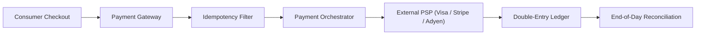
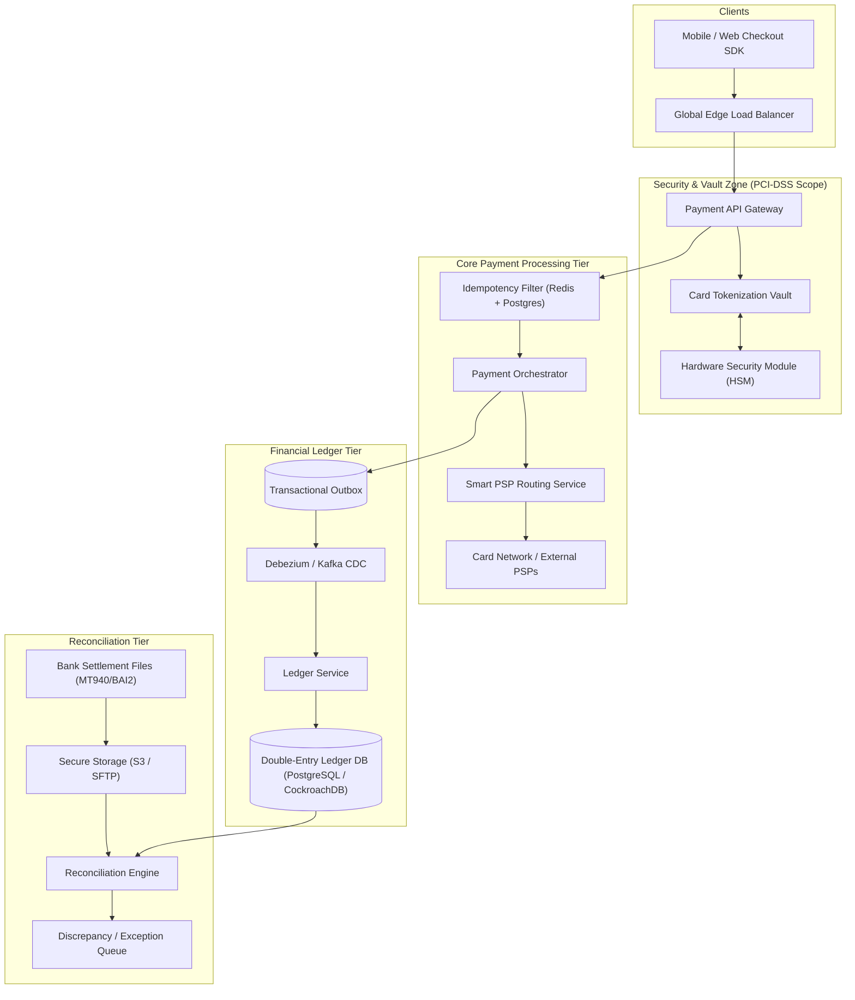
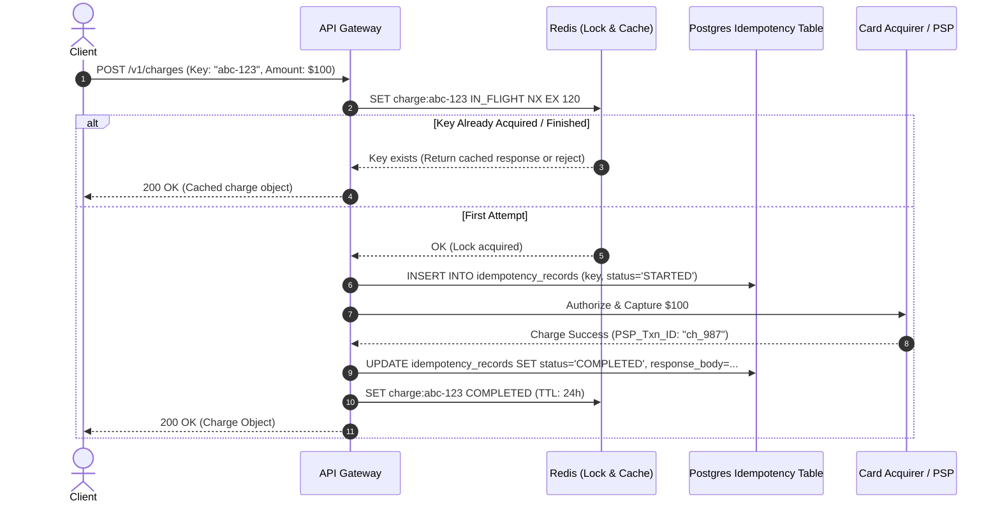
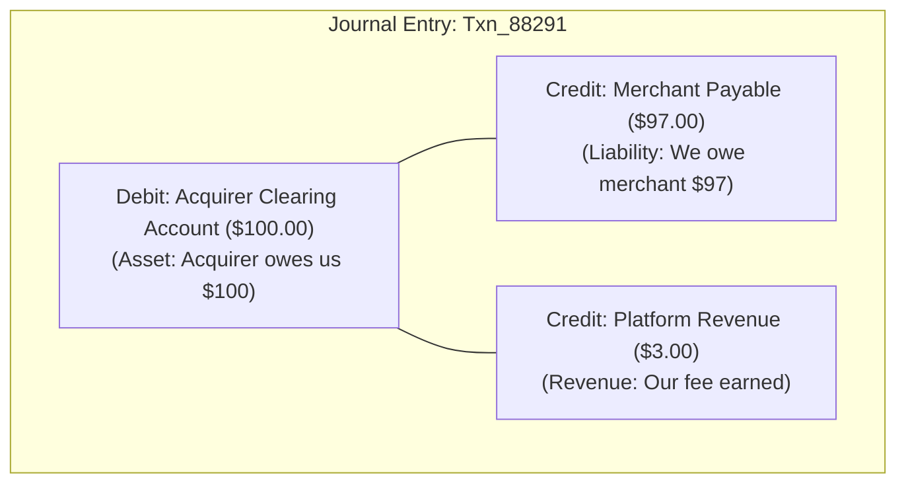
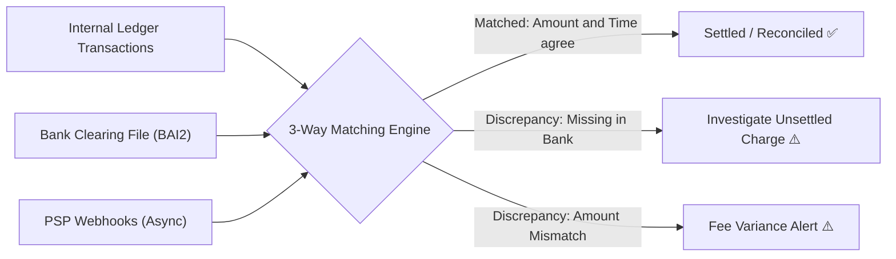

# 15. Design a High-Throughput Payment Gateway & Double-Entry Ledger (Stripe / PayPal)

[← Back to Distributed Vector Database](./14-design-a-distributed-vector-database-pinecone-milvus.md) | [Track Hub](./README.md) | [Next: Real-Time Ad Click Aggregator →](./16-design-a-real-time-ad-click-event-aggregator-google-meta.md)

---

## 🏛️ 1. Requirements & System Scope

A modern payment gateway and financial ledger orchestrates credit card, bank, and digital wallet transactions between consumers, merchants, and Payment Service Providers (PSPs / Card Networks like Visa, Mastercard, and banks). It must guarantee strictly zero money loss, exactly-once processing, multi-region high availability, and mathematically auditable double-entry accounting.



### 1.1 Functional Requirements
1. **Payment Authorization & Capture:** Support two-phase payments: (1) `Authorize` (reserve funds on card) and (2) `Capture` (transfer settled funds).
2. **Idempotent API Execution:** Guarantee that network retries or double-clicked buttons never result in duplicate charges.
3. **Card Tokenization (PCI-DSS Compliance):** Sensitive Primary Account Numbers (PAN) and CVVs are tokenized in an isolated vault; application services only process opaque tokens.
4. **Immutable Double-Entry Ledger:** Every financial movement is recorded as balanced debit/credit journal entries where $\sum \text{Debits} = \sum \text{Credits}$.
5. **Automated Reconciliation:** Ingest end-of-day bank settlement reports (e.g., BAI2, MT940, ISO 20022 CAMT.053) and reconcile internal ledger transactions against external bank truth.

### 1.2 Non-Functional Requirements
- **Financial Durability & Zero Data Loss:** Recovery Point Objective (RPO) = 0. Transactions must never be dropped or silently corrupted.
- **Strict Exactly-Once Semantics:** Network failures must never produce duplicate transfers.
- **Ultra-High Availability:** 99.999% uptime ($< 5.26\text{ minutes}$ downtime/year).
- **Auditability & Traceability:** Immutable audit trail with cryptographic hashing for financial compliance (SOC 1/2, PCI-DSS Level 1).

---

## 🔢 2. Capacity & Scale Estimations

```
╭───────────────────────────────────────────────────────────────────────────────────────────╮
│                              BACK-OF-THE-ENVELOPE SCALE MATH                              │
├───────────────────────────────┬───────────────────────────────┬───────────────────────────┤
│ Metric                        │ Raw Value                     │ Engineering Shorthand     │
├───────────────────────────────┼───────────────────────────────┼───────────────────────────┤
│ Daily Payment Volume          │ 100 Million transactions/day  │ 100M Txns/day             │
│ Average Processing Throughput │ 100M / 86,400 sec             │ ~1,200 TPS                │
│ Peak Traffic (Black Friday 8x)│ 1,200 × 8                     │ ~10,000 TPS peak          │
│ Ledger Journal Entry Size     │ ~1 KB per balanced entry      │ 1 KB                      │
│ Daily Ledger Storage Growth   │ 100M × 1 KB                   │ 100 GB / day              │
│ Annual Ledger Storage         │ 100 GB × 365                  │ ~36.5 TB / year (Replicas)│
│ API Latency SLA (p99)         │ Sub-1.5s total (PSP bounded)  │ < 1.5s                    │
╰───────────────────────────────┴───────────────────────────────┴───────────────────────────╯
```

---

## 🏗️ 3. High-Level Architecture



---

## 🔑 4. Deep-Dive: Exactly-Once Processing via Idempotency Keys

Every mutating payment request includes an `Idempotency-Key: <UUID>` header generated on the client.



---

## ⚖️ 5. Deep-Dive: Double-Entry Bookkeeping Principles

In financial accounting, money cannot be created or destroyed—it only moves between accounts. Every transaction consists of balanced **Debits** and **Credits**:

$$\sum \text{Debits} - \sum \text{Credits} = 0$$

### 5.1 Account Categories & Sign Conventions
- **Assets (Bank Accounts, Cash):** Debits increase balance, Credits decrease balance.
- **Liabilities (Merchant Payables, User Balances):** Credits increase balance, Debits decrease balance.
- **Equity / Revenue (Platform Fees):** Credits increase balance, Debits decrease balance.

### 5.2 Real-World E-Commerce Example
Customer purchases an item for **$100.00**. The platform charges a **3% processing fee ($3.00)**, and the merchant receives **$97.00**:



```sql
-- Immutable Ledger Schema
CREATE TABLE ledger_entries (
    entry_id UUID PRIMARY KEY DEFAULT gen_random_uuid(),
    transaction_id VARCHAR(64) NOT NULL,
    account_id VARCHAR(64) NOT NULL,
    direction VARCHAR(6) NOT NULL CHECK (direction IN ('DEBIT', 'CREDIT')),
    amount_cents BIGINT NOT NULL CHECK (amount_cents > 0),
    currency VARCHAR(3) NOT NULL,
    created_at TIMESTAMP WITH TIME ZONE DEFAULT NOW()
);

-- Zero-Sum Validation Constraint (checked atomically per transaction)
-- SUM(amount_cents WHERE direction = 'DEBIT') == SUM(amount_cents WHERE direction = 'CREDIT')
```

> [!IMPORTANT]
> **Immutability Invariant:** Ledger rows are **NEVER updated or deleted**. If a mistake or refund occurs, a new compensating journal entry is appended with inverse debits and credits.

---

## 🔄 6. Automated Reconciliation Engine

At $T = \text{Midnight}$, banks generate clearing files (BAI2 / MT940 / CAMT.053) detailing every settled transaction:



---

## 🛡️ 7. Edge Cases & Resilience Mechanisms

| Failure Mode / Edge Case | System Impact | Architectural Mitigation |
| :--- | :--- | :--- |
| **PSP Network Timeout** | Gateway sent request, but connection timed out before receiving approval | **Ambiguous State Resolution:** Do NOT retry blindly. Poll the PSP's Inquiry API using the internal transaction reference to determine actual transaction outcome before failing or capturing. |
| **Concurrent Double-Clicks** | User submits checkout twice simultaneously | **Redis Atomic NX Lock:** First thread acquires lock; second thread receives `409 Conflict` or blocks on condition variable awaiting the first thread's result. |
| **Partial Reversals / Split Refunds** | Customer returns 1 item of a 3-item order | Each partial refund creates a distinct compensating ledger journal entry referencing the original parent transaction with its own balance validation. |
| **Multi-Region Ledger Split-Brain** | Network partition between US-East and US-West | **Deterministic Region Partitioning:** Shard payment accounts strictly by Merchant ID with multi-region CockroachDB consensus (Raft). Cross-region accounts route to the owning home region. |

---

<div align="center">

| [← Back to Distributed Vector Database](./14-design-a-distributed-vector-database-pinecone-milvus.md) | [Track Hub: HLD](./README.md) | [Next: Real-Time Ad Click Aggregator →](./16-design-a-real-time-ad-click-event-aggregator-google-meta.md) |
| :--- | :---: | ---: |

</div>
