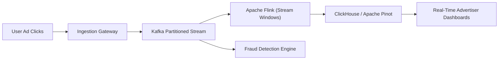
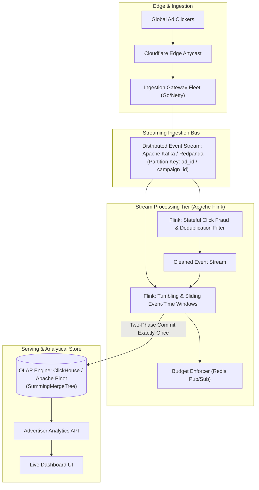
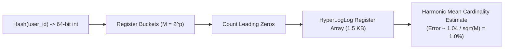

# 16. Design a Real-Time Ad Click Stream Event Aggregator (Google / Meta Ads)

[← Back to Payment Gateway & Ledger](./15-design-a-high-throughput-payment-gateway-and-ledger-stripe.md) | [Track Hub](./README.md) | [Next: Global Live Video Streaming Platform →](./17-design-a-global-live-video-streaming-platform-twitch-youtube-live.md)

---

## 🏛️ 1. Requirements & System Scope

Online advertising platforms (Google Ads, Meta Ads, TikTok) ingest millions of ad impressions, conversions, and clicks per second. Advertisers require sub-second real-time dashboards to track return-on-ad-spend (ROAS) and stop exhausted budgets immediately. Concurrently, the platform must detect click fraud and bill advertisers with strict exactly-once accounting.



### 1.1 Functional Requirements
1. **Ultra-High Throughput Ingestion:** Ingest raw click and conversion events with payload attributes: `click_id`, `ad_id`, `campaign_id`, `user_id`, `timestamp`, `ip_address`, `bid_price`.
2. **Real-Time Stream Aggregation:** Compute aggregated metrics (Clicks, Cost, Impressions, CTR, Unique Viewers) over fixed and sliding time windows (1-minute, 5-minute, 1-hour).
3. **Advertiser Real-Time Dashboards:** Enable interactive OLAP queries across ad dimensions (`campaign_id`, `country`, `device`) with sub-500ms p99 query latency.
4. **Click Fraud & Anomaly Detection:** Identify botnet clicks, duplicate clicks within short timeframes, and IP spam before billing advertisers.
5. **Budget Pacing & Auto-Shutoff:** Trigger immediate campaign deactivation within $< 2\text{ seconds}$ when an advertiser's daily budget cap is exhausted.

### 1.2 Non-Functional Requirements
- **High Ingestion Scale:** Ingest and process 1,000,000 clicks/second during peak campaigns.
- **End-to-End Latency:** Time from user click to visible dashboard metric must be $< 2\text{ seconds}$.
- **Exactly-Once Semantics:** Critical for financial billing—no duplicate counts from network retries.
- **Fault Tolerance:** Distributed checkpointing ensures zero data loss upon worker node crash.

---

## 🔢 2. Capacity & Scale Estimations

```
╭───────────────────────────────────────────────────────────────────────────────────────────╮
│                              BACK-OF-THE-ENVELOPE SCALE MATH                              │
├───────────────────────────────┬───────────────────────────────┬───────────────────────────┤
│ Metric                        │ Raw Value                     │ Engineering Shorthand     │
├───────────────────────────────┼───────────────────────────────┼───────────────────────────┤
│ Peak Ingestion Throughput     │ 1,000,000 clicks / second     │ 1M Clicks/sec             │
│ Average Raw Event Payload     │ 128 bytes per click record    │ 128 Bytes                 │
│ Peak Network Bandwidth        │ 1M × 128 bytes                │ 128 MB/sec (~1 Gbps)      │
│ Daily Raw Ingestion Volume    │ 1M/s avg × 86,400 × 128 B     │ ~11 TB / day uncompressed │
│ Kafka Partitions Needed       │ 1M clicks/s ÷ 5,000/partition │ 200 Kafka Partitions      │
│ Aggregated OLAP Record Rate   │ Rollup to 1-min windows       │ ~5,000 rows/sec to OLAP   │
│ Dashboard Query Latency (p99) │ Aggregated analytical queries │ < 500 ms                  │
╰───────────────────────────────┴───────────────────────────────┴───────────────────────────╯
```

---

## 🏗️ 3. High-Level Architecture



---

## ⏱️ 4. Deep-Dive: Stream Windowing & Watermark Mechanics

Real-world mobile clicks arrive out-of-order due to network latency, plane mode reconnection, and cell tower handoffs. We rely on **Event Time** (the exact timestamp when the click occurred on the client) rather than **Processing Time** (when the server received the event).

```mermaid
gantt
    title Event-Time Windowing & Watermark Handling
    dateFormat X
    axisFormat %s
    section Window 1 [00:00 - 00:01]
    Event (t=15s)       :done, 0, 15
    Event (t=45s)       :done, 0, 45
    Late Event (t=55s)  :crit, done, 0, 55
    section Watermark
    Watermark (t=WindowEnd + 10s) :active, 70, 71
```



### 4.1 Watermark Definition
A watermark is a control record that flows through the stream indicating that no subsequent events with timestamp $t < W$ are expected:

$$W = \max(\text{EventTimestamp}) - \Delta_{\text{delay}}$$

- **On-Time Events ($t \le W$):** Aggregated into the active window.
- **Late Events ($W < t \le W + \text{AllowedLateness}$):** Triggers window update / retraction.
- **Dead-Letter Late Events ($t > W + \text{AllowedLateness}$):** Routed to a Dead-Letter Queue (DLQ) for asynchronous batch reconciliation.

### 4.2 Exactly-Once Sink via Two-Phase Commit (2PC)
To avoid duplicate counts in the analytics store when a Flink worker restarts:
1. **Pre-Commit:** Flink writes pre-aggregated partial window batches to ClickHouse temporary partition blocks tied to the active Flink checkpoint ID.
2. **Commit:** Once Flink's global checkpoint coordinator confirms all operators successfully saved their state snapshot, the sink atomically publishes the partition block to the live table.

---

## 🧮 5. Scalable Deduplication & Unique Reach (HyperLogLog)

Advertisers need to know both total clicks and **Unique Clickers**. Tracking exact sets of millions of user UUIDs in memory requires gigabytes per ad.



- **HyperLogLog (HLL):** Uses only $1.5\text{ KB}$ of RAM to estimate unique users with a standard error of $\approx 1\%$.
- **Mergeability:** HLL registers can be unioned across distributed nodes with zero loss of accuracy:
  $$\text{UniqueUsers}(\text{Day}) = \bigcup_{h=0}^{23} \text{HLL}(\text{Hour}_h)$$

---

## 🛡️ 6. Edge Cases & Resilience Mechanisms

| Failure Mode / Edge Case | System Impact | Architectural Mitigation |
| :--- | :--- | :--- |
| **Super Bowl Ad Partition Hotspot** | Single ad generates 500,000 clicks/sec; hot partition overwhelms single Kafka consumer | **Salting & Two-Phase Aggregation:** Ingest with salted partition keys (`ad_id + "_" + random(0, 15)`). Pre-aggregate locally in Flink workers, then perform second-stage global rollup. |
| **Botnet Click Farm Attack** | Millions of clicks from rotating proxy IPs exhaust advertiser budget in seconds | **Sliding Window Bloom Filter & IP Velocity:** Maintain Redis Bloom filter of `(ip, ad_id)`. Rate limit clicks exceeding $> 5\text{ clicks/minute}$ per IP before forwarding to the billing stream. |
| **Flink Backpressure Cascade** | Slow ClickHouse writes cause buffers to fill up, stalling ingestion | Configure asynchronous non-blocking bulk insert sinks. Apply backpressure alarms and scale ClickHouse ingestion nodes horizontally. |
| **Network Partition Recovery** | Disconnected workers replay 10 minutes of queued logs | Idempotency keys (`click_id`) validated against a RocksDB state TTL table prevents double billing during replay. |

---

<div align="center">

| [← Back to Payment Gateway & Ledger](./15-design-a-high-throughput-payment-gateway-and-ledger-stripe.md) | [Track Hub: HLD](./README.md) | [Next: Global Live Video Streaming Platform →](./17-design-a-global-live-video-streaming-platform-twitch-youtube-live.md) |
| :--- | :---: | ---: |

</div>
