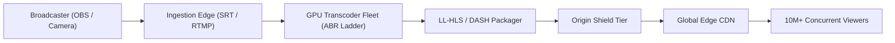
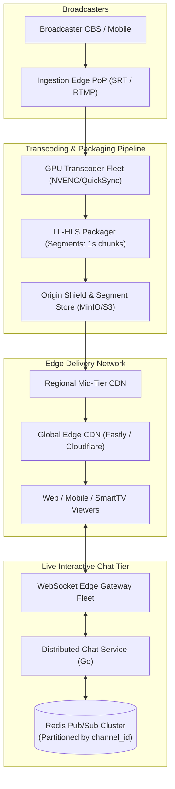
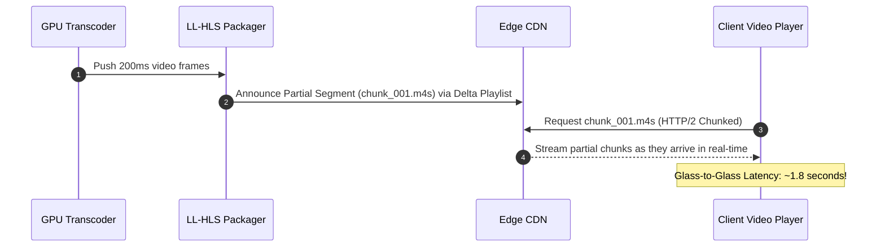
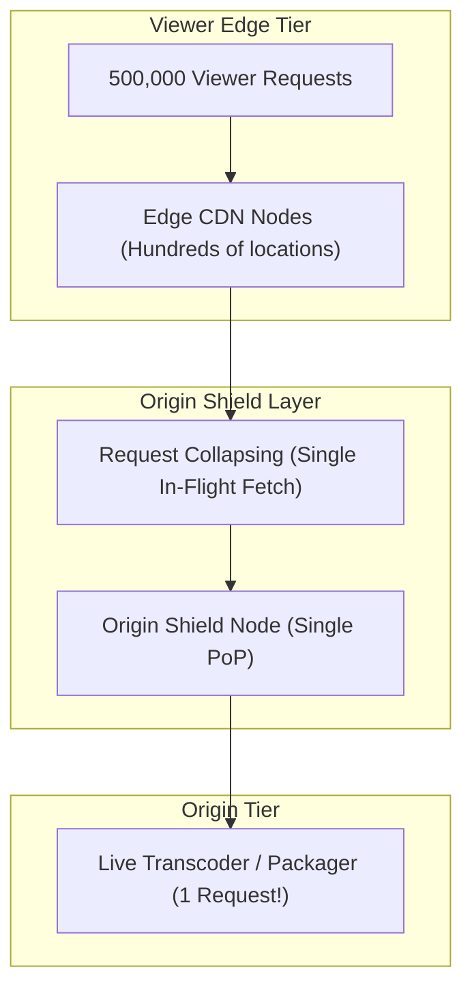
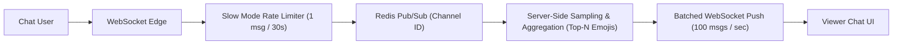

# 17. Design a Global Live Video Streaming Platform (Twitch / YouTube Live)

[← Back to Real-Time Ad Click Aggregator](./16-design-a-real-time-ad-click-event-aggregator-google-meta.md) | [Track Hub](./README.md) | [LLD & Machine Coding Hub →](../lld-machine-coding/README.md)

---

## 🏛️ 1. Requirements & System Scope

A global live video streaming platform (Twitch, YouTube Live, Kick) enables content creators to broadcast high-definition video feeds to millions of concurrent viewers worldwide with ultra-low latency (< 2--3 seconds glass-to-glass) and synchronized real-time interactive chat.



### 1.1 Functional Requirements
1. **Live Video Ingestion:** Ingest raw audio/video streams from creators using low-overhead broadcast protocols (RTMP, SRT, WebRTC).
2. **Real-Time Transcoding & ABR Ladder:** Transcode incoming video streams into multiple Adaptive Bitrate (ABR) profiles (1080p60, 720p60, 480p, 360p) in real time.
3. **Ultra-Low Latency Delivery:** Achieve glass-to-glass latency of $< 2.5\text{ seconds}$ worldwide using Low-Latency HLS (LL-HLS) or Low-Latency DASH (LL-DASH).
4. **Massive Live Chat:** Synchronize text chat rooms supporting up to 500,000 concurrent viewers in a single channel with moderation and slow-mode rate limiting.
5. **Video On Demand (VOD) Archival:** Automatically package and archive live streams into durable object storage for instant playback after broadcast concludes.

### 1.2 Non-Functional Requirements
- **Scale:** Support 50,000 concurrent broadcasters and 10,000,000 concurrent viewers.
- **High Availability & Fault Tolerance:** Seamless failover if an ingestion server or transcoding GPU crashes mid-stream.
- **Bandwidth Optimization:** 98%+ CDN cache hit ratio to protect origin infrastructure.
- **Stream Stability:** Dynamic network adaptation for broadcasters experiencing packet loss or bandwidth jitter.

---

## 🔢 2. Capacity & Scale Estimations

```
╭───────────────────────────────────────────────────────────────────────────────────────────╮
│                              BACK-OF-THE-ENVELOPE SCALE MATH                              │
├───────────────────────────────┬───────────────────────────────┬───────────────────────────┤
│ Metric                        │ Raw Value                     │ Engineering Shorthand     │
├───────────────────────────────┼───────────────────────────────┼───────────────────────────┤
│ Active Concurrent Streams     │ 50,000 live channels          │ 50,000 Streams            │
│ Concurrent Viewers            │ 10,000,000 global viewers     │ 10M Viewers               │
│ Average Stream Bitrate        │ 4 Mbps (ABR ladder average)   │ 4 Mbps                    │
│ Total Peak Egress Bandwidth   │ 10M viewers × 4 Mbps          │ 40 Terabits/sec (40 Tbps!)│
│ Ingress Bandwidth             │ 50,000 streams × 8 Mbps 1080p │ 400 Gbps Ingress          │
│ Transcoding Compute Fleet     │ 50,000 streams × 1 GPU / 4 ch │ 12,500 GPU Transcoders    │
│ Live Chat Message Rate        │ Top stream: 30,000 msgs / sec │ 30K msgs/sec              │
╰───────────────────────────────┴───────────────────────────────┴───────────────────────────╯
```

---

## 🏗️ 3. High-Level Architecture



---

## ⚡ 4. Deep-Dive: Low-Latency HLS (LL-HLS) Pipeline

Standard HLS requires downloading full 6-second segments before playback, creating $15\text{--}30\text{ second}$ latency. **Low-Latency HLS (LL-HLS)** splits segments into tiny sub-segments (partial segments, $\sim 200\text{ms}$) delivered via HTTP/2 Chunked Transfer Encoding.



### 4.1 Ingestion Protocols: SRT vs. RTMP
- **RTMP (Legacy):** Built over TCP. Reliable, but suffers from head-of-line blocking and buffer bloat under network packet loss.
- **SRT (Secure Reliable Transport):** Built over UDP with Selective Repeat ARQ (Automatic Repeat reQuest). Dynamically compensates for packet jitter and packet loss up to 20% without dropping video frames.

---

## 🛡️ 5. Origin Shielding & CDN Thundering Herd Mitigation

When a streamer with 500,000 viewers reaches an exciting moment, all 500,000 clients request the next segment (`segment_4829.ts`) within the same 500ms window:



- **Request Collapsing (Coalescing):** Edge CDN nodes coalesce simultaneous requests for the same video segment; only one request travels upstream to the Origin Shield.
- **Origin Shield:** A dedicated caching layer between regional CDNs and the origin packager. Slashes origin load from $500,000 \to 1$ request per segment!

---

## 💬 6. Massive Channel Live Chat Architecture

For a top stream with 300,000 concurrent viewers in a single channel, broadcasting 30,000 messages/sec directly to every user would require $300,000 \times 30,000 = 9,000,000,000$ messages/sec—crashing both network and client browsers!



1. **Slow Mode & Rate Limiting:** Enforce a strict minimum interval (e.g., 30 seconds) between messages per user during peak traffic.
2. **Server-Side Message Sampling:** If incoming chat exceeds 100 msgs/sec, sample a representative subset of messages and aggregate repeated emoji reactions into reaction counters (e.g. `🔥 x 14,200`).
3. **Batched Client Delivery:** WebSockets push bundled message batches every 250ms rather than individual frame packets.

---

## 🛡️ 7. Edge Cases & Resilience Mechanisms

| Failure Mode / Edge Case | System Impact | Architectural Mitigation |
| :--- | :--- | :--- |
| **GPU Transcoder Crash Mid-Stream** | Stream freezes; 100,000 viewers experience playback error | **Active-Active Dual Transcoding:** Hot-standby secondary transcoder runs in parallel with identical segment timestamp sequence numbering. Packager fails over instantaneously without dropped frames. |
| **Broadcaster Uplink Degradation** | Creator's home internet bandwidth drops from 10 Mbps to 1 Mbps | **Dynamic Bitrate Scaling at Ingest:** Broadcaster client monitors SRT round-trip time and packet loss; automatically downscales encoding bitrate before buffer underruns occur. |
| **Viewer Thundering Herd on Go-Live** | 1,000,000 notification clicks hit manifest URL simultaneously | Serve master playlists (`index.m3u8`) with a 1-second CDN cache TTL and stale-while-revalidate headers. |
| **DDoS on Live Ingestion Edge** | Malicious actor floods RTMP/SRT ports | Protect ingestion PoPs behind Anycast BGP routing with SYN-proxying and automated IP blackholing via hardware scrubbing centers. |

---

<div align="center">

| [← Back to Real-Time Ad Click Aggregator](./16-design-a-real-time-ad-click-event-aggregator-google-meta.md) | [Track Hub: HLD](./README.md) | [LLD & Machine Coding Hub →](../lld-machine-coding/README.md) |
| :--- | :---: | ---: |

</div>
