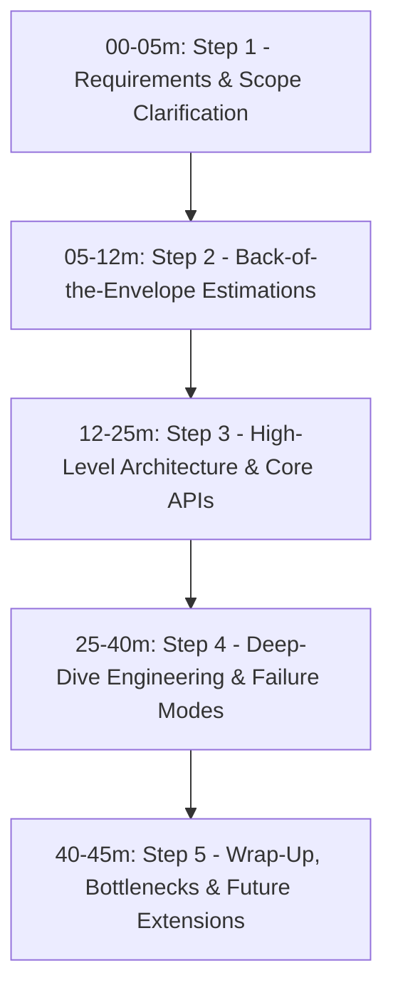
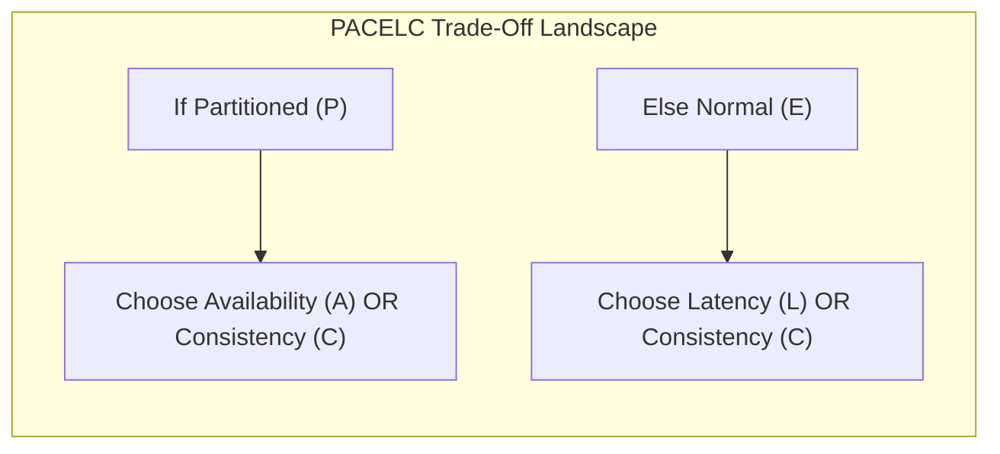

# High-Level Design (HLD) Case Studies

A comprehensive, production-grade curriculum covering end-to-end distributed system architectures, scale engineering, capacity estimation, and failure mode analysis for technical interviews and large-scale backend engineering.

---

## 🧭 The 4-Step System Design Interview Blueprint (45-Minute Breakdown)

In high-level system design interviews, success is measured by structured communication, identifying bottlenecks, justifying architectural trade-offs, and driving from abstract requirements to concrete, resilient topologies.

| Phase | Duration | Core Deliverables & Interviewer Checkpoints |
| :---: | :---: | :--- |
| **Step 1** | **00 – 05m** | **Scope Clarification:** Define Functional Requirements (FR), Non-Functional Requirements (NFR), and state explicit Out-of-Scope boundaries. |
| **Step 2** | **05 – 12m** | **Capacity Math:** Calculate Daily Active Users (DAU), Read/Write QPS, Peak Traffic Multipliers ($2\times - 5\times$), 5-Year Storage Sizing, Network Bandwidth, and Cache Memory (80/20 rule). |
| **Step 3** | **12 – 25m** | **High-Level Design:** Draw end-to-end component flow (Clients $\to$ DNS/CDN $\to$ Load Balancers $\to$ API Gateway $\to$ Microservices $\to$ Storage/Cache). Define REST/gRPC API contracts and database schema models. |
| **Step 4** | **25 – 40m** | **Deep-Dive & Trade-offs:** Zoom into the 2–3 hardest architectural bottlenecks: data partitioning, replication consensus, concurrency race conditions, cache invalidation, and disaster recovery. |
| **Step 5** | **40 – 45m** | **Review & Hardening:** Summarize single points of failure (SPOFs), monitoring & alerting (SLI/SLO), and cost optimization. |

---

## 📋 Master System Catalog & Architectural Taxonomy

| # | System Design Case Study | Primary Storage & Tech Stack | Core Distributed Challenge | Link |
| :---: | :--- | :--- | :--- | :--- |
| **01** | **Design a Distributed Rate Limiter** | Redis Cluster, Lua Scripts, Local Cache | Sliding window synchronization, race condition elimination, clock drift | [01-design-a-distributed-rate-limiter.md](./01-design-a-distributed-rate-limiter.md) |
| **02** | **Design a Global URL Shortener (TinyURL)** | NoSQL / RDBMS, Redis, Snowflake / KGS | 100:1 read ratio, Base62 encoding, 301 vs 302 redirects, DB sharding | [02-design-a-global-url-shortener-tinyurl.md](./02-design-a-global-url-shortener-tinyurl.md) |
| **03** | **Design a Real-Time Chat System (WhatsApp)** | WebSockets, Cassandra / HBase, Redis Pub/Sub | Stateful connection management, monotonic message ordering, offline delivery | [03-design-a-real-time-chat-system-whatsapp-slack.md](./03-design-a-real-time-chat-system-whatsapp-slack.md) |
| **04** | **Design a Distributed Message Queue (Kafka Clone)** | Append-only Disk Segments, PageCache, KRaft | Zero-copy `sendfile`, partition consumer groups, ISR replication consensus | [04-design-a-distributed-message-queue-kafka-clone.md](./04-design-a-distributed-message-queue-kafka-clone.md) |
| **05** | **Design a Video Streaming Platform (YouTube)** | Blob Storage (S3), CDN, Cassandra, Transcoders | Asynchronous transcoding DAG, Adaptive Bitrate Streaming (HLS/DASH), CDN edge caching | [05-design-a-video-streaming-platform-youtube-netflix.md](./05-design-a-video-streaming-platform-youtube-netflix.md) |
| **06** | **Design a Distributed Key-Value Store (Dynamo-Style)** | Consistent Hashing, Virtual Nodes, Vector Clocks | Tunable quorum ($R + W > N$), sloppy quorums, hinted handoff, Merkle anti-entropy | [06-design-a-distributed-key-value-store-dynamo-style.md](./06-design-a-distributed-key-value-store-dynamo-style.md) |
| **07** | **Design a Real-Time Ride-Hailing System (Uber / Lyft)** | Google S2, Geohash, WebSockets/gRPC, Kafka, Redis | 500k QPS location stream, spatial proximity dispatch, dynamic surge heatmaps | [07-design-a-real-time-ride-hailing-system-uber-lyft.md](./07-design-a-real-time-ride-hailing-system-uber-lyft.md) |
| **08** | **Design a Cloud Storage & Sync Engine (Google Drive)** | Content-Defined Chunking (CDC), S3/GCS, CockroachDB | SHA-256 deduplication, differential sync, metadata sharding, offline conflicts | [08-design-a-distributed-cloud-storage-and-sync-google-drive-dropbox.md](./08-design-a-distributed-cloud-storage-and-sync-google-drive-dropbox.md) |
| **09** | **Design an E-Commerce Flash Sale & Inventory System** | Redis Lua, Kafka, PostgreSQL, Saga Pattern | 1M QPS thundering herd, zero overselling, atomic inventory reservation, idempotency | [09-design-an-ecommerce-flash-sale-and-inventory-system.md](./09-design-an-ecommerce-flash-sale-and-inventory-system.md) |

---

## ⚖️ The Distributed Systems Decision Matrix (CAP & PACELC)

Every system in this track makes deliberate trade-offs across consistency, availability, latency, and partition tolerance:

- **AP / PA/EL Systems:** (e.g., TinyURL, Video Streaming, Real-Time Chat) Prioritize low latency and high availability. Eventual consistency is accepted via asynchronous background synchronization.
- **CP / PC/EC Systems:** (e.g., Distributed Key-Value Store with Quorum, Distributed Lock Manager, Financial Ledgers) Prioritize linearizability and strict consistency. Rejects writes if quorum cannot be achieved during network partitions.

---

| [← System Design Track Hub](../README.md) | [Track Hub: HLD Case Studies](./README.md) | [Next: Design a Distributed Rate Limiter →](./01-design-a-distributed-rate-limiter.md) |
| :--- | :---: | ---: |

