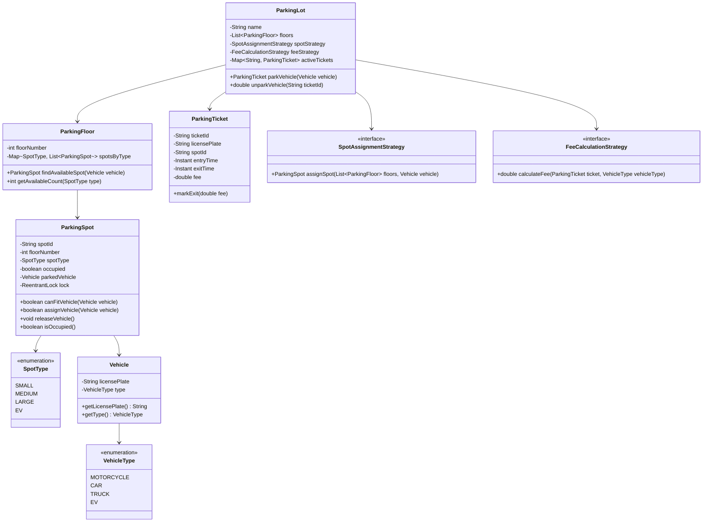
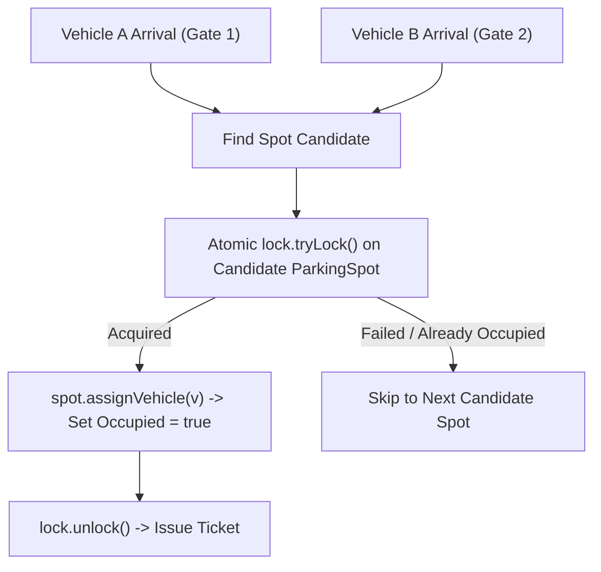

# 01. Design a Parking Lot System

[← Track Hub: LLD & Machine Coding](./README.md) | [Track Hub](./README.md) | [Next: Design an Elevator Control System →](./02-design-an-elevator-control-system.md)

---

## 1. Requirements & Scope

### Functional Requirements
1. **Multi-Floor Support:** The parking lot consists of multiple floors, each with an array of parking spots.
2. **Vehicle & Spot Compatibility:**
   - **Motorcycle:** Fits in Small, Medium, or Large spots.
   - **Car:** Fits in Medium or Large spots.
   - **Truck / Bus:** Fits only in Large spots.
   - **Electric Vehicle (EV):** Fits in EV-equipped spots.
3. **Multiple Entry & Exit Gates:** Multiple vehicles can enter and exit concurrently across different gates.
4. **Ticket Issuance:** Upon entry, a ticket is generated containing a unique ID, license plate, assigned spot ID, and entry timestamp.
5. **Pluggable Spot Assignment Policy:** Supports different allocation algorithms (e.g., nearest entrance, lowest floor first).
6. **Pluggable Fee Calculation Policy:** Supports flat rate, hourly rates, vehicle-dependent rates, and EV surcharge.
7. **Capacity / Display Board:** Real-time visibility into available spots per floor and per vehicle category.

### Non-Functional Requirements
- **Thread Safety:** Multiple concurrent vehicles entering simultaneously must NEVER be assigned the same parking spot (Race Condition Immunity).
- **Extensibility:** Adding new vehicle types or pricing schemes must require zero changes to existing classes (Open/Closed Principle).
- **High Availability & Fault Tolerance:** In-memory state consistency with atomic state transitions.

---

## 2. Core Domain Entities & Class Diagram



---

## 3. Design Patterns Applied & SOLID Principles Alignment

1. **Strategy Pattern (Spot Assignment & Fee Calculation):**
   - Encapsulates spot selection (`LowestFloorFirstStrategy`, `NearestToEntryStrategy`) and fee calculation (`HourlyVehicleRateStrategy`, `FlatRateStrategy`). New strategies can be injected at runtime without touching `ParkingLot`.
2. **Factory Pattern:**
   - Decouples spot creation across diverse spot types (Small, Medium, Large, EV).
3. **Single Responsibility Principle:**
   - `ParkingSpot` solely manages its occupancy state and thread locking.
   - `FeeCalculationStrategy` strictly calculates monetary cost.
   - `ParkingLot` orchestrates gates and ticket state tracking.
4. **Open/Closed Principle:**
   - To add an electric vehicle charging tariff, implement a new `FeeCalculationStrategy` without modifying the core parking lot service.

---

## 4. Concurrency & Thread-Safety Strategy



- **Granular Spot-Level Locking:** Rather than locking the entire `ParkingLot` or entire `ParkingFloor` (which creates a massive bottleneck across gates), each `ParkingSpot` possesses its own `ReentrantLock`.
- **Concurrent Collections:** Active tickets are managed via `ConcurrentHashMap<String, ParkingTicket>`.

---

## 5. Complete Production-Ready Java 17/21 Implementation

```java
package com.prep.lld.parkinglot;

import java.time.Duration;
import java.time.Instant;
import java.util.*;
import java.util.concurrent.*;
import java.util.concurrent.locks.ReentrantLock;

// ==========================================
// 1. Enums & Domain Models
// ==========================================

enum VehicleType {
    MOTORCYCLE, CAR, TRUCK, EV
}

enum SpotType {
    SMALL, MEDIUM, LARGE, EV
}

final class Vehicle {
    private final String licensePlate;
    private final VehicleType type;

    public Vehicle(String licensePlate, VehicleType type) {
        this.licensePlate = Objects.requireNonNull(licensePlate);
        this.type = Objects.requireNonNull(type);
    }

    public String getLicensePlate() { return licensePlate; }
    public VehicleType getType() { return type; }
}

final class ParkingSpot {
    private final String spotId;
    private final int floorNumber;
    private final SpotType spotType;
    private final ReentrantLock lock = new ReentrantLock();
    
    private volatile boolean occupied = false;
    private Vehicle parkedVehicle;

    public ParkingSpot(String spotId, int floorNumber, SpotType spotType) {
        this.spotId = spotId;
        this.floorNumber = floorNumber;
        this.spotType = spotType;
    }

    public boolean canFitVehicle(Vehicle vehicle) {
        return switch (vehicle.getType()) {
            case MOTORCYCLE -> true; // Fits small, medium, large, EV
            case CAR -> spotType == SpotType.MEDIUM || spotType == SpotType.LARGE;
            case TRUCK -> spotType == SpotType.LARGE;
            case EV -> spotType == SpotType.EV || spotType == SpotType.MEDIUM || spotType == SpotType.LARGE;
        };
    }

    public boolean tryAssign(Vehicle vehicle) {
        if (!canFitVehicle(vehicle) || occupied) {
            return false;
        }
        if (lock.tryLock()) {
            try {
                if (!occupied) {
                    this.parkedVehicle = vehicle;
                    this.occupied = true;
                    return true;
                }
            } finally {
                lock.unlock();
            }
        }
        return false;
    }

    public void release() {
        lock.lock();
        try {
            this.parkedVehicle = null;
            this.occupied = false;
        } finally {
            lock.unlock();
        }
    }

    public String getSpotId() { return spotId; }
    public int getFloorNumber() { return floorNumber; }
    public SpotType getSpotType() { return spotType; }
    public boolean isOccupied() { return occupied; }
}

final class ParkingFloor {
    private final int floorNumber;
    private final List<ParkingSpot> spots = new CopyOnWriteArrayList<>();

    public ParkingFloor(int floorNumber) {
        this.floorNumber = floorNumber;
    }

    public void addSpot(ParkingSpot spot) {
        spots.add(spot);
    }

    public List<ParkingSpot> getSpots() {
        return Collections.unmodifiableList(spots);
    }

    public int getFloorNumber() {
        return floorNumber;
    }
}

final class ParkingTicket {
    private final String ticketId;
    private final String licensePlate;
    private final ParkingSpot assignedSpot;
    private final VehicleType vehicleType;
    private final Instant entryTime;
    private Instant exitTime;
    private double fee;

    public ParkingTicket(String ticketId, String licensePlate, ParkingSpot assignedSpot, VehicleType vehicleType) {
        this.ticketId = ticketId;
        this.licensePlate = licensePlate;
        this.assignedSpot = assignedSpot;
        this.vehicleType = vehicleType;
        this.entryTime = Instant.now();
    }

    public void closeTicket(Instant exitTime, double fee) {
        this.exitTime = exitTime;
        this.fee = fee;
    }

    public String getTicketId() { return ticketId; }
    public String getLicensePlate() { return licensePlate; }
    public ParkingSpot getAssignedSpot() { return assignedSpot; }
    public VehicleType getVehicleType() { return vehicleType; }
    public Instant getEntryTime() { return entryTime; }
    public Instant getExitTime() { return exitTime; }
    public double getFee() { return fee; }
}

// ==========================================
// 2. Strategies (Strategy Pattern)
// ==========================================

interface SpotAssignmentStrategy {
    ParkingSpot assignSpot(List<ParkingFloor> floors, Vehicle vehicle);
}

class LowestFloorFirstStrategy implements SpotAssignmentStrategy {
    @Override
    public ParkingSpot assignSpot(List<ParkingFloor> floors, Vehicle vehicle) {
        for (ParkingFloor floor : floors) {
            for (ParkingSpot spot : floor.getSpots()) {
                if (spot.tryAssign(vehicle)) {
                    return spot;
                }
            }
        }
        return null; // No spot available
    }
}

interface FeeCalculationStrategy {
    double calculateFee(ParkingTicket ticket, Instant exitTime);
}

class HourlyVehicleFeeStrategy implements FeeCalculationStrategy {
    @Override
    public double calculateFee(ParkingTicket ticket, Instant exitTime) {
        long durationMillis = Duration.between(ticket.getEntryTime(), exitTime).toMillis();
        // For simulation: 100ms = 1 hour billable
        long hours = Math.max(1, (durationMillis + 99) / 100);

        double hourlyRate = switch (ticket.getVehicleType()) {
            case MOTORCYCLE -> 10.0;
            case CAR -> 25.0;
            case TRUCK -> 50.0;
            case EV -> 35.0; // Includes charging base
        };

        return hours * hourlyRate;
    }
}

// ==========================================
// 3. Central Service (Facade / Singleton)
// ==========================================

public final class ParkingLot {
    private final String name;
    private final List<ParkingFloor> floors = new CopyOnWriteArrayList<>();
    private final Map<String, ParkingTicket> activeTickets = new ConcurrentHashMap<>();
    
    private SpotAssignmentStrategy spotStrategy;
    private FeeCalculationStrategy feeStrategy;

    public ParkingLot(String name, SpotAssignmentStrategy spotStrategy, FeeCalculationStrategy feeStrategy) {
        this.name = name;
        this.spotStrategy = Objects.requireNonNull(spotStrategy);
        this.feeStrategy = Objects.requireNonNull(feeStrategy);
    }

    public void addFloor(ParkingFloor floor) {
        floors.add(floor);
    }

    public ParkingTicket parkVehicle(Vehicle vehicle) {
        ParkingSpot spot = spotStrategy.assignSpot(floors, vehicle);
        if (spot == null) {
            throw new IllegalStateException("Parking Full: No compatible spot found for " + vehicle.getType());
        }

        String ticketId = "TKT-" + UUID.randomUUID().toString().substring(0, 8).toUpperCase();
        ParkingTicket ticket = new ParkingTicket(ticketId, vehicle.getLicensePlate(), spot, vehicle.getType());
        activeTickets.put(ticketId, ticket);
        return ticket;
    }

    public double unparkVehicle(String ticketId) {
        ParkingTicket ticket = activeTickets.remove(ticketId);
        if (ticket == null) {
            throw new IllegalArgumentException("Invalid ticket ID: " + ticketId);
        }

        Instant exitTime = Instant.now();
        double fee = feeStrategy.calculateFee(ticket, exitTime);
        ticket.closeTicket(exitTime, fee);

        // Release spot
        ticket.getAssignedSpot().release();
        return fee;
    }

    public void displayStatus() {
        System.out.println("\n--- Real-Time Parking Lot Availability ---");
        for (ParkingFloor floor : floors) {
            long freeSmall = floor.getSpots().stream().filter(s -> !s.isOccupied() && s.getSpotType() == SpotType.SMALL).count();
            long freeMed = floor.getSpots().stream().filter(s -> !s.isOccupied() && s.getSpotType() == SpotType.MEDIUM).count();
            long freeLarge = floor.getSpots().stream().filter(s -> !s.isOccupied() && s.getSpotType() == SpotType.LARGE).count();
            long freeEv = floor.getSpots().stream().filter(s -> !s.isOccupied() && s.getSpotType() == SpotType.EV).count();
            System.out.printf("Floor %d | Small: %d | Medium: %d | Large: %d | EV: %d%n",
                    floor.getFloorNumber(), freeSmall, freeMed, freeLarge, freeEv);
        }
        System.out.println("------------------------------------------\n");
    }

    // ==========================================
    // 4. Driver & Multi-Threaded Simulation
    // ==========================================
    public static void main(String[] args) throws InterruptedException {
        System.out.println("=== Starting Multi-Floor Concurrent Parking Lot Demo ===");

        ParkingLot lot = new ParkingLot(
                "Metro Tech Center Parking",
                new LowestFloorFirstStrategy(),
                new HourlyVehicleFeeStrategy()
        );

        // Build 2 Floors
        ParkingFloor f1 = new ParkingFloor(1);
        f1.addSpot(new ParkingSpot("F1-S1", 1, SpotType.SMALL));
        f1.addSpot(new ParkingSpot("F1-M1", 1, SpotType.MEDIUM));
        f1.addSpot(new ParkingSpot("F1-L1", 1, SpotType.LARGE));
        f1.addSpot(new ParkingSpot("F1-E1", 1, SpotType.EV));

        ParkingFloor f2 = new ParkingFloor(2);
        f2.addSpot(new ParkingSpot("F2-M1", 2, SpotType.MEDIUM));
        f2.addSpot(new ParkingSpot("F2-L1", 2, SpotType.LARGE));

        lot.addFloor(f1);
        lot.addFloor(f2);
        lot.displayStatus();

        // Simulate concurrent vehicle entries across threads
        ExecutorService executor = Executors.newFixedThreadPool(4);
        List<Vehicle> arrivals = List.of(
                new Vehicle("MH-01-AB-1234", VehicleType.CAR),
                new Vehicle("MH-02-CD-5678", VehicleType.CAR),
                new Vehicle("MH-03-EF-9012", VehicleType.TRUCK),
                new Vehicle("MH-04-EV-7777", VehicleType.EV)
        );

        List<ParkingTicket> issuedTickets = new CopyOnWriteArrayList<>();

        for (Vehicle v : arrivals) {
            executor.submit(() -> {
                try {
                    ParkingTicket ticket = lot.parkVehicle(v);
                    issuedTickets.add(ticket);
                    System.out.printf("[SUCCESS] Vehicle %s (%s) parked at %s (Ticket: %s)%n",
                            v.getLicensePlate(), v.getType(), ticket.getAssignedSpot().getSpotId(), ticket.getTicketId());
                } catch (Exception ex) {
                    System.err.printf("[FAILED] Could not park %s: %s%n", v.getLicensePlate(), ex.getMessage());
                }
            });
        }

        executor.shutdown();
        executor.awaitTermination(2, TimeUnit.SECONDS);

        lot.displayStatus();

        // Process exits
        for (ParkingTicket t : issuedTickets) {
            Thread.sleep(150); // Simulate time parked
            double fee = lot.unparkVehicle(t.getTicketId());
            System.out.printf("[EXIT] Ticket %s (%s) cleared. Total Fee Charged: $%.2f%n",
                    t.getTicketId(), t.getLicensePlate(), fee);
        }

        lot.displayStatus();
        System.out.println("=== Parking Lot Demo Finished Successfully ===");
    }
}
```

---

## 6. Extensibility & Interview Follow-ups

- **Q1: How would you add Valet Parking support?**
  Add a `ValetTicket` that decorates `ParkingTicket` with `valetEmployeeId` and adds a fixed service fee via a `ValetFeeDecorator`.
- **Q2: How do you handle Dynamic Surge Pricing during peak hours?**
  Implement `SurgePricingDecorator` wrapping `FeeCalculationStrategy`. Inspect occupancy percentage; if occupancy exceeds $85\%$, apply a $1.5\times$ surge multiplier.
- **Q3: What if parking spots have IoT sensors sending status over MQTT?**
  Adopt the **Observer Pattern**. Have `ParkingSpot` listen to `SensorEvent` updates. If a sensor reports occupancy without a valid ticket, trigger a `SecurityAlarmEvent`.

---

<div align="center">

| [← Track Hub: LLD & Machine Coding](./README.md) | [Track Hub: LLD & Machine Coding](./README.md) | [Next: Design an Elevator Control System →](./02-design-an-elevator-control-system.md) |
| :--- | :---: | ---: |

</div>
