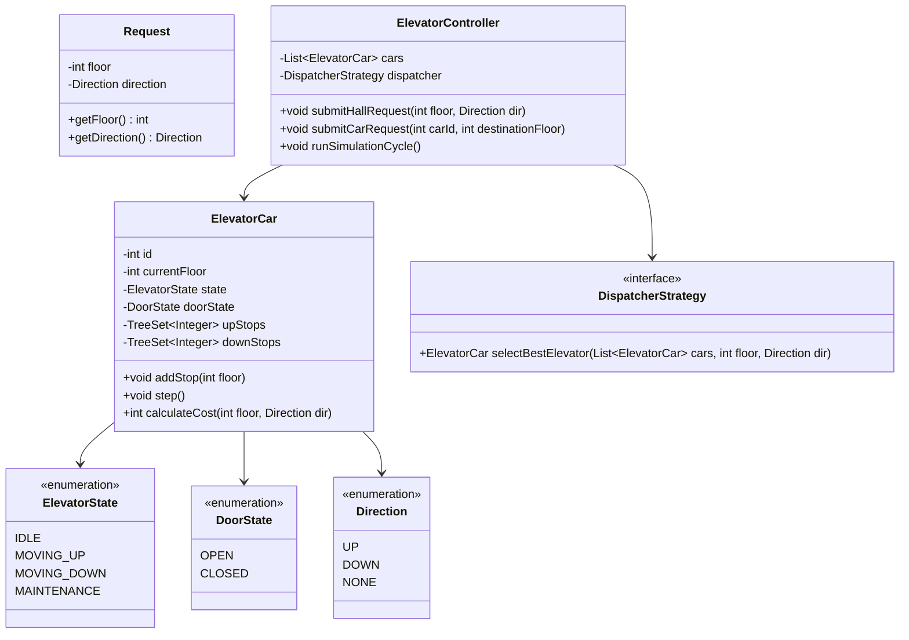
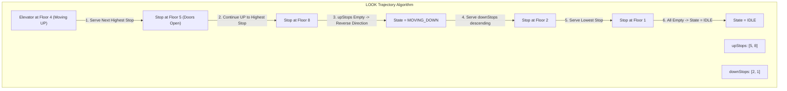

# 02. Design an Elevator Control System

[← Back to Parking Lot System](./01-design-a-parking-lot-system.md) | [Track Hub](./README.md) | [Next: Design an In-Memory Key-Value Store →](./03-design-an-in-memory-key-value-store-with-ttl-and-transactions.md)

---

## 1. Requirements & Scope

### Functional Requirements
1. **Multi-Car Elevator Bank:** Controls a bank of $M$ elevators serving an $N$-story building.
2. **Dual-Request Architecture:**
   - **External Hall Requests:** Passenger on floor $F$ presses an `UP` or `DOWN` button.
   - **Internal Car Requests:** Passenger inside Elevator $E$ presses destination button $D$.
3. **Elevator States & Transitions:**
   - Motion: `IDLE`, `MOVING_UP`, `MOVING_DOWN`.
   - Doors: `OPEN`, `CLOSED`.
4. **SCAN / LOOK Scheduling Algorithm:** An elevator moving in direction $D$ continues serving all floors along its trajectory before reversing direction, minimizing wait time and mechanical wear.
5. **Central Dispatcher:** Evaluates all elevators and assigns hall requests to the best candidate car based on proximity, direction, and current load.

### Non-Functional Requirements
- **Thread Safety:** Elevator cars run concurrent motion loops while passengers submit external and internal requests asynchronously.
- **Starvation Freedom:** Requests must not be delayed indefinitely while other floors are repeatedly serviced.
- **Graceful Degradation:** An elevator entering maintenance or emergency mode is cleanly removed from the dispatch pool.

---

## 2. Core Domain Entities & Class Diagram



---

## 3. Design Patterns Applied & SOLID Principles Alignment

1. **State Pattern:**
   - Manages transitions between `IDLE`, `MOVING_UP`, and `MOVING_DOWN`. Moving behavior and stop-selection vary strictly according to current motion state.
2. **Strategy Pattern (Elevator Dispatcher):**
   - Decouples dispatch heuristics (`ProximityDispatcher`, `LOOKCostDispatcher`, `EnergyEfficientDispatcher`) from the controller.
3. **Producer-Consumer Threading Model:**
   - Hall and car buttons produce floor requests; elevator cars consume stops along their trajectory.

---

## 4. The SCAN / LOOK Scheduling Algorithm



- If moving `UP`: Serves `upStops.ceiling(currentFloor)`. When no higher stops remain, reverses direction to `MOVING_DOWN`.
- If moving `DOWN`: Serves `downStops.floor(currentFloor)`. When no lower stops remain, reverses direction to `MOVING_UP`.

---

## 5. Complete Production-Ready Java 17/21 Implementation

```java
package com.prep.lld.elevator;

import java.util.*;
import java.util.concurrent.*;
import java.util.concurrent.locks.ReentrantLock;

// ==========================================
// 1. Enums & Request Record
// ==========================================

enum Direction {
    UP, DOWN, NONE
}

enum ElevatorState {
    IDLE, MOVING_UP, MOVING_DOWN, MAINTENANCE
}

enum DoorState {
    OPEN, CLOSED
}

record HallRequest(int floor, Direction direction) {}

// ==========================================
// 2. Elevator Car (The Core Engine)
// ==========================================

final class ElevatorCar {
    private final int id;
    private final int minFloor;
    private final int maxFloor;
    private final ReentrantLock lock = new ReentrantLock();

    private int currentFloor;
    private ElevatorState state = ElevatorState.IDLE;
    private DoorState doorState = DoorState.CLOSED;

    // Ordered stops: SCAN / LOOK pattern
    private final TreeSet<Integer> upStops = new TreeSet<>();
    private final TreeSet<Integer> downStops = new TreeSet<>(Collections.reverseOrder());

    public ElevatorCar(int id, int minFloor, int maxFloor) {
        this.id = id;
        this.minFloor = minFloor;
        this.maxFloor = maxFloor;
        this.currentFloor = minFloor;
    }

    public void addStop(int targetFloor) {
        if (targetFloor < minFloor || targetFloor > maxFloor) {
            throw new IllegalArgumentException("Floor out of building bounds: " + targetFloor);
        }

        lock.lock();
        try {
            if (targetFloor == currentFloor && state == ElevatorState.IDLE) {
                openAndCloseDoors();
                return;
            }

            if (targetFloor > currentFloor) {
                upStops.add(targetFloor);
                if (state == ElevatorState.IDLE) {
                    state = ElevatorState.MOVING_UP;
                }
            } else {
                downStops.add(targetFloor);
                if (state == ElevatorState.IDLE) {
                    state = ElevatorState.MOVING_DOWN;
                }
            }
        } finally {
            lock.unlock();
        }
    }

    /**
     * Executes one discrete simulation step of elevator movement.
     */
    public void step() {
        lock.lock();
        try {
            if (state == ElevatorState.IDLE) {
                return;
            }

            if (state == ElevatorState.MOVING_UP) {
                currentFloor++;
                System.out.printf("[Car %d] Moved UP to Floor %d%n", id, currentFloor);

                if (upStops.contains(currentFloor)) {
                    upStops.remove(currentFloor);
                    openAndCloseDoors();
                }

                // Check direction continuation
                Integer nextHigher = upStops.ceiling(currentFloor);
                if (nextHigher == null) {
                    // No higher stops; switch to down stops or IDLE
                    if (!downStops.isEmpty()) {
                        state = ElevatorState.MOVING_DOWN;
                    } else {
                        state = ElevatorState.IDLE;
                    }
                }
            } else if (state == ElevatorState.MOVING_DOWN) {
                currentFloor--;
                System.out.printf("[Car %d] Moved DOWN to Floor %d%n", id, currentFloor);

                if (downStops.contains(currentFloor)) {
                    downStops.remove(currentFloor);
                    openAndCloseDoors();
                }

                // Check direction continuation
                Integer nextLower = downStops.floor(currentFloor);
                if (nextLower == null) {
                    // No lower stops; switch to up stops or IDLE
                    if (!upStops.isEmpty()) {
                        state = ElevatorState.MOVING_UP;
                    } else {
                        state = ElevatorState.IDLE;
                    }
                }
            }
        } finally {
            lock.unlock();
        }
    }

    private void openAndCloseDoors() {
        doorState = DoorState.OPEN;
        System.out.printf("[Car %d] *** Doors OPENING at Floor %d (Passenger Exchange) ***%n", id, currentFloor);
        doorState = DoorState.CLOSED;
    }

    /**
     * Heuristic cost function for dispatch calculation.
     */
    public int calculateCost(int targetFloor, Direction dir) {
        lock.lock();
        try {
            if (state == ElevatorState.IDLE) {
                return Math.abs(currentFloor - targetFloor);
            }

            if (state == ElevatorState.MOVING_UP) {
                if (dir == Direction.UP && targetFloor >= currentFloor) {
                    return targetFloor - currentFloor; // Directly along path
                } else {
                    // Cost to reach highest upStop + turn around to targetFloor
                    int highest = upStops.isEmpty() ? currentFloor : upStops.last();
                    return (highest - currentFloor) + Math.abs(highest - targetFloor);
                }
            }

            if (state == ElevatorState.MOVING_DOWN) {
                if (dir == Direction.DOWN && targetFloor <= currentFloor) {
                    return currentFloor - targetFloor; // Directly along path
                } else {
                    int lowest = downStops.isEmpty() ? currentFloor : downStops.first();
                    return (currentFloor - lowest) + Math.abs(lowest - targetFloor);
                }
            }

            return Integer.MAX_VALUE / 2;
        } finally {
            lock.unlock();
        }
    }

    public int getId() { return id; }
    public int getCurrentFloor() { return currentFloor; }
    public ElevatorState getState() { return state; }
}

// ==========================================
// 3. Dispatcher Strategy (Strategy Pattern)
// ==========================================

interface DispatcherStrategy {
    ElevatorCar selectBestCar(List<ElevatorCar> cars, int targetFloor, Direction dir);
}

class MinimumCostDispatcher implements DispatcherStrategy {
    @Override
    public ElevatorCar selectBestCar(List<ElevatorCar> cars, int targetFloor, Direction dir) {
        ElevatorCar bestCar = null;
        int minCost = Integer.MAX_VALUE;

        for (ElevatorCar car : cars) {
            int cost = car.calculateCost(targetFloor, dir);
            if (cost < minCost) {
                minCost = cost;
                bestCar = car;
            }
        }
        return bestCar;
    }
}

// ==========================================
// 4. Central Controller (Facade)
// ==========================================

public final class ElevatorController {
    private final List<ElevatorCar> cars = new CopyOnWriteArrayList<>();
    private final DispatcherStrategy dispatcher;

    public ElevatorController(int numCars, int minFloor, int maxFloor, DispatcherStrategy dispatcher) {
        this.dispatcher = Objects.requireNonNull(dispatcher);
        for (int i = 1; i <= numCars; i++) {
            cars.add(new ElevatorCar(i, minFloor, maxFloor));
        }
    }

    public void submitHallRequest(int floor, Direction direction) {
        ElevatorCar bestCar = dispatcher.selectBestCar(cars, floor, direction);
        if (bestCar != null) {
            System.out.printf("[DISPATCH] Assigned Floor %d (%s) to Car %d%n", floor, direction, bestCar.getId());
            bestCar.addStop(floor);
        }
    }

    public void submitCarRequest(int carId, int destinationFloor) {
        for (ElevatorCar car : cars) {
            if (car.getId() == carId) {
                System.out.printf("[INTERNAL] Passenger in Car %d requested Floor %d%n", carId, destinationFloor);
                car.addStop(destinationFloor);
                return;
            }
        }
        throw new IllegalArgumentException("Invalid Car ID: " + carId);
    }

    public void stepSimulation() {
        for (ElevatorCar car : cars) {
            car.step();
        }
    }

    // ==========================================
    // 5. Driver & Simulation Demonstration
    // ==========================================
    public static void main(String[] args) {
        System.out.println("=== Starting Elevator Control System Simulation ===");

        // Building with 2 Elevators, Floors 1 to 10
        ElevatorController controller = new ElevatorController(2, 1, 10, new MinimumCostDispatcher());

        // Step 1: External Passengers call elevators
        controller.submitHallRequest(3, Direction.UP);
        controller.submitHallRequest(7, Direction.UP);

        // Step 2: Simulate discrete clock ticks
        for (int tick = 1; tick <= 5; tick++) {
            System.out.println("\n--- Simulation Tick " + tick + " ---");
            controller.stepSimulation();
        }

        // Step 3: Passenger enters Car 1 at Floor 3 and presses Floor 6
        controller.submitCarRequest(1, 6);

        // Run remaining simulation ticks
        for (int tick = 6; tick <= 10; tick++) {
            System.out.println("\n--- Simulation Tick " + tick + " ---");
            controller.stepSimulation();
        }

        System.out.println("\n=== Elevator Simulation Completed ===");
    }
}
```

---

## 6. Extensibility & Interview Follow-ups

- **Q1: How would you handle Weight Capacity Limits?**
  Add a `weightSensor` to `ElevatorCar`. If `currentWeight > maxWeightLimit`, transition door state to `OPEN`, disable motor motion, and emit a buzzer event until load drops.
- **Q2: What is Destination Dispatch (Modern smart elevators)?**
  In Destination Dispatch, passengers specify their destination floor *at the lobby kiosk* before boarding. The dispatcher groups passengers traveling to identical or adjacent floors into the same elevator car, drastically cutting intermediate stops.
- **Q3: How do you support VIP / Fire Emergency Override?**
  Add a `Priority` field or dedicated `EmergencyCommand`. When engaged, the elevator clears all standard stops, descends immediately to Ground Floor 1, and holds doors open until reset by physical fire key.

---

<div align="center">

| [← Back to Parking Lot System](./01-design-a-parking-lot-system.md) | [Track Hub: LLD & Machine Coding](./README.md) | [Next: Design an In-Memory Key-Value Store →](./03-design-an-in-memory-key-value-store-with-ttl-and-transactions.md) |
| :--- | :---: | ---: |

</div>
