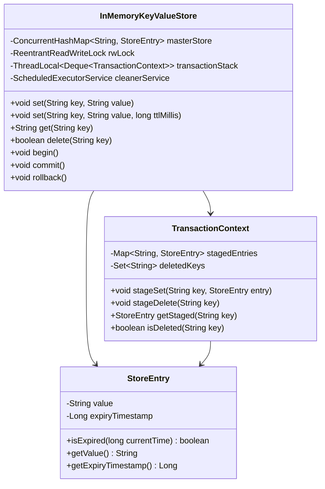
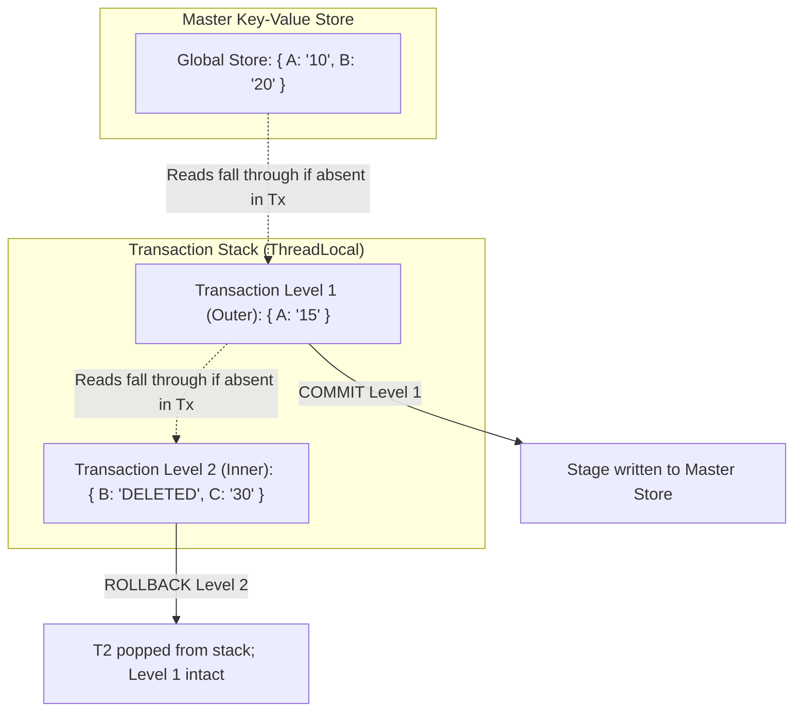

# 03. Design an In-Memory Key-Value Store with TTL & Transactions

[← Back to Elevator Control System](./02-design-an-elevator-control-system.md) | [Track Hub](./README.md) | [Next: Design an Expense Sharing System (Splitwise) →](./04-design-an-expense-sharing-system-splitwise.md)

---

## 1. Requirements & Scope

### Functional Requirements
1. **Core CRUD Operations:**
   - `get(key)`: Retrieves value for key. Returns `null` if absent or expired.
   - `set(key, value)`: Stores key-value pair.
   - `delete(key)`: Deletes key. Returns boolean success.
2. **Time-To-Live (TTL) & Expiration:**
   - `set(key, value, ttlMillis)`: Assigns an expiry timestamp to the key.
   - **Passive Expiration:** Key is checked on read (`get`); if expired, it is deleted and treated as absent.
   - **Active Expiration:** Background daemon thread sweeps and prunes expired keys periodically to prevent memory leaks.
3. **Transaction Management (ACID Semantics):**
   - `begin()`: Initiates a new transaction scope.
   - `commit()`: Atomically commits all changes in the current transaction to the global store.
   - `rollback()`: Discards all mutations staged in the current transaction.
   - **Nested Transactions:** Multiple nested `begin()` calls form a stack. An inner `rollback()` only cancels changes made since that specific `begin()`; an inner `commit()` merges staged mutations into the parent transaction scope.

### Non-Functional Requirements
- **Thread Safety:** Master store accessed concurrently by multiple reader and writer threads (`ReentrantReadWriteLock`).
- **Isolation:** Transactions executing on different threads remain completely isolated until committed.
- **Memory Optimization:** Tombstones and staging buffers must be garbage collected promptly upon transaction commit/rollback.

---

## 2. Core Domain Entities & Class Diagram



---

## 3. Design Patterns Applied & SOLID Principles Alignment

1. **Memento Pattern (Transactions):**
   - Each transaction layer acts as an isolated delta snapshot (Memento) capturing changes without modifying the underlying master store prematurely.
2. **Command Pattern:**
   - Operations within transactions (`SET`, `DELETE`) are staged as pending commands executed in batch upon `commit()`.
3. **Single Responsibility Principle:**
   - `StoreEntry` strictly encapsulates value and TTL expiry logic.
   - `TransactionContext` manages thread-scoped staging deltas.
   - `InMemoryKeyValueStore` coordinates global storage and concurrent synchronization.

---

## 4. Transaction Isolation & Nested Rollback Engine



---

## 5. Complete Production-Ready Java 17/21 Implementation

```java
package com.prep.lld.kvstore;

import java.time.Instant;
import java.util.*;
import java.util.concurrent.*;
import java.util.concurrent.locks.ReentrantReadWriteLock;

// ==========================================
// 1. Store Entry with TTL Support
// ==========================================

final class StoreEntry {
    private final String value;
    private final Long expiryTimeMillis; // null if permanent

    public StoreEntry(String value, Long expiryTimeMillis) {
        this.value = value;
        this.expiryTimeMillis = expiryTimeMillis;
    }

    public boolean isExpired(long nowMillis) {
        return expiryTimeMillis != null && nowMillis >= expiryTimeMillis;
    }

    public String getValue() { return value; }
    public Long getExpiryTimeMillis() { return expiryTimeMillis; }
}

// ==========================================
// 2. Transaction Context (Staging Buffer)
// ==========================================

final class TransactionContext {
    private final Map<String, StoreEntry> staged = new HashMap<>();
    private final Set<String> deleted = new HashSet<>();

    public void put(String key, StoreEntry entry) {
        deleted.remove(key);
        staged.put(key, entry);
    }

    public void delete(String key) {
        staged.remove(key);
        deleted.add(key);
    }

    public StoreEntry get(String key) {
        return staged.get(key);
    }

    public boolean isDeleted(String key) {
        return deleted.contains(key);
    }

    public Map<String, StoreEntry> getStaged() { return staged; }
    public Set<String> getDeleted() { return deleted; }
}

// ==========================================
// 3. In-Memory Key-Value Store Engine
// ==========================================

public final class InMemoryKeyValueStore {
    private final ConcurrentHashMap<String, StoreEntry> masterStore = new ConcurrentHashMap<>();
    private final ReentrantReadWriteLock rwLock = new ReentrantReadWriteLock();
    
    // Thread-isolated transaction stack for nested transaction support
    private final ThreadLocal<Deque<TransactionContext>> txStack = ThreadLocal.withInitial(ArrayDeque::new);

    private final ScheduledExecutorService activeCleaner = Executors.newSingleThreadScheduledExecutor(r -> {
        Thread t = new Thread(r, "kv-ttl-cleaner");
        t.setDaemon(true);
        return t;
    });

    public InMemoryKeyValueStore() {
        // Active TTL Eviction sweeps every 1 second
        activeCleaner.scheduleAtFixedRate(this::activeTtlCleanup, 1, 1, TimeUnit.SECONDS);
    }

    // --- Core Operations ---

    public void set(String key, String value) {
        set(key, value, null);
    }

    public void set(String key, String value, Long ttlMillis) {
        Long expiryTime = ttlMillis != null ? System.currentTimeMillis() + ttlMillis : null;
        StoreEntry entry = new StoreEntry(value, expiryTime);

        Deque<TransactionContext> stack = txStack.get();
        if (!stack.isEmpty()) {
            // Stage in current transaction
            stack.peek().put(key, entry);
            return;
        }

        // Direct write to master store
        rwLock.writeLock().lock();
        try {
            masterStore.put(key, entry);
        } finally {
            rwLock.writeLock().unlock();
        }
    }

    public String get(String key) {
        long now = System.currentTimeMillis();
        Deque<TransactionContext> stack = txStack.get();

        // 1. If inside transaction, check transaction stack from top to bottom
        if (!stack.isEmpty()) {
            for (TransactionContext ctx : stack) {
                if (ctx.isDeleted(key)) {
                    return null;
                }
                StoreEntry stagedEntry = ctx.get(key);
                if (stagedEntry != null) {
                    if (stagedEntry.isExpired(now)) {
                        ctx.delete(key);
                        return null;
                    }
                    return stagedEntry.getValue();
                }
            }
        }

        // 2. Query Master Store with Read Lock
        rwLock.readLock().lock();
        try {
            StoreEntry entry = masterStore.get(key);
            if (entry == null) {
                return null;
            }

            // Passive TTL check
            if (entry.isExpired(now)) {
                // Elevate to write lock to evict expired key
                rwLock.readLock().unlock();
                rwLock.writeLock().lock();
                try {
                    masterStore.remove(key);
                } finally {
                    rwLock.readLock().lock(); // Downgrade back to read lock
                    rwLock.writeLock().unlock();
                }
                return null;
            }

            return entry.getValue();
        } finally {
            rwLock.readLock().unlock();
        }
    }

    public boolean delete(String key) {
        Deque<TransactionContext> stack = txStack.get();
        if (!stack.isEmpty()) {
            stack.peek().delete(key);
            return true;
        }

        rwLock.writeLock().lock();
        try {
            return masterStore.remove(key) != null;
        } finally {
            rwLock.writeLock().unlock();
        }
    }

    // --- Transaction Semantics ---

    public void begin() {
        txStack.get().push(new TransactionContext());
    }

    public void commit() {
        Deque<TransactionContext> stack = txStack.get();
        if (stack.isEmpty()) {
            throw new IllegalStateException("No active transaction to commit!");
        }

        TransactionContext currentTx = stack.pop();

        if (!stack.isEmpty()) {
            // Nested commit: merge current transaction into parent transaction
            TransactionContext parentTx = stack.peek();
            for (String delKey : currentTx.getDeleted()) {
                parentTx.delete(delKey);
            }
            for (Map.Entry<String, StoreEntry> entry : currentTx.getStaged().entrySet()) {
                parentTx.put(entry.getKey(), entry.getValue());
            }
        } else {
            // Root commit: apply atomically to master store under write lock
            rwLock.writeLock().lock();
            try {
                for (String delKey : currentTx.getDeleted()) {
                    masterStore.remove(delKey);
                }
                masterStore.putAll(currentTx.getStaged());
            } finally {
                rwLock.writeLock().unlock();
            }
        }
    }

    public void rollback() {
        Deque<TransactionContext> stack = txStack.get();
        if (stack.isEmpty()) {
            throw new IllegalStateException("No active transaction to rollback!");
        }
        // Discard the topmost transaction context
        stack.pop();
    }

    // --- Active Cleaner Daemon ---

    private void activeTtlCleanup() {
        long now = System.currentTimeMillis();
        // Sample and evict expired keys under write lock
        rwLock.writeLock().lock();
        try {
            masterStore.entrySet().removeIf(entry -> entry.getValue().isExpired(now));
        } finally {
            rwLock.writeLock().unlock();
        }
    }

    public void shutdown() {
        activeCleaner.shutdownNow();
    }

    // ==========================================
    // 4. Driver & Multi-Feature Simulation
    // ==========================================
    public static void main(String[] args) throws InterruptedException {
        System.out.println("=== Starting In-Memory KV Store with TTL & Transactions ===");

        InMemoryKeyValueStore store = new InMemoryKeyValueStore();

        // 1. Basic CRUD
        store.set("user", "Alice");
        System.out.println("GET user: " + store.get("user")); // Alice

        // 2. TTL Expiration Demo (Passive & Active)
        System.out.println("\n--- Testing TTL Expiration (200ms) ---");
        store.set("tempSession", "XYZ-999", 200L);
        System.out.println("Immediate GET tempSession: " + store.get("tempSession")); // XYZ-999
        Thread.sleep(300);
        System.out.println("GET tempSession after 300ms: " + store.get("tempSession")); // null (expired)

        // 3. Simple Transaction with Rollback
        System.out.println("\n--- Testing Transaction Rollback ---");
        store.begin();
        store.set("user", "Bob");
        store.set("role", "Admin");
        System.out.println("Inside Tx - user: " + store.get("user")); // Bob
        System.out.println("Inside Tx - role: " + store.get("role")); // Admin
        store.rollback();
        System.out.println("After Rollback - user: " + store.get("user")); // Alice
        System.out.println("After Rollback - role: " + store.get("role")); // null

        // 4. Nested Transactions
        System.out.println("\n--- Testing Nested Transactions ---");
        store.begin(); // Level 1
        store.set("A", "10");
        store.begin(); // Level 2
        store.set("B", "20");
        store.rollback(); // Rollback Level 2
        System.out.println("After Level 2 Rollback - A: " + store.get("A")); // 10
        System.out.println("After Level 2 Rollback - B: " + store.get("B")); // null
        store.commit(); // Commit Level 1
        System.out.println("After Level 1 Commit - A: " + store.get("A")); // 10

        store.shutdown();
        System.out.println("\n=== KV Store Simulation Completed Successfully ===");
    }
}
```

---

## 6. Extensibility & Interview Follow-ups

- **Q1: How would you add Write-Ahead Logging (WAL) for durability?**
  Before applying mutations to `masterStore`, append an append-only binary log entry (`SET key value timestamp\n`) via `FileChannel`. On reboot, replay the log file to reconstruct state.
- **Q2: How do you handle Memory Limits (LRU Eviction)?**
  Maintain a doubly linked list of keys or use Java's `LinkedHashMap(16, 0.75f, true)`. When JVM memory consumption reaches a defined threshold, evict from the tail of the LRU chain.
- **Q3: What transaction isolation level does this provide?**
  This architecture provides **Read Committed / Snapshot-like Isolation**. Readers outside transactions do not see uncommitted staged writes (no Dirty Reads).

---

<div align="center">

| [← Back to Elevator Control System](./02-design-an-elevator-control-system.md) | [Track Hub: LLD & Machine Coding](./README.md) | [Next: Design an Expense Sharing System (Splitwise) →](./04-design-an-expense-sharing-system-splitwise.md) |
| :--- | :---: | ---: |

</div>
