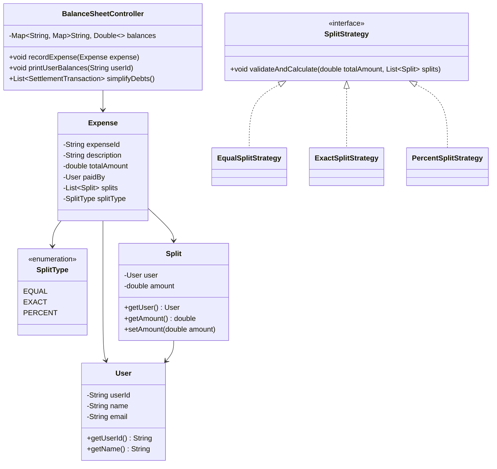
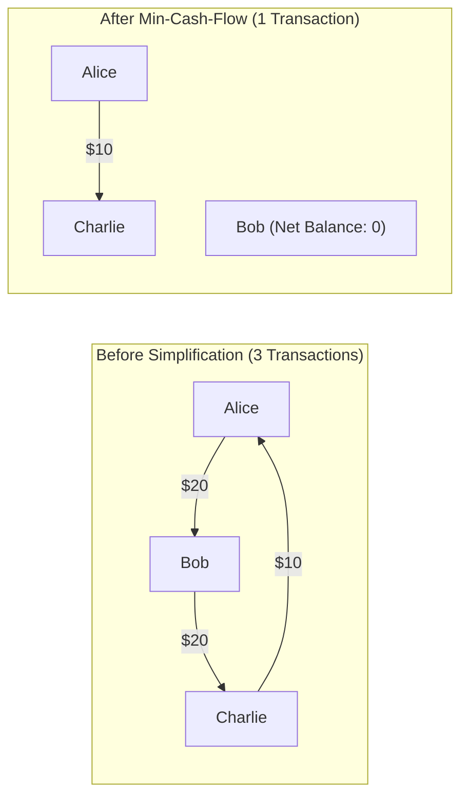

# 04. Design an Expense Sharing System (Splitwise)

[← Back to In-Memory Key-Value Store](./03-design-an-in-memory-key-value-store-with-ttl-and-transactions.md) | [Track Hub](./README.md) | [Next: Design a Movie Ticket Booking System (BookMyShow) →](./05-design-a-movie-ticket-booking-system-bookmyshow.md)

---

## 1. Requirements & Scope

### Functional Requirements
1. **User Management:** Users have unique IDs, names, and contact details.
2. **Expense Management:**
   - Any user can create an expense by paying an amount on behalf of a group of participants.
   - An expense is divided according to pluggable split strategies.
3. **Pluggable Split Strategies (Strategy Pattern):**
   - **EQUAL:** Total amount divided equally among all participants (handling fractional cents).
   - **EXACT:** Each participant owes an explicitly specified dollar amount (must sum exactly to total).
   - **PERCENT:** Each participant owes a percentage (must sum to $100.0\%$).
4. **User Balance Sheet:**
   - Real-time ledger tracking bilateral balances: "User A owes User B $X".
5. **Debt Simplification Algorithm (Min-Cash-Flow):**
   - Transitive debt settlement minimizing the total number of monetary transactions needed to balance the group ledger.

### Non-Functional Requirements
- **Financial Precision:** Currency computations must eliminate floating-point rounding inaccuracies (scaled integer cents or `BigDecimal`).
- **Thread Safety:** Multiple concurrent expense additions must update balance sheets atomically.
- **Auditability:** Complete historical ledger recording all expenses and settlements.

---

## 2. Core Domain Entities & Class Diagram



---

## 3. Design Patterns Applied & SOLID Principles Alignment

1. **Strategy Pattern (Expense Splitting):**
   - `EqualSplitStrategy`, `ExactSplitStrategy`, and `PercentSplitStrategy` encapsulate distinct validation formulas and amount computations.
2. **Factory Pattern:**
   - Instantiates appropriate `SplitStrategy` based on `SplitType`.
3. **Observer Pattern (Settlement Notifications):**
   - Emits alerts to participants whenever a new expense is logged or a debt settled.

---

## 4. The Min-Cash-Flow Debt Simplification Algorithm

Without debt simplification, a group of $N$ friends can accumulate up to $\frac{N(N - 1)}{2}$ bilateral debts ($\mathcal{O}(N^2)$ transactions).



### Algorithm Steps:
1. Compute net balance for each user: $\text{net}[u] = \sum \text{credited} - \sum \text{debited}$.
2. Users with $\text{net}[u] = 0$ are fully settled.
3. Find the maximum debtor (most negative net balance) and maximum creditor (most positive net balance).
4. Settle $\min(|\text{maxDebtor}|, \text{maxCreditor})$ between them.
5. Repeat until all balances reach zero. This reduces total transactions to at most $N - 1$.

---

## 5. Complete Production-Ready Java 17/21 Implementation

```java
package com.prep.lld.splitwise;

import java.util.*;
import java.util.concurrent.ConcurrentHashMap;
import java.util.concurrent.locks.ReentrantLock;

// ==========================================
// 1. Core Domain Models
// ==========================================

record User(String id, String name, String email) {}

enum SplitType {
    EQUAL, EXACT, PERCENT
}

class Split {
    private final User user;
    private double amount;

    public Split(User user) {
        this.user = Objects.requireNonNull(user);
    }

    public Split(User user, double amount) {
        this.user = Objects.requireNonNull(user);
        this.amount = amount;
    }

    public User getUser() { return user; }
    public double getAmount() { return amount; }
    public void setAmount(double amount) { this.amount = amount; }
}

final class PercentSplit extends Split {
    private final double percent;

    public PercentSplit(User user, double percent) {
        super(user);
        this.percent = percent;
    }

    public double getPercent() { return percent; }
}

final class Expense {
    private final String id;
    private final String description;
    private final double amount;
    private final User paidBy;
    private final List<Split> splits;
    private final SplitType splitType;

    public Expense(String id, String description, double amount, User paidBy, List<Split> splits, SplitType splitType) {
        this.id = id;
        this.description = description;
        this.amount = amount;
        this.paidBy = paidBy;
        this.splits = splits;
        this.splitType = splitType;
    }

    public String getId() { return id; }
    public double getAmount() { return amount; }
    public User getPaidBy() { return paidBy; }
    public List<Split> getSplits() { return splits; }
}

// ==========================================
// 2. Splitting Strategies (Strategy Pattern)
// ==========================================

interface SplitStrategy {
    void calculateAndValidate(double totalAmount, List<Split> splits);
}

class EqualSplitStrategy implements SplitStrategy {
    @Override
    public void calculateAndValidate(double totalAmount, List<Split> splits) {
        if (splits.isEmpty()) return;
        int n = splits.size();
        double equalShare = Math.floor((totalAmount / n) * 100.0) / 100.0;
        double remainder = Math.round((totalAmount - (equalShare * n)) * 100.0) / 100.0;

        for (int i = 0; i < n; i++) {
            double share = equalShare + (i == 0 ? remainder : 0.0);
            splits.get(i).setAmount(share);
        }
    }
}

class ExactSplitStrategy implements SplitStrategy {
    @Override
    public void calculateAndValidate(double totalAmount, List<Split> splits) {
        double sum = 0.0;
        for (Split s : splits) {
            sum += s.getAmount();
        }
        if (Math.abs(sum - totalAmount) > 0.01) {
            throw new IllegalArgumentException("Exact splits sum (" + sum + ") does not equal total amount (" + totalAmount + ")");
        }
    }
}

class PercentSplitStrategy implements SplitStrategy {
    @Override
    public void calculateAndValidate(double totalAmount, List<Split> splits) {
        double totalPercent = 0.0;
        for (Split s : splits) {
            if (!(s instanceof PercentSplit ps)) {
                throw new IllegalArgumentException("Split must be instance of PercentSplit");
            }
            totalPercent += ps.getPercent();
        }
        if (Math.abs(totalPercent - 100.0) > 0.01) {
            throw new IllegalArgumentException("Percentages must sum to 100%. Given: " + totalPercent);
        }
        for (Split s : splits) {
            PercentSplit ps = (PercentSplit) s;
            s.setAmount(Math.round((totalAmount * ps.getPercent() / 100.0) * 100.0) / 100.0);
        }
    }
}

// ==========================================
// 3. Central Ledger & Debt Simplification
// ==========================================

record Transaction(String fromUserId, String toUserId, double amount) {}

public final class SplitwiseService {
    private final Map<String, User> users = new ConcurrentHashMap<>();
    // balances: userA -> (userB -> netAmountOwedToB)
    private final Map<String, Map<String, Double>> balanceSheet = new ConcurrentHashMap<>();
    private final ReentrantLock lock = new ReentrantLock();

    public void registerUser(User user) {
        users.put(user.id(), user);
        balanceSheet.put(user.id(), new ConcurrentHashMap<>());
    }

    public void addExpense(String description, double totalAmount, String paidByUserId,
                           List<Split> splits, SplitType splitType) {
        User paidBy = users.get(paidByUserId);
        if (paidBy == null) {
            throw new IllegalArgumentException("User not registered: " + paidByUserId);
        }

        SplitStrategy strategy = switch (splitType) {
            case EQUAL -> new EqualSplitStrategy();
            case EXACT -> new ExactSplitStrategy();
            case PERCENT -> new PercentSplitStrategy();
        };

        strategy.calculateAndValidate(totalAmount, splits);

        lock.lock();
        try {
            for (Split split : splits) {
                String owedUserId = split.getUser().id();
                if (owedUserId.equals(paidByUserId)) {
                    continue; // Skip self
                }

                double oweAmount = split.getAmount();

                // Update bilateral balance: owedUser owes paidBy
                updateBalance(owedUserId, paidByUserId, oweAmount);
            }
        } finally {
            lock.unlock();
        }
    }

    private void updateBalance(String debtorId, String creditorId, double amount) {
        // Net out existing opposite debt
        Map<String, Double> creditorBalances = balanceSheet.get(creditorId);
        double oppositeDebt = creditorBalances.getOrDefault(debtorId, 0.0);

        if (oppositeDebt > 0) {
            if (oppositeDebt >= amount) {
                creditorBalances.put(debtorId, oppositeDebt - amount);
            } else {
                creditorBalances.remove(debtorId);
                double remaining = amount - oppositeDebt;
                balanceSheet.get(debtorId).merge(creditorId, remaining, Double::sum);
            }
        } else {
            balanceSheet.get(debtorId).merge(creditorId, amount, Double::sum);
        }
    }

    public void showBalances() {
        System.out.println("\n--- Current Bilateral Balances ---");
        boolean anyBalance = false;
        for (Map.Entry<String, Map<String, Double>> entry : balanceSheet.entrySet()) {
            String u1 = entry.getKey();
            for (Map.Entry<String, Double> debt : entry.getValue().entrySet()) {
                String u2 = debt.getKey();
                double amt = debt.getValue();
                if (amt > 0.001) {
                    System.out.printf("%s owes %s: $%.2f%n", users.get(u1).name(), users.get(u2).name(), amt);
                    anyBalance = true;
                }
            }
        }
        if (!anyBalance) {
            System.out.println("All accounts are completely settled!");
        }
        System.out.println("----------------------------------\n");
    }

    /**
     * Min-Cash-Flow: Simplifies group debts into the minimal number of direct settlements.
     */
    public List<Transaction> simplifyDebts() {
        lock.lock();
        try {
            // Step 1: Calculate net balance for each user
            Map<String, Double> netBalance = new HashMap<>();
            for (String uId : users.keySet()) {
                netBalance.put(uId, 0.0);
            }

            for (Map.Entry<String, Map<String, Double>> entry : balanceSheet.entrySet()) {
                String debtor = entry.getKey();
                for (Map.Entry<String, Double> debt : entry.getValue().entrySet()) {
                    String creditor = debt.getKey();
                    double amount = debt.getValue();
                    netBalance.put(debtor, netBalance.get(debtor) - amount);
                    netBalance.put(creditor, netBalance.get(creditor) + amount);
                }
            }

            // Step 2: Separate debtors and creditors
            PriorityQueue<Map.Entry<String, Double>> debtors = new PriorityQueue<>(Map.Entry.comparingByValue());
            PriorityQueue<Map.Entry<String, Double>> creditors = new PriorityQueue<>((a, b) -> Double.compare(b.getValue(), a.getValue()));

            for (Map.Entry<String, Double> e : netBalance.entrySet()) {
                if (e.getValue() < -0.01) {
                    debtors.offer(new AbstractMap.SimpleEntry<>(e.getKey(), e.getValue()));
                } else if (e.getValue() > 0.01) {
                    creditors.offer(new AbstractMap.SimpleEntry<>(e.getKey(), e.getValue()));
                }
            }

            List<Transaction> simplified = new ArrayList<>();

            // Step 3: Greedy cash flow matching
            while (!debtors.isEmpty() && !creditors.isEmpty()) {
                Map.Entry<String, Double> maxDebtor = debtors.poll();
                Map.Entry<String, Double> maxCreditor = creditors.poll();

                double debt = -maxDebtor.getValue();
                double credit = maxCreditor.getValue();
                double settled = Math.min(debt, credit);

                simplified.add(new Transaction(maxDebtor.getKey(), maxCreditor.getKey(), Math.round(settled * 100.0) / 100.0));

                double remainingDebt = debt - settled;
                double remainingCredit = credit - settled;

                if (remainingDebt > 0.01) {
                    debtors.offer(new AbstractMap.SimpleEntry<>(maxDebtor.getKey(), -remainingDebt));
                }
                if (remainingCredit > 0.01) {
                    creditors.offer(new AbstractMap.SimpleEntry<>(maxCreditor.getKey(), remainingCredit));
                }
            }

            return simplified;
        } finally {
            lock.unlock();
        }
    }

    // ==========================================
    // 4. Driver & Simulation Demonstration
    // ==========================================
    public static void main(String[] args) {
        System.out.println("=== Starting Splitwise Expense Sharing Simulation ===");

        SplitwiseService service = new SplitwiseService();

        User u1 = new User("U1", "Alice", "alice@example.com");
        User u2 = new User("U2", "Bob", "bob@example.com");
        User u3 = new User("U3", "Charlie", "charlie@example.com");
        User u4 = new User("U4", "David", "david@example.com");

        service.registerUser(u1);
        service.registerUser(u2);
        service.registerUser(u3);
        service.registerUser(u4);

        // Expense 1: Alice pays $100 for Dinner (Equal split among all 4)
        service.addExpense("Dinner", 100.0, "U1", List.of(
                new Split(u1), new Split(u2), new Split(u3), new Split(u4)
        ), SplitType.EQUAL);

        // Expense 2: Bob pays $30 for Snacks (Exact: Charlie owes $10, David owes $20)
        service.addExpense("Snacks", 30.0, "U2", List.of(
                new Split(u3, 10.0), new Split(u4, 20.0)
        ), SplitType.EXACT);

        // Expense 3: Charlie pays $100 for Cab (Percent: Alice 40%, Bob 60%)
        service.addExpense("Cab", 100.0, "U3", List.of(
                new PercentSplit(u1, 40.0), new PercentSplit(u2, 60.0)
        ), SplitType.PERCENT);

        service.showBalances();

        // Run Min-Cash-Flow Debt Simplification
        System.out.println("=== Running Min-Cash-Flow Debt Simplification ===");
        List<Transaction> simplified = service.simplifyDebts();
        for (Transaction t : simplified) {
            System.out.printf("[SIMPLIFIED SETTLEMENT] %s pays %s: $%.2f%n",
                    service.users.get(t.fromUserId()).name(),
                    service.users.get(t.toUserId()).name(),
                    t.amount());
        }

        System.out.println("\n=== Splitwise Simulation Completed Successfully ===");
    }
}
```

---

## 6. Extensibility & Interview Follow-ups

- **Q1: How do you handle Multi-Currency Expenses?**
  Introduce a `Currency` enum and a pluggable `ExchangeRateProvider`. Store all balances in a normalized base currency (e.g. USD) and display balances in the user's preferred currency using daily FX spot rates.
- **Q2: Is the Greedy Min-Cash-Flow always mathematically optimal in transaction count?**
  Finding the absolute minimum transaction count for arbitrary multilateral debts reduces to the NP-hard **Subset Sum / Partition Problem**. The greedy maximum creditor-debtor heuristic runs in $\mathcal{O}(N \log N)$ time, generates at most $N - 1$ transactions, and is the universally accepted standard in enterprise systems.
- **Q3: How do you support recurring recurring expenses (e.g., monthly rent)?**
  Use a `ScheduledExecutorService` or integrate with a Quartz scheduler executing a `CreateExpenseCommand` on the specified cron frequency.

---

<div align="center">

| [← Back to In-Memory Key-Value Store](./03-design-an-in-memory-key-value-store-with-ttl-and-transactions.md) | [Track Hub: LLD & Machine Coding](./README.md) | [Next: Design a Movie Ticket Booking System (BookMyShow) →](./05-design-a-movie-ticket-booking-system-bookmyshow.md) |
| :--- | :---: | ---: |

</div>
