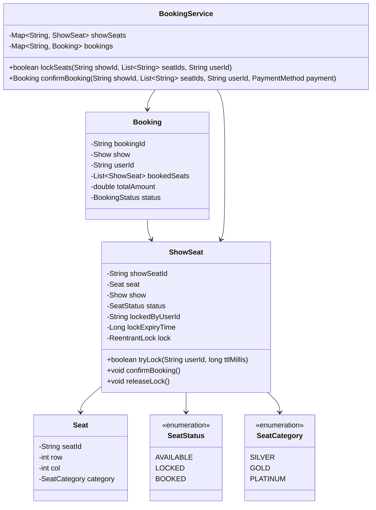
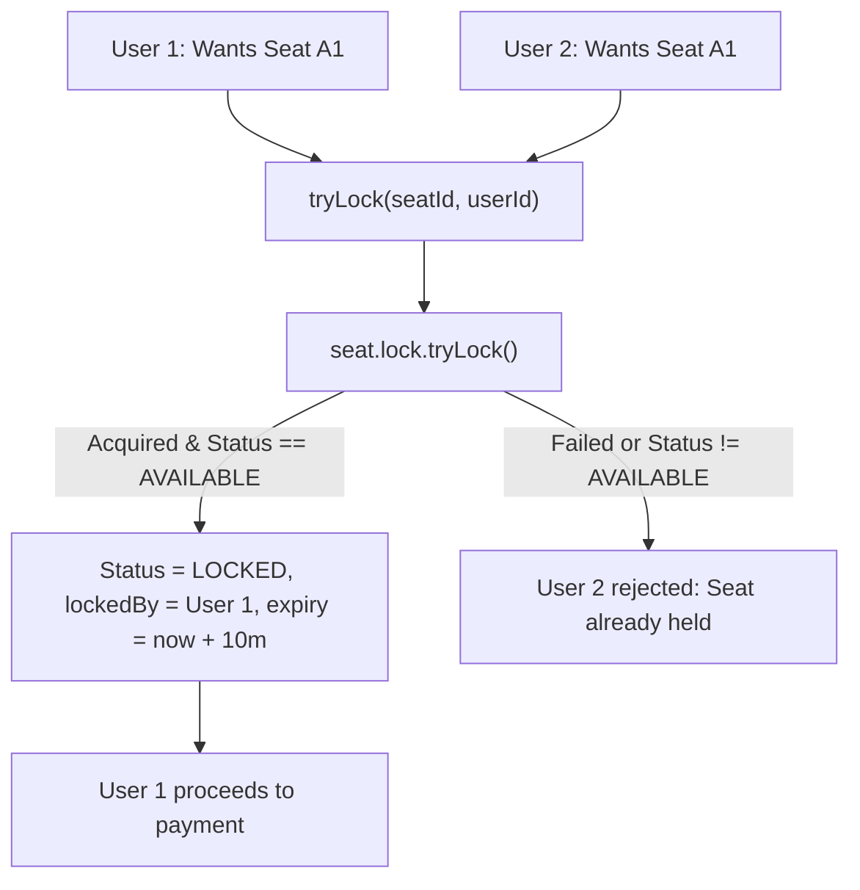

# 05. Design a Movie Ticket Booking System (BookMyShow)

[← Back to Expense Sharing System (Splitwise)](./04-design-an-expense-sharing-system-splitwise.md) | [Track Hub](./README.md) | [Next: Design a Concurrent In-Memory Cache →](./06-design-a-concurrent-in-memory-cache-with-eviction-policies.md)

---

## 1. Requirements & Scope

### Functional Requirements
1. **Cinema & Screen Hierarchy:**
   - City $\to$ Cinema $\to$ Hall / Screen $\to$ Show $\to$ Seats.
2. **Seat Categories:**
   - `SILVER` (Regular), `GOLD` (Premium), `PLATINUM` (Recliner) with tiered baseline pricing.
3. **Seat State Lifecycle (State Pattern):**
   - `AVAILABLE`: Can be chosen by any customer.
   - `LOCKED`: Temporarily held for a customer for 10 minutes while proceeding to payment.
   - `BOOKED`: Permanently confirmed following successful payment gateway callback.
4. **Lock Expiration & Cleanup (TTL):**
   - If payment is not completed within the lock window, the seat lock automatically lapses back to `AVAILABLE`.
5. **Pluggable Payment Processing (Strategy Pattern):**
   - Supports multiple payment gateways (Credit Card, UPI, Digital Wallet).

### Non-Functional Requirements
- **High Concurrency & Zero Double Booking:** Under peak traffic (e.g. blockbuster movie ticket release), multiple users attempting to lock the identical seat must result in exactly **one** successful lock; all other attempts must fail gracefully without deadlock.
- **Low Latency:** High read throughput for seat availability layout queries.

---

## 2. Core Domain Entities & Class Diagram



---

## 3. Design Patterns Applied & SOLID Principles Alignment

1. **State Pattern (Seat Booking Lifecycle):**
   - Transitions `AVAILABLE -> LOCKED -> BOOKED` encapsulate distinct invariants.
2. **Strategy Pattern (Payment Gateways):**
   - `PaymentStrategy` decouples credit card, UPI, and digital wallet providers from booking business logic.
3. **Facade Pattern:**
   - `BookingService` provides a unified entry point orchestrating seat locking, payment execution, and ticket issuance.

---

## 4. Concurrent Seat Locking & Double-Booking Prevention



- **Atomic Lock Acquisition:** Each `ShowSeat` maintains an internal `ReentrantLock`.
- When reserving multiple seats simultaneously, lock candidates in **strictly sorted order of seat IDs** to eliminate distributed deadlocks!

---

## 5. Complete Production-Ready Java 17/21 Implementation

```java
package com.prep.lld.bookmyshow;

import java.time.Instant;
import java.util.*;
import java.util.concurrent.*;
import java.util.concurrent.locks.ReentrantLock;

// ==========================================
// 1. Enums & Domain Entities
// ==========================================

enum SeatCategory {
    SILVER(150.0), GOLD(250.0), PLATINUM(450.0);

    private final double basePrice;
    SeatCategory(double basePrice) { this.basePrice = basePrice; }
    public double getBasePrice() { return basePrice; }
}

enum SeatStatus {
    AVAILABLE, LOCKED, BOOKED
}

enum BookingStatus {
    PENDING, CONFIRMED, CANCELLED
}

record Seat(String id, int row, int number, SeatCategory category) {}

final class ShowSeat {
    private final String id;
    private final Seat seat;
    private final ReentrantLock lock = new ReentrantLock();

    private volatile SeatStatus status = SeatStatus.AVAILABLE;
    private String lockedByUserId;
    private Long lockExpiryTime;

    public ShowSeat(String id, Seat seat) {
        this.id = id;
        this.seat = seat;
    }

    public boolean tryLock(String userId, long ttlMillis) {
        lock.lock();
        try {
            long now = System.currentTimeMillis();
            // Check if existing lock expired (passive expiration)
            if (status == SeatStatus.LOCKED && lockExpiryTime != null && now >= lockExpiryTime) {
                status = SeatStatus.AVAILABLE;
                lockedByUserId = null;
                lockExpiryTime = null;
            }

            if (status == SeatStatus.AVAILABLE) {
                this.status = SeatStatus.LOCKED;
                this.lockedByUserId = userId;
                this.lockExpiryTime = now + ttlMillis;
                return true;
            }
            return false;
        } finally {
            lock.unlock();
        }
    }

    public void confirmBooking(String userId) {
        lock.lock();
        try {
            if (status != SeatStatus.LOCKED || !Objects.equals(lockedByUserId, userId)) {
                throw new IllegalStateException("Seat is not locked by user: " + userId);
            }
            this.status = SeatStatus.BOOKED;
            this.lockExpiryTime = null;
        } finally {
            lock.unlock();
        }
    }

    public void releaseLock() {
        lock.lock();
        try {
            if (status == SeatStatus.LOCKED) {
                this.status = SeatStatus.AVAILABLE;
                this.lockedByUserId = null;
                this.lockExpiryTime = null;
            }
        } finally {
            lock.unlock();
        }
    }

    public String getId() { return id; }
    public Seat getSeat() { return seat; }
    public SeatStatus getStatus() { return status; }
}

// ==========================================
// 2. Payment Strategy (Strategy Pattern)
// ==========================================

interface PaymentStrategy {
    boolean processPayment(String userId, double amount);
}

class MockUpiPayment implements PaymentStrategy {
    @Override
    public boolean processPayment(String userId, double amount) {
        System.out.printf("[PAYMENT] Processing UPI transfer of $%.2f for %s... SUCCESS%n", amount, userId);
        return true;
    }
}

// ==========================================
// 3. Central Booking Service (Facade)
// ==========================================

record Booking(String bookingId, String userId, List<String> seatIds, double totalAmount, BookingStatus status) {}

public final class BookingService {
    private final Map<String, ShowSeat> showSeats = new ConcurrentHashMap<>();
    private final Map<String, Booking> bookings = new ConcurrentHashMap<>();
    private final PaymentStrategy paymentStrategy;

    public BookingService(PaymentStrategy paymentStrategy) {
        this.paymentStrategy = Objects.requireNonNull(paymentStrategy);
    }

    public void addShowSeat(ShowSeat seat) {
        showSeats.put(seat.getId(), seat);
    }

    /**
     * Locks multiple seats atomically. Sorts IDs to strictly prevent deadlocks.
     */
    public boolean lockSeats(List<String> requestedSeatIds, String userId, long ttlMillis) {
        List<String> sortedIds = new ArrayList<>(requestedSeatIds);
        Collections.sort(sortedIds); // Invariant: Deadlock prevention via lock ordering

        List<ShowSeat> lockedSeats = new ArrayList<>();

        for (String seatId : sortedIds) {
            ShowSeat seat = showSeats.get(seatId);
            if (seat == null || !seat.tryLock(userId, ttlMillis)) {
                // Rollback all acquired locks in this attempt
                for (ShowSeat rollbackSeat : lockedSeats) {
                    rollbackSeat.releaseLock();
                }
                return false;
            }
            lockedSeats.add(seat);
        }

        return true;
    }

    /**
     * Confirms booking and marks seats permanently BOOKED upon payment.
     */
    public Booking bookSeats(List<String> seatIds, String userId) {
        double total = 0.0;
        for (String sId : seatIds) {
            ShowSeat seat = showSeats.get(sId);
            if (seat == null) throw new IllegalArgumentException("Seat not found: " + sId);
            total += seat.getSeat().category().getBasePrice();
        }

        // Process payment
        boolean paymentSuccess = paymentStrategy.processPayment(userId, total);
        if (!paymentSuccess) {
            // Release locks
            for (String sId : seatIds) {
                showSeats.get(sId).releaseLock();
            }
            throw new IllegalStateException("Payment failed. Seat locks released.");
        }

        // Transition seats to BOOKED
        for (String sId : seatIds) {
            showSeats.get(sId).confirmBooking(userId);
        }

        String bookingId = "BKG-" + UUID.randomUUID().toString().substring(0, 8).toUpperCase();
        Booking booking = new Booking(bookingId, userId, seatIds, total, BookingStatus.CONFIRMED);
        bookings.put(bookingId, booking);
        return booking;
    }

    public void displaySeatLayout() {
        System.out.println("\n--- Current Seat Availability Layout ---");
        for (ShowSeat ss : showSeats.values()) {
            System.out.printf("Seat %s [%s] -> Status: %s%n",
                    ss.getId(), ss.getSeat().category(), ss.getStatus());
        }
        System.out.println("-----------------------------------------\n");
    }

    // ==========================================
    // 4. Driver & Multi-Threaded Simulation
    // ==========================================
    public static void main(String[] args) throws InterruptedException {
        System.out.println("=== Starting Movie Ticket Booking System (BookMyShow) Demo ===");

        BookingService service = new BookingService(new MockUpiPayment());

        // Setup Screen with 3 Seats
        service.addShowSeat(new ShowSeat("A1", new Seat("A1", 1, 1, SeatCategory.PLATINUM)));
        service.addShowSeat(new ShowSeat("A2", new Seat("A2", 1, 2, SeatCategory.PLATINUM)));
        service.addShowSeat(new ShowSeat("B1", new Seat("B1", 2, 1, SeatCategory.GOLD)));

        service.displaySeatLayout();

        // Scenario: Alice and Bob race concurrently to book the EXACT SAME seat (A1)
        ExecutorService executor = Executors.newFixedThreadPool(2);

        Callable<Boolean> user1Task = () -> {
            boolean locked = service.lockSeats(List.of("A1"), "Alice", 5000L);
            if (locked) {
                System.out.println("[ALICE] Successfully locked Seat A1. Proceeding to pay...");
                Booking b = service.bookSeats(List.of("A1"), "Alice");
                System.out.println("[ALICE] Booking Confirmed! Booking ID: " + b.bookingId());
                return true;
            } else {
                System.out.println("[ALICE] Could not lock Seat A1. Seat already taken!");
                return false;
            }
        };

        Callable<Boolean> user2Task = () -> {
            boolean locked = service.lockSeats(List.of("A1"), "Bob", 5000L);
            if (locked) {
                System.out.println("[BOB] Successfully locked Seat A1. Proceeding to pay...");
                Booking b = service.bookSeats(List.of("A1"), "Bob");
                System.out.println("[BOB] Booking Confirmed! Booking ID: " + b.bookingId());
                return true;
            } else {
                System.out.println("[BOB] Could not lock Seat A1. Seat already taken!");
                return false;
            }
        };

        executor.invokeAll(List.of(user1Task, user2Task));
        executor.shutdown();
        executor.awaitTermination(2, TimeUnit.SECONDS);

        service.displaySeatLayout();
        System.out.println("=== Movie Ticket Booking Simulation Completed ===");
    }
}
```

---

## 6. Extensibility & Interview Follow-ups

- **Q1: How do you prevent distributed deadlocks when users request overlapping seat sets?**
  Always sort requested seat IDs lexicographically (e.g. `Collections.sort(seatIds)`) before acquiring locks. This guarantees a uniform global lock acquisition hierarchy, mathematically eliminating circular wait conditions.
- **Q2: In a distributed system with multiple server nodes, how do you handle temporary seat locking?**
  Use **Redis Distributed Locks with Redlock or Lua Scripts**:
  `SET lock:show_1:seat_A1 userId NX PX 600000` (acquire lock atomically with 10-minute TTL).
- **Q3: How do you implement Dynamic Surge Pricing?**
  Compute remaining inventory percentage for the show. If available seats $< 20\%$, apply a price surge multiplier (e.g. $1.3\times$) calculated dynamically inside `BookingService`.

---

<div align="center">

| [← Back to Expense Sharing System (Splitwise)](./04-design-an-expense-sharing-system-splitwise.md) | [Track Hub: LLD & Machine Coding](./README.md) | [Next: Design a Concurrent In-Memory Cache →](./06-design-a-concurrent-in-memory-cache-with-eviction-policies.md) |
| :--- | :---: | ---: |

</div>
