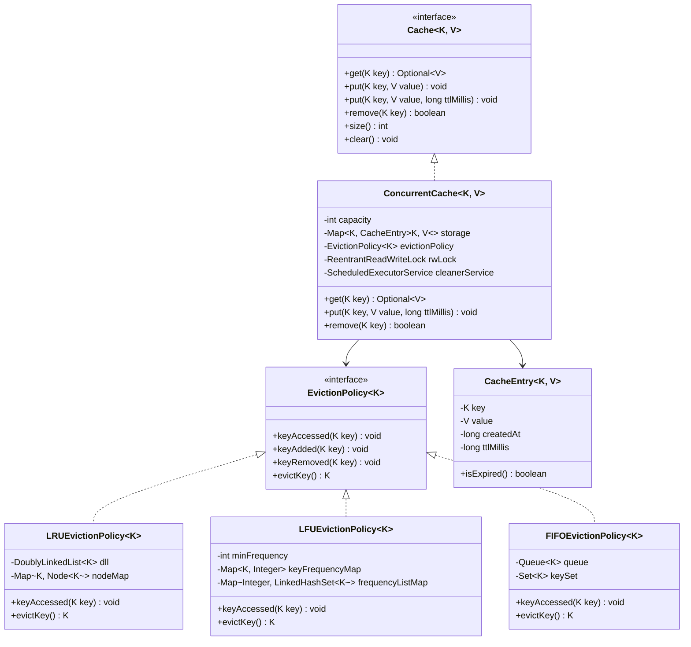

# 06. Design a Concurrent In-Memory Cache with Eviction Policies

[← Back to Movie Ticket Booking System (BookMyShow)](./05-design-a-movie-ticket-booking-system-bookmyshow.md) | [Track Hub](./README.md) | [Next: Design a Food Delivery System (Swiggy/Zomato) →](./07-design-a-food-delivery-system-swiggy-zomato.md)

---

## 1. Requirements & Scope

### Functional Requirements
1. **Key-Value Store with Generics:**
   - Support generic typed keys and values `Cache<K, V>` with basic operations: `put(key, value)`, `get(key)`, and `remove(key)`.
2. **Configurable Capacity & Pluggable Eviction Policies:**
   - Fixed capacity limit $N$. When the cache exceeds capacity, an eviction policy decides which key to remove.
   - Pluggable strategy interface `EvictionPolicy<K>` supporting:
     - **LRU (Least Recently Used):** Evicts the item accessed longest ago.
     - **LFU (Least Frequently Used):** Evicts the item with the minimum access frequency; ties broken by LRU.
     - **FIFO (First In, First Out):** Evicts the oldest inserted item.
3. **Time-To-Live (TTL) & Expiration:**
   - Optional TTL per key or global default TTL.
   - **Passive Expiry:** Check on `get(key)`; if expired, evict immediately and return empty.
   - **Active Expiry:** Background daemon task periodically sweeps and purges expired entries to prevent memory leaks from inactive keys.
4. **Eviction Callback Listeners (Observer Pattern):**
   - Provide `CacheEventListener<K, V>` to notify external metrics or persistence layers when an entry is evicted, expired, or updated.

### Non-Functional Requirements
- **High Concurrency & Thread-Safety:**
  - High read throughput using `ReentrantReadWriteLock` (concurrent reads without mutual exclusion, exclusive writes).
  - Race-condition immunity during concurrent evictions and concurrent `put`/`get` operations.
- **Time Complexity Guarantees:**
  - `get(key)`: $O(1)$ average time.
  - `put(key, value)`: $O(1)$ average time.
  - `remove(key)`: $O(1)$ average time.
- **Extensibility:** Adhere strictly to the Strategy Pattern and Open/Closed Principle (OCP) so new eviction strategies (e.g. ARC, LIRS) can be plugged in without modifying core cache engine code.

---

## 2. High-Level Architecture & Class Diagram



---

## 3. Complete Production-Grade Java Implementation

### 3.1 Domain Models, Entry & Listeners

```java
package com.prep.lld.cache;

import java.time.Instant;
import java.util.Objects;
import java.util.Optional;

/**
 * Encapsulates the cached value along with creation timestamp and TTL.
 */
public class CacheEntry<K, V> {
    private final K key;
    private V value;
    private final long createdAtMillis;
    private final long ttlMillis;

    public CacheEntry(K key, V value, long ttlMillis) {
        this.key = Objects.requireNonNull(key, "Key cannot be null");
        this.value = Objects.requireNonNull(value, "Value cannot be null");
        this.createdAtMillis = System.currentTimeMillis();
        this.ttlMillis = ttlMillis > 0 ? ttlMillis : Long.MAX_VALUE;
    }

    public K getKey() { return key; }
    public V getValue() { return value; }
    public void setValue(V value) { this.value = value; }

    public boolean isExpired() {
        if (ttlMillis == Long.MAX_VALUE) return false;
        return (System.currentTimeMillis() - createdAtMillis) > ttlMillis;
    }

    public long getExpirationTimeMillis() {
        if (ttlMillis == Long.MAX_VALUE) return Long.MAX_VALUE;
        return createdAtMillis + ttlMillis;
    }
}
```

```java
package com.prep.lld.cache;

public interface CacheEventListener<K, V> {
    void onPut(K key, V value);
    void onEvict(K key, V value, EvictionReason reason);
    void onRemove(K key, V value);

    enum EvictionReason {
        CAPACITY_EXCEEDED,
        EXPIRED
    }
}
```

---

### 3.2 Pluggable Eviction Strategies

```java
package com.prep.lld.cache.strategy;

/**
 * Strategy contract for cache key eviction algorithms.
 * Note: Implementations operate on keys and are called within the cache lock context.
 */
public interface EvictionPolicy<K> {
    void keyAccessed(K key);
    void keyAdded(K key);
    void keyRemoved(K key);
    K evictKey();
}
```

#### LRU (Least Recently Used) Strategy ($O(1)$)
```java
package com.prep.lld.cache.strategy;

import java.util.HashMap;
import java.util.Map;

public class LRUEvictionPolicy<K> implements EvictionPolicy<K> {

    private static class Node<K> {
        K key;
        Node<K> prev;
        Node<K> next;
        Node(K key) { this.key = key; }
    }

    private final Map<K, Node<K>> nodeMap = new HashMap<>();
    private final Node<K> head = new Node<>(null);
    private final Node<K> tail = new Node<>(null);

    public LRUEvictionPolicy() {
        head.next = tail;
        tail.prev = head;
    }

    @Override
    public void keyAccessed(K key) {
        Node<K> node = nodeMap.get(key);
        if (node != null) {
            removeNode(node);
            addToHead(node);
        }
    }

    @Override
    public void keyAdded(K key) {
        Node<K> existing = nodeMap.get(key);
        if (existing != null) {
            removeNode(existing);
        }
        Node<K> newNode = new Node<>(key);
        addToHead(newNode);
        nodeMap.put(key, newNode);
    }

    @Override
    public void keyRemoved(K key) {
        Node<K> node = nodeMap.remove(key);
        if (node != null) {
            removeNode(node);
        }
    }

    @Override
    public K evictKey() {
        if (tail.prev == head) {
            return null; // Empty
        }
        Node<K> lruNode = tail.prev;
        removeNode(lruNode);
        nodeMap.remove(lruNode.key);
        return lruNode.key;
    }

    private void addToHead(Node<K> node) {
        node.next = head.next;
        node.prev = head;
        head.next.prev = node;
        head.next = node;
    }

    private void removeNode(Node<K> node) {
        node.prev.next = node.next;
        node.next.prev = node.prev;
    }
}
```

#### LFU (Least Frequently Used) Strategy ($O(1)$)
```java
package com.prep.lld.cache.strategy;

import java.util.HashMap;
import java.util.LinkedHashSet;
import java.util.Map;

public class LFUEvictionPolicy<K> implements EvictionPolicy<K> {

    private final Map<K, Integer> keyFrequencyMap = new HashMap<>();
    private final Map<Integer, LinkedHashSet<K>> frequencyBucketMap = new HashMap<>();
    private int minFrequency = 0;

    @Override
    public void keyAccessed(K key) {
        Integer currentFreq = keyFrequencyMap.get(key);
        if (currentFreq == null) return;

        int newFreq = currentFreq + 1;
        keyFrequencyMap.put(key, newFreq);

        // Remove from current frequency bucket
        LinkedHashSet<K> currentBucket = frequencyBucketMap.get(currentFreq);
        currentBucket.remove(key);
        if (currentBucket.isEmpty() && currentFreq == minFrequency) {
            minFrequency = newFreq;
        }

        // Add to new frequency bucket
        frequencyBucketMap.computeIfAbsent(newFreq, k -> new LinkedHashSet<>()).add(key);
    }

    @Override
    public void keyAdded(K key) {
        if (keyFrequencyMap.containsKey(key)) {
            keyAccessed(key);
            return;
        }
        // New item gets frequency 1
        keyFrequencyMap.put(key, 1);
        frequencyBucketMap.computeIfAbsent(1, k -> new LinkedHashSet<>()).add(key);
        minFrequency = 1;
    }

    @Override
    public void keyRemoved(K key) {
        Integer freq = keyFrequencyMap.remove(key);
        if (freq != null) {
            LinkedHashSet<K> bucket = frequencyBucketMap.get(freq);
            if (bucket != null) {
                bucket.remove(key);
            }
        }
    }

    @Override
    public K evictKey() {
        LinkedHashSet<K> minBucket = frequencyBucketMap.get(minFrequency);
        if (minBucket == null || minBucket.isEmpty()) {
            return null;
        }
        // Evict oldest in min frequency bucket (tie-breaker is FIFO/LRU)
        K candidate = minBucket.iterator().next();
        minBucket.remove(candidate);
        keyFrequencyMap.remove(candidate);
        return candidate;
    }
}
```

---

### 3.3 The Core Cache Interface & Thread-Safe Engine

```java
package com.prep.lld.cache;

import java.util.Optional;

public interface Cache<K, V> {
    Optional<V> get(K key);
    void put(K key, V value);
    void put(K key, V value, long ttlMillis);
    boolean remove(K key);
    int size();
    void clear();
}
```

```java
package com.prep.lld.cache;

import com.prep.lld.cache.strategy.EvictionPolicy;

import java.util.HashMap;
import java.util.Map;
import java.util.Objects;
import java.util.Optional;
import java.util.concurrent.*;
import java.util.concurrent.locks.ReentrantReadWriteLock;

public class ConcurrentCache<K, V> implements Cache<K, V> {

    private final int capacity;
    private final Map<K, CacheEntry<K, V>> storage;
    private final EvictionPolicy<K> evictionPolicy;
    private final CacheEventListener<K, V> eventListener;
    
    // Read-Write synchronization
    private final ReentrantReadWriteLock rwLock = new ReentrantReadWriteLock();
    private final ReentrantReadWriteLock.ReadLock readLock = rwLock.readLock();
    private final ReentrantReadWriteLock.WriteLock writeLock = rwLock.writeLock();

    // Background TTL sweep scheduler
    private final ScheduledExecutorService ttlCleaner;

    public ConcurrentCache(int capacity, 
                           EvictionPolicy<K> evictionPolicy, 
                           CacheEventListener<K, V> eventListener,
                           long ttlCleanupIntervalMillis) {
        if (capacity <= 0) throw new IllegalArgumentException("Capacity must be positive");
        this.capacity = capacity;
        this.evictionPolicy = Objects.requireNonNull(evictionPolicy, "Eviction policy required");
        this.storage = new HashMap<>(capacity);
        this.eventListener = eventListener;

        if (ttlCleanupIntervalMillis > 0) {
            this.ttlCleaner = Executors.newSingleThreadScheduledExecutor(r -> {
                Thread t = new Thread(r, "cache-ttl-cleaner");
                t.setDaemon(true);
                return t;
            });
            this.ttlCleaner.scheduleAtFixedRate(
                this::purgeExpiredKeys, 
                ttlCleanupIntervalMillis, 
                ttlCleanupIntervalMillis, 
                TimeUnit.MILLISECONDS
            );
        } else {
            this.ttlCleaner = null;
        }
    }

    @Override
    public Optional<V> get(K key) {
        Objects.requireNonNull(key, "Key cannot be null");
        
        // Optimistic Read Lock
        readLock.lock();
        CacheEntry<K, V> entry;
        try {
            entry = storage.get(key);
            if (entry == null) {
                return Optional.empty();
            }
            if (!entry.isExpired()) {
                // Must record access in eviction policy under write lock (or upgraded)
                // We briefly acquire write lock for policy bookkeeping
            }
        } finally {
            readLock.unlock();
        }

        // Handle expired entry or record access
        writeLock.lock();
        try {
            entry = storage.get(key);
            if (entry == null) {
                return Optional.empty();
            }
            if (entry.isExpired()) {
                // Passive Expiration
                storage.remove(key);
                evictionPolicy.keyRemoved(key);
                if (eventListener != null) {
                    eventListener.onEvict(key, entry.getValue(), CacheEventListener.EvictionReason.EXPIRED);
                }
                return Optional.empty();
            }
            // Record access
            evictionPolicy.keyAccessed(key);
            return Optional.of(entry.getValue());
        } finally {
            writeLock.unlock();
        }
    }

    @Override
    public void put(K key, V value) {
        put(key, value, -1);
    }

    @Override
    public void put(K key, V value, long ttlMillis) {
        Objects.requireNonNull(key, "Key cannot be null");
        Objects.requireNonNull(value, "Value cannot be null");

        writeLock.lock();
        try {
            CacheEntry<K, V> existing = storage.get(key);
            if (existing != null) {
                existing.setValue(value);
                evictionPolicy.keyAccessed(key);
                if (eventListener != null) {
                    eventListener.onPut(key, value);
                }
                return;
            }

            // Check if capacity reached -> Evict
            if (storage.size() >= capacity) {
                K evictedKey = evictionPolicy.evictKey();
                if (evictedKey != null) {
                    CacheEntry<K, V> evictedEntry = storage.remove(evictedKey);
                    if (evictedEntry != null && eventListener != null) {
                        eventListener.onEvict(evictedKey, evictedEntry.getValue(), 
                            CacheEventListener.EvictionReason.CAPACITY_EXCEEDED);
                    }
                }
            }

            // Insert new entry
            CacheEntry<K, V> newEntry = new CacheEntry<>(key, value, ttlMillis);
            storage.put(key, newEntry);
            evictionPolicy.keyAdded(key);

            if (eventListener != null) {
                eventListener.onPut(key, value);
            }
        } finally {
            writeLock.unlock();
        }
    }

    @Override
    public boolean remove(K key) {
        Objects.requireNonNull(key, "Key cannot be null");
        writeLock.lock();
        try {
            CacheEntry<K, V> entry = storage.remove(key);
            if (entry != null) {
                evictionPolicy.keyRemoved(key);
                if (eventListener != null) {
                    eventListener.onRemove(key, entry.getValue());
                }
                return true;
            }
            return false;
        } finally {
            writeLock.unlock();
        }
    }

    @Override
    public int size() {
        readLock.lock();
        try {
            return storage.size();
        } finally {
            readLock.unlock();
        }
    }

    @Override
    public void clear() {
        writeLock.lock();
        try {
            storage.clear();
        } finally {
            writeLock.unlock();
        }
    }

    /**
     * Active background cleaner sweeping for expired keys.
     */
    private void purgeExpiredKeys() {
        writeLock.lock();
        try {
            var it = storage.entrySet().iterator();
            while (it.hasNext()) {
                var entry = it.next();
                if (entry.getValue().isExpired()) {
                    K key = entry.getKey();
                    V val = entry.getValue().getValue();
                    it.remove();
                    evictionPolicy.keyRemoved(key);
                    if (eventListener != null) {
                        eventListener.onEvict(key, val, CacheEventListener.EvictionReason.EXPIRED);
                    }
                }
            }
        } finally {
            writeLock.unlock();
        }
    }

    public void shutdown() {
        if (ttlCleaner != null) {
            ttlCleaner.shutdownNow();
        }
    }
}
```

---

### 3.4 Verification Driver & Multi-Threaded Concurrency Test

```java
package com.prep.lld.cache;

import com.prep.lld.cache.strategy.LFUEvictionPolicy;
import com.prep.lld.cache.strategy.LRUEvictionPolicy;

import java.util.concurrent.CountDownLatch;
import java.util.concurrent.Executors;

public class CacheDemoDriver {
    public static void main(String[] args) throws InterruptedException {
        System.out.println("=== 1. TESTING LRU EVICTION POLICY (Capacity = 3) ===");
        
        CacheEventListener<String, String> listener = new CacheEventListener<>() {
            @Override
            public void onPut(String k, String v) {
                System.out.println("  [PUT] " + k + " = " + v);
            }
            @Override
            public void onEvict(String k, String v, EvictionReason r) {
                System.out.println("  [EVICTED] " + k + " (Reason: " + r + ")");
            }
            @Override
            public void onRemove(String k, String v) {
                System.out.println("  [REMOVED] " + k);
            }
        };

        ConcurrentCache<String, String> lruCache = 
            new ConcurrentCache<>(3, new LRUEvictionPolicy<>(), listener, 1000);

        lruCache.put("A", "Apple");
        lruCache.put("B", "Banana");
        lruCache.put("C", "Cherry");

        // Access "A" to make "B" the least recently used
        System.out.println("Accessing A: " + lruCache.get("A").orElse("MISS"));

        // Put "D" -> Evicts "B"
        System.out.println("Inserting D (Should evict B):");
        lruCache.put("D", "Date");

        System.out.println("Check B: " + lruCache.get("B").orElse("MISS (Evicted successfully)"));
        System.out.println("Check A: " + lruCache.get("A").orElse("MISS"));
        System.out.println("Check C: " + lruCache.get("C").orElse("MISS"));
        System.out.println("Check D: " + lruCache.get("D").orElse("MISS"));

        System.out.println("\n=== 2. TESTING TTL PASSIVE EXPIRATION ===");
        lruCache.put("TempKey", "ShortLived", 200); // 200 ms TTL
        System.out.println("Immediate Get: " + lruCache.get("TempKey").orElse("MISS"));
        Thread.sleep(300);
        System.out.println("Get after 300ms: " + lruCache.get("TempKey").orElse("EXPIRED (Passively removed)"));

        System.out.println("\n=== 3. TESTING CONCURRENT MULTI-THREADED ACCESS ===");
        int threads = 10;
        int operationsPerThread = 500;
        var executor = Executors.newFixedThreadPool(threads);
        var latch = new CountDownLatch(threads);

        for (int i = 0; i < threads; i++) {
            final int threadId = i;
            executor.submit(() -> {
                try {
                    for (int j = 0; j < operationsPerThread; j++) {
                        String k = "Key-" + (j % 5);
                        lruCache.put(k, "Val-" + threadId + "-" + j);
                        lruCache.get(k);
                    }
                } finally {
                    latch.countDown();
                }
            });
        }

        latch.await();
        executor.shutdown();
        System.out.println("Concurrent execution finished. Cache size: " + lruCache.size() + " (Capacity: 3)");
        lruCache.shutdown();
        System.out.println("\nAll Cache verification checks completed successfully.");
    }
}
```

---

## 4. Edge Cases & Interview Deep-Dive Q&A

- **Q1: Why use `ReentrantReadWriteLock` instead of `ConcurrentHashMap` alone?**
  `ConcurrentHashMap` handles atomic map updates, but **eviction requires composite multi-step atomicity**: removing from the map AND updating the doubly linked list / frequency buckets atomically. Without synchronizing both together under a write lock, concurrent readers could observe a corrupted linked list or access an entry during eviction.
- **Q2: How do you achieve Lock Striping for even higher concurrency?**
  Instead of one global lock for the entire cache, divide the cache into $K$ segments (e.g. 16 shards), where each shard maintains its own `ReentrantReadWriteLock` and independent eviction policy. A key is mapped to a shard via `hash(key) % K`.
- **Q3: What are the memory leak risks with TTL?**
  If keys are inserted with TTL but never queried again, **passive expiration alone will never reclaim their memory**. A background active sweeper thread (`ScheduledExecutorService`) is strictly necessary to clean abandoned keys.

---

<div align="center">

| [← Back to Movie Ticket Booking System (BookMyShow)](./05-design-a-movie-ticket-booking-system-bookmyshow.md) | [Track Hub: LLD & Machine Coding](./README.md) | [Next: Design a Food Delivery System (Swiggy/Zomato) →](./07-design-a-food-delivery-system-swiggy-zomato.md) |
| :--- | :---: | ---: |

</div>
