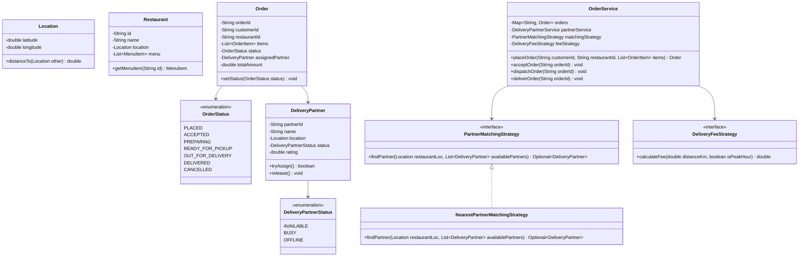

# 07. Design a Food Delivery System (Swiggy / Zomato / DoorDash)

[← Back to Concurrent In-Memory Cache](./06-design-a-concurrent-in-memory-cache-with-eviction-policies.md) | [Track Hub](./README.md) | [System Design Track Hub →](../README.md)

---

## 1. Requirements & Scope

### Functional Requirements
1. **User, Restaurant & Menu Management:**
   - Customers can browse nearby restaurants and their menu items (item name, price, availability).
2. **Cart & Order Processing:**
   - Customers can add items from a single restaurant to a cart and initiate checkout.
3. **Order State Lifecycle (State Pattern):**
   - Transitions strictly follow the lifecycle:
     $$\text{PLACED} \longrightarrow \text{ACCEPTED} \longrightarrow \text{PREPARING} \longrightarrow \text{READY\_FOR\_PICKUP} \longrightarrow \text{OUT\_FOR\_DELIVERY} \longrightarrow \text{DELIVERED}$$
   - Orders can transition to $\text{CANCELLED}$ prior to restaurant preparation.
4. **Pluggable Delivery Partner Assignment (Strategy Pattern):**
   - **Nearest Available Partner Strategy:** Assigns the idle rider with the minimum geographical distance to the restaurant.
   - **Highest-Rated Partner Strategy:** Prefers top-rated riders within an acceptable radius.
5. **Dynamic Fee Calculation (Strategy Pattern):**
   - Pluggable delivery fee algorithms: Base fee + distance fee + surge multipliers (bad weather, peak rush hour).
6. **Real-Time Notifications (Observer Pattern):**
   - Notify customers and delivery partners on order status changes.

### Non-Functional Requirements
- **High Concurrency & Atomic Partner Assignment:**
  - Multiple concurrent orders must never be assigned to the same delivery partner simultaneously.
  - Delivery partner state updates (`AVAILABLE` $\leftrightarrow$ `BUSY`) must be atomic using concurrency primitives.
- **SOLID Compliance:** Loose coupling between payment, matching algorithms, fee computation, and order management.

---

## 2. High-Level Architecture & Class Diagram



---

## 3. Complete Production-Grade Java Implementation

### 3.1 Domain Models, Enums & Location Geometry

```java
package com.prep.lld.fooddelivery.model;

public record Location(double latitude, double longitude) {
    /**
     * Approximate Euclidean distance in kilometers (or Haversine formula)
     */
    public double distanceTo(Location other) {
        double dLat = Math.toRadians(other.latitude() - this.latitude());
        double dLon = Math.toRadians(other.longitude() - this.longitude());
        double a = Math.sin(dLat / 2) * Math.sin(dLat / 2) +
                   Math.cos(Math.toRadians(this.latitude())) * Math.cos(Math.toRadians(other.latitude())) *
                   Math.sin(dLon / 2) * Math.sin(dLon / 2);
        double c = 2 * Math.atan2(Math.sqrt(a), Math.sqrt(1 - a));
        return 6371.0 * c; // Earth radius in km
    }
}
```

```java
package com.prep.lld.fooddelivery.model;

public enum OrderStatus {
    PLACED,
    ACCEPTED,
    PREPARING,
    READY_FOR_PICKUP,
    OUT_FOR_DELIVERY,
    DELIVERED,
    CANCELLED
}
```

```java
package com.prep.lld.fooddelivery.model;

import java.util.concurrent.atomic.AtomicReference;

public class DeliveryPartner {
    private final String partnerId;
    private final String name;
    private volatile Location currentLocation;
    private final AtomicReference<PartnerStatus> status;
    private final double rating;

    public enum PartnerStatus {
        AVAILABLE,
        BUSY,
        OFFLINE
    }

    public DeliveryPartner(String partnerId, String name, Location currentLocation, double rating) {
        this.partnerId = partnerId;
        this.name = name;
        this.currentLocation = currentLocation;
        this.status = new AtomicReference<>(PartnerStatus.AVAILABLE);
        this.rating = rating;
    }

    public String getPartnerId() { return partnerId; }
    public String getName() { return name; }
    public Location getCurrentLocation() { return currentLocation; }
    public void setCurrentLocation(Location loc) { this.currentLocation = loc; }
    public PartnerStatus getStatus() { return status.get(); }
    public double getRating() { return rating; }

    /**
     * Atomically attempts to lock the partner for an order assignment.
     */
    public boolean tryAssign() {
        return status.compareAndSet(PartnerStatus.AVAILABLE, PartnerStatus.BUSY);
    }

    public void release() {
        status.set(PartnerStatus.AVAILABLE);
    }
}
```

```java
package com.prep.lld.fooddelivery.model;

import java.util.Collections;
import java.util.List;

public record MenuItem(String itemId, String name, double price, boolean isAvailable) {}

public record OrderItem(MenuItem item, int quantity) {
    public double getSubtotal() { return item.price() * quantity; }
}

public class Restaurant {
    private final String restaurantId;
    private final String name;
    private final Location location;
    private final List<MenuItem> menu;

    public Restaurant(String restaurantId, String name, Location location, List<MenuItem> menu) {
        this.restaurantId = restaurantId;
        this.name = name;
        this.location = location;
        this.menu = Collections.unmodifiableList(menu);
    }

    public String getRestaurantId() { return restaurantId; }
    public String getName() { return name; }
    public Location getLocation() { return location; }
    public List<MenuItem> getMenu() { return menu; }
}
```

```java
package com.prep.lld.fooddelivery.model;

import java.time.Instant;
import java.util.List;

public class Order {
    private final String orderId;
    private final String customerId;
    private final String restaurantId;
    private final List<OrderItem> items;
    private final double itemsSubtotal;
    private final double deliveryFee;
    private final double totalAmount;
    private volatile OrderStatus status;
    private volatile DeliveryPartner assignedPartner;
    private final Instant createdAt;

    public Order(String orderId, String customerId, String restaurantId, 
                 List<OrderItem> items, double deliveryFee) {
        this.orderId = orderId;
        this.customerId = customerId;
        this.restaurantId = restaurantId;
        this.items = List.copyOf(items);
        this.deliveryFee = deliveryFee;
        this.itemsSubtotal = items.stream().mapToDouble(OrderItem::getSubtotal).sum();
        this.totalAmount = this.itemsSubtotal + deliveryFee;
        this.status = OrderStatus.PLACED;
        this.createdAt = Instant.now();
    }

    public String getOrderId() { return orderId; }
    public String getCustomerId() { return customerId; }
    public String getRestaurantId() { return restaurantId; }
    public List<OrderItem> items() { return items; }
    public double getTotalAmount() { return totalAmount; }
    public OrderStatus getStatus() { return status; }
    public void setStatus(OrderStatus status) { this.status = status; }
    public DeliveryPartner getAssignedPartner() { return assignedPartner; }
    public void setAssignedPartner(DeliveryPartner partner) { this.assignedPartner = partner; }
}
```

---

### 3.2 Pluggable Strategies: Matching & Pricing

```java
package com.prep.lld.fooddelivery.strategy;

import com.prep.lld.fooddelivery.model.DeliveryPartner;
import com.prep.lld.fooddelivery.model.Location;

import java.util.Comparator;
import java.util.List;
import java.util.Optional;

public interface PartnerMatchingStrategy {
    Optional<DeliveryPartner> findPartner(Location restaurantLoc, List<DeliveryPartner> candidatePartners);
}
```

```java
package com.prep.lld.fooddelivery.strategy;

import com.prep.lld.fooddelivery.model.DeliveryPartner;
import com.prep.lld.fooddelivery.model.Location;

import java.util.Comparator;
import java.util.List;
import java.util.Optional;

/**
 * Greedily selects the nearest available partner to the restaurant.
 */
public class NearestPartnerMatchingStrategy implements PartnerMatchingStrategy {
    @Override
    public Optional<DeliveryPartner> findPartner(Location restaurantLoc, List<DeliveryPartner> candidatePartners) {
        return candidatePartners.stream()
            .filter(p -> p.getStatus() == DeliveryPartner.PartnerStatus.AVAILABLE)
            .min(Comparator.comparingDouble(p -> p.getCurrentLocation().distanceTo(restaurantLoc)));
    }
}
```

```java
package com.prep.lld.fooddelivery.strategy;

public interface DeliveryFeeStrategy {
    double calculateFee(double distanceKm, boolean isSurge);
}

public class DynamicSurgeFeeStrategy implements DeliveryFeeStrategy {
    private final double baseFee = 30.0;
    private final double perKmRate = 12.0;
    private final double surgeMultiplier = 1.5;

    @Override
    public double calculateFee(double distanceKm, boolean isSurge) {
        double fee = baseFee + (distanceKm * perKmRate);
        return isSurge ? (fee * surgeMultiplier) : fee;
    }
}
```

---

### 3.3 Orchestration Service Layer

```java
package com.prep.lld.fooddelivery.service;

import com.prep.lld.fooddelivery.model.*;
import com.prep.lld.fooddelivery.strategy.DeliveryFeeStrategy;
import com.prep.lld.fooddelivery.strategy.PartnerMatchingStrategy;

import java.util.*;
import java.util.concurrent.ConcurrentHashMap;

public class OrderService {

    private final Map<String, Order> orderRepository = new ConcurrentHashMap<>();
    private final Map<String, Restaurant> restaurantRepository = new ConcurrentHashMap<>();
    private final List<DeliveryPartner> partners = Collections.synchronizedList(new ArrayList<>());
    
    private final PartnerMatchingStrategy matchingStrategy;
    private final DeliveryFeeStrategy feeStrategy;

    public OrderService(PartnerMatchingStrategy matchingStrategy, DeliveryFeeStrategy feeStrategy) {
        this.matchingStrategy = Objects.requireNonNull(matchingStrategy);
        this.feeStrategy = Objects.requireNonNull(feeStrategy);
    }

    public void registerRestaurant(Restaurant restaurant) {
        restaurantRepository.put(restaurant.getRestaurantId(), restaurant);
    }

    public void registerPartner(DeliveryPartner partner) {
        partners.add(partner);
    }

    public Order placeOrder(String customerId, String restaurantId, 
                            Location customerLocation, List<OrderItem> items, boolean isSurge) {
        Restaurant restaurant = restaurantRepository.get(restaurantId);
        if (restaurant == null) {
            throw new IllegalArgumentException("Restaurant not found: " + restaurantId);
        }

        double distance = restaurant.getLocation().distanceTo(customerLocation);
        double fee = feeStrategy.calculateFee(distance, isSurge);

        String orderId = "ORD-" + UUID.randomUUID().toString().substring(0, 8).toUpperCase();
        Order order = new Order(orderId, customerId, restaurantId, items, fee);
        orderRepository.put(orderId, order);
        return order;
    }

    public void acceptOrder(String orderId) {
        Order order = getOrderOrThrow(orderId);
        order.setStatus(OrderStatus.ACCEPTED);
    }

    public void startPreparation(String orderId) {
        Order order = getOrderOrThrow(orderId);
        order.setStatus(OrderStatus.PREPARING);
    }

    /**
     * Assigns an available delivery partner atomically using CAS.
     */
    public boolean assignDeliveryPartner(String orderId) {
        Order order = getOrderOrThrow(orderId);
        Restaurant restaurant = restaurantRepository.get(order.getRestaurantId());

        synchronized (partners) {
            // Find candidate partner
            Optional<DeliveryPartner> candidate = matchingStrategy.findPartner(restaurant.getLocation(), partners);
            if (candidate.isPresent()) {
                DeliveryPartner partner = candidate.get();
                // Atomic CAS assignment
                if (partner.tryAssign()) {
                    order.setAssignedPartner(partner);
                    order.setStatus(OrderStatus.READY_FOR_PICKUP);
                    return true;
                }
            }
        }
        return false;
    }

    public void markOutForDelivery(String orderId) {
        Order order = getOrderOrThrow(orderId);
        if (order.getAssignedPartner() == null) {
            throw new IllegalStateException("Cannot dispatch order without assigned delivery partner");
        }
        order.setStatus(OrderStatus.OUT_FOR_DELIVERY);
    }

    public void markDelivered(String orderId) {
        Order order = getOrderOrThrow(orderId);
        order.setStatus(OrderStatus.DELIVERED);
        if (order.getAssignedPartner() != null) {
            order.getAssignedPartner().release();
        }
    }

    private Order getOrderOrThrow(String orderId) {
        Order order = orderRepository.get(orderId);
        if (order == null) throw new IllegalArgumentException("Order not found: " + orderId);
        return order;
    }
}
```

---

### 3.4 Verification Driver & Simulation

```java
package com.prep.lld.fooddelivery;

import com.prep.lld.fooddelivery.model.*;
import com.prep.lld.fooddelivery.service.OrderService;
import com.prep.lld.fooddelivery.strategy.DynamicSurgeFeeStrategy;
import com.prep.lld.fooddelivery.strategy.NearestPartnerMatchingStrategy;

import java.util.List;

public class FoodDeliveryDemoDriver {
    public static void main(String[] args) {
        System.out.println("=== 1. INITIALIZING FOOD DELIVERY PLATFORM ===");

        OrderService orderService = new OrderService(
            new NearestPartnerMatchingStrategy(),
            new DynamicSurgeFeeStrategy()
        );

        // Setup Restaurant & Menu
        Location restLoc = new Location(12.9352, 77.6245); // Koramangala, Bangalore
        MenuItem burger = new MenuItem("ITEM-1", "Truffle Burger", 250.0, true);
        MenuItem fries = new MenuItem("ITEM-2", "Peri Peri Fries", 120.0, true);
        Restaurant restaurant = new Restaurant("REST-1", "Gourmet Bites", restLoc, List.of(burger, fries));
        orderService.registerRestaurant(restaurant);

        // Setup Delivery Partners at different distances
        DeliveryPartner partnerFar = new DeliveryPartner("RIDER-1", "Rahul (Far)", new Location(12.9500, 77.6400), 4.8);
        DeliveryPartner partnerNear = new DeliveryPartner("RIDER-2", "Amit (Near)", new Location(12.9360, 77.6250), 4.9);
        orderService.registerPartner(partnerFar);
        orderService.registerPartner(partnerNear);

        // Customer Places Order
        Location custLoc = new Location(12.9400, 77.6300);
        List<OrderItem> cart = List.of(new OrderItem(burger, 2), new OrderItem(fries, 1));
        
        System.out.println("\n=== 2. CUSTOMER PLACES ORDER ===");
        Order order = orderService.placeOrder("CUST-101", "REST-1", custLoc, cart, false);
        System.out.println("Order ID: " + order.getOrderId());
        System.out.println("Total Amount: ₹" + order.getTotalAmount() + " (Status: " + order.getStatus() + ")");

        // State Transitions: Restaurant Actions
        System.out.println("\n=== 3. RESTAURANT ACCEPTS & PREPARES FOOD ===");
        orderService.acceptOrder(order.getOrderId());
        System.out.println("Status: " + order.getStatus());
        orderService.startPreparation(order.getOrderId());
        System.out.println("Status: " + order.getStatus());

        // Partner Assignment: Should select Nearest Partner (Amit)
        System.out.println("\n=== 4. MATCHING DELIVERY PARTNER ===");
        boolean assigned = orderService.assignDeliveryPartner(order.getOrderId());
        System.out.println("Partner Assigned Successfully: " + assigned);
        System.out.println("Assigned Partner: " + order.getAssignedPartner().getName() + 
                           " (Status: " + order.getAssignedPartner().getStatus() + ")");
        System.out.println("Order Status: " + order.getStatus());

        // Dispatch & Delivery
        System.out.println("\n=== 5. OUT FOR DELIVERY & COMPLETED ===");
        orderService.markOutForDelivery(order.getOrderId());
        System.out.println("Order Status: " + order.getStatus());

        orderService.markDelivered(order.getOrderId());
        System.out.println("Order Status: " + order.getStatus());
        System.out.println("Rider Status post-delivery: " + order.getAssignedPartner().getStatus());

        System.out.println("\nAll Food Delivery System flows executed successfully.");
    }
}
```

---

## 4. Edge Cases & Interview Deep-Dive Q&A

- **Q1: How do you handle Rider Rejection / Timeout?**
  When an order is broadcast to a rider, start a countdown timer (e.g. 30 seconds). If the rider declines or does not respond before the timer expires, release the rider, record the refusal in rider telemetry, and invoke the matching strategy for the next best candidate.
- **Q2: How do you prevent double-assignment if two orders dispatch simultaneously?**
  Use `AtomicReference<PartnerStatus>.compareAndSet(AVAILABLE, BUSY)`. Only the first thread that successfully changes the status from `AVAILABLE` to `BUSY` wins the partner. The second thread fails CAS, loops, and selects the next nearest partner.
- **Q3: How do you support Multi-Order Batching (Pickup multiple orders along the same route)?**
  Extend `DeliveryPartner` with a capacity parameter (e.g. `maxConcurrentOrders = 2`). The matching strategy checks if an active rider's route has an overlapping spatial corridor with the new order's restaurant and dropoff locations, using traveling salesperson heuristics.

---

<div align="center">

| [← Back to Concurrent In-Memory Cache](./06-design-a-concurrent-in-memory-cache-with-eviction-policies.md) | [Track Hub: LLD & Machine Coding](./README.md) | [System Design Track Hub →](../README.md) |
| :--- | :---: | ---: |

</div>
