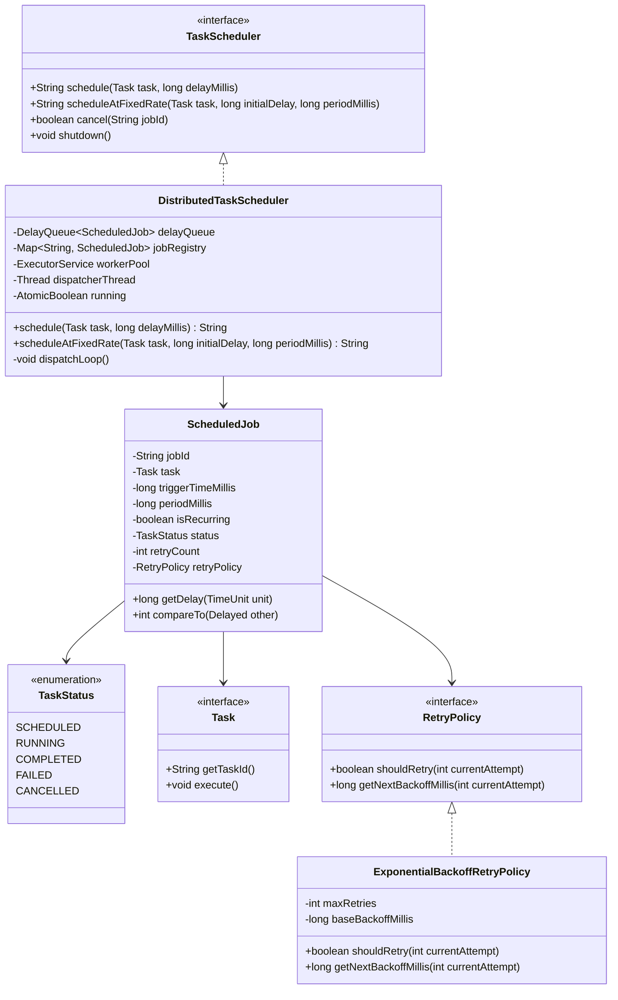

# 08. Design a Distributed Task & Job Scheduler (Quartz / Cron)

[← Back to Food Delivery System](./07-design-a-food-delivery-system-swiggy-zomato.md) | [Track Hub](./README.md) | [Next: Design an In-Memory Rate Limiter Library →](./09-design-an-in-memory-rate-limiter-library.md)

---

## 1. Requirements & Scope

### Functional Requirements
1. **Task Submission & Scheduling:**
   - **One-Time Delayed Tasks:** Schedule a task to execute at a specific future timestamp or after a delay: `schedule(Task, delayMillis)`.
   - **Recurring Fixed-Rate Tasks:** Schedule a task to execute repeatedly with a configured period: `scheduleAtFixedRate(Task, initialDelay, periodMillis)`.
2. **Task State Lifecycle (State Pattern):**
   $$\text{SCHEDULED} \longrightarrow \text{RUNNING} \longrightarrow \text{COMPLETED} \quad \text{or} \quad \text{FAILED} \quad (\text{or } \text{CANCELLED})$$
3. **Pluggable Retry Policy (Strategy Pattern):**
   - Configurable retry behavior upon task execution failure: Fixed retry or Exponential Backoff with jitter.
4. **Execution History & Observability:**
   - Record execution metrics: start time, duration, completion status, and exception traces.

### Non-Functional Requirements
- **High Concurrency & Thread-Safety:**
  - Support high-frequency concurrent task submissions across multiple producer threads.
  - Decouple task scheduling from task execution using a dedicated worker thread pool (`ThreadPoolExecutor`).
- **Precision & Starvation Freedom:**
  - Tasks must execute as close to their scheduled trigger timestamp as possible using Java's `DelayQueue` (backed by a priority min-heap on `triggerTime`).
- **Graceful Shutdown:** Support stopping the scheduler gracefully, allowing in-flight tasks to finish within a timeout window.

---

## 2. High-Level Architecture & Class Diagram



---

## 3. Complete Production-Grade Java Implementation

### 3.1 Domain Models, Job & Retry Strategies

```java
package com.prep.lld.scheduler.model;

import java.util.Objects;
import java.util.concurrent.Delayed;
import java.util.concurrent.TimeUnit;

public enum TaskStatus {
    SCHEDULED,
    RUNNING,
    COMPLETED,
    FAILED,
    CANCELLED
}
```

```java
package com.prep.lld.scheduler.strategy;

public interface RetryPolicy {
    boolean shouldRetry(int currentAttempt);
    long getNextBackoffMillis(int currentAttempt);
}

public class ExponentialBackoffRetryPolicy implements RetryPolicy {
    private final int maxRetries;
    private final long baseBackoffMillis;

    public ExponentialBackoffRetryPolicy(int maxRetries, long baseBackoffMillis) {
        this.maxRetries = maxRetries;
        this.baseBackoffMillis = baseBackoffMillis;
    }

    @Override
    public boolean shouldRetry(int currentAttempt) {
        return currentAttempt < maxRetries;
    }

    @Override
    public long getNextBackoffMillis(int currentAttempt) {
        return (long) (baseBackoffMillis * Math.pow(2, currentAttempt));
    }
}
```

```java
package com.prep.lld.scheduler.model;

import com.prep.lld.scheduler.strategy.RetryPolicy;

import java.util.Objects;
import java.util.concurrent.Delayed;
import java.util.concurrent.TimeUnit;
import java.util.concurrent.atomic.AtomicInteger;
import java.util.concurrent.atomic.AtomicReference;

public class ScheduledJob implements Delayed {

    private final String jobId;
    private final Runnable task;
    private volatile long triggerTimeMillis;
    private final long periodMillis;
    private final boolean isRecurring;
    private final RetryPolicy retryPolicy;
    private final AtomicInteger attemptCount = new AtomicInteger(0);
    private final AtomicReference<TaskStatus> status = new AtomicReference<>(TaskStatus.SCHEDULED);

    public ScheduledJob(String jobId, Runnable task, long triggerTimeMillis, 
                        long periodMillis, boolean isRecurring, RetryPolicy retryPolicy) {
        this.jobId = Objects.requireNonNull(jobId);
        this.task = Objects.requireNonNull(task);
        this.triggerTimeMillis = triggerTimeMillis;
        this.periodMillis = periodMillis;
        this.isRecurring = isRecurring;
        this.retryPolicy = retryPolicy;
    }

    public String getJobId() { return jobId; }
    public Runnable getTask() { return task; }
    public long getTriggerTimeMillis() { return triggerTimeMillis; }
    public boolean isRecurring() { return isRecurring; }
    public long getPeriodMillis() { return periodMillis; }
    public RetryPolicy getRetryPolicy() { return retryPolicy; }
    public int getAttemptCount() { return attemptCount.get(); }
    public int incrementAttempt() { return attemptCount.incrementAndGet(); }
    public TaskStatus getStatus() { return status.get(); }
    public void setStatus(TaskStatus newStatus) { this.status.set(newStatus); }

    public void updateNextTriggerTime() {
        if (isRecurring) {
            this.triggerTimeMillis = System.currentTimeMillis() + periodMillis;
            this.status.set(TaskStatus.SCHEDULED);
        }
    }

    public void scheduleRetry(long backoffMillis) {
        this.triggerTimeMillis = System.currentTimeMillis() + backoffMillis;
        this.status.set(TaskStatus.SCHEDULED);
    }

    @Override
    public long getDelay(TimeUnit unit) {
        long diff = triggerTimeMillis - System.currentTimeMillis();
        return unit.convert(diff, TimeUnit.MILLISECONDS);
    }

    @Override
    public int compareTo(Delayed other) {
        if (this == other) return 0;
        if (other instanceof ScheduledJob otherJob) {
            return Long.compare(this.triggerTimeMillis, otherJob.triggerTimeMillis);
        }
        return Long.compare(this.getDelay(TimeUnit.MILLISECONDS), other.getDelay(TimeUnit.MILLISECONDS));
    }
}
```

---

### 3.2 The Core Task Scheduler Engine

```java
package com.prep.lld.scheduler.service;

import com.prep.lld.scheduler.model.ScheduledJob;
import com.prep.lld.scheduler.model.TaskStatus;
import com.prep.lld.scheduler.strategy.ExponentialBackoffRetryPolicy;
import com.prep.lld.scheduler.strategy.RetryPolicy;

import java.util.Map;
import java.util.UUID;
import java.util.concurrent.*;
import java.util.concurrent.atomic.AtomicBoolean;

public class DistributedTaskScheduler {

    private final DelayQueue<ScheduledJob> delayQueue = new DelayQueue<>();
    private final Map<String, ScheduledJob> jobRegistry = new ConcurrentHashMap<>();
    private final ExecutorService workerPool;
    private final Thread dispatcherThread;
    private final AtomicBoolean isRunning = new AtomicBoolean(true);

    public DistributedTaskScheduler(int workerPoolSize) {
        this.workerPool = Executors.newFixedThreadPool(workerPoolSize, r -> {
            Thread t = new Thread(r, "scheduler-worker");
            t.setDaemon(true);
            return t;
        });

        this.dispatcherThread = new Thread(this::dispatchLoop, "scheduler-dispatcher");
        this.dispatcherThread.setDaemon(true);
        this.dispatcherThread.start();
    }

    public String schedule(Runnable task, long delayMillis) {
        return schedule(task, delayMillis, new ExponentialBackoffRetryPolicy(3, 100));
    }

    public String schedule(Runnable task, long delayMillis, RetryPolicy retryPolicy) {
        String jobId = "JOB-" + UUID.randomUUID().toString().substring(0, 8);
        long triggerTime = System.currentTimeMillis() + delayMillis;
        ScheduledJob job = new ScheduledJob(jobId, task, triggerTime, 0, false, retryPolicy);
        
        jobRegistry.put(jobId, job);
        delayQueue.put(job);
        return jobId;
    }

    public String scheduleAtFixedRate(Runnable task, long initialDelayMillis, long periodMillis) {
        String jobId = "JOB-REC-" + UUID.randomUUID().toString().substring(0, 8);
        long triggerTime = System.currentTimeMillis() + initialDelayMillis;
        ScheduledJob job = new ScheduledJob(jobId, task, triggerTime, periodMillis, true, null);

        jobRegistry.put(jobId, job);
        delayQueue.put(job);
        return jobId;
    }

    public boolean cancel(String jobId) {
        ScheduledJob job = jobRegistry.get(jobId);
        if (job != null && job.getStatus() == TaskStatus.SCHEDULED) {
            job.setStatus(TaskStatus.CANCELLED);
            delayQueue.remove(job);
            return true;
        }
        return false;
    }

    private void dispatchLoop() {
        while (isRunning.get()) {
            try {
                // Blocks until a task's delay has expired (triggerTime reached)
                ScheduledJob job = delayQueue.take();

                if (job.getStatus() == TaskStatus.CANCELLED) {
                    continue;
                }

                // Submit task execution to worker pool
                workerPool.submit(() -> executeJob(job));

            } catch (InterruptedException e) {
                if (!isRunning.get()) break;
            }
        }
    }

    private void executeJob(ScheduledJob job) {
        job.setStatus(TaskStatus.RUNNING);
        try {
            job.getTask().run();
            job.setStatus(TaskStatus.COMPLETED);

            // If recurring, reschedule for next period
            if (job.isRecurring() && isRunning.get()) {
                job.updateNextTriggerTime();
                delayQueue.put(job);
            }
        } catch (Throwable t) {
            System.err.println("Job failed: " + job.getJobId() + " (" + t.getMessage() + ")");
            RetryPolicy retry = job.getRetryPolicy();
            int attempts = job.incrementAttempt();

            if (retry != null && retry.shouldRetry(attempts)) {
                long backoff = retry.getNextBackoffMillis(attempts);
                System.out.println("  -> Rescheduling retry #" + attempts + " for " + job.getJobId() + " in " + backoff + "ms");
                job.scheduleRetry(backoff);
                delayQueue.put(job);
            } else {
                job.setStatus(TaskStatus.FAILED);
            }
        }
    }

    public void shutdown() {
        isRunning.set(false);
        dispatcherThread.interrupt();
        workerPool.shutdown();
        try {
            if (!workerPool.awaitTermination(3, TimeUnit.SECONDS)) {
                workerPool.shutdownNow();
            }
        } catch (InterruptedException e) {
            workerPool.shutdownNow();
        }
    }
}
```

---

### 3.3 Verification Driver Simulation

```java
package com.prep.lld.scheduler;

import com.prep.lld.scheduler.service.DistributedTaskScheduler;

public class SchedulerDemoDriver {
    public static void main(String[] args) throws InterruptedException {
        System.out.println("=== 1. INITIALIZING TASK SCHEDULER (4 Worker Threads) ===");
        DistributedTaskScheduler scheduler = new DistributedTaskScheduler(4);

        // 1. One-time delayed task (200ms)
        System.out.println("\nScheduling one-time task (delay 200ms)...");
        scheduler.schedule(() -> {
            System.out.println("  [TASK 1] Executed at: " + System.currentTimeMillis());
        }, 200);

        // 2. Flaky task testing retry policy
        System.out.println("Scheduling flaky task (delay 100ms)...");
        scheduler.schedule(new Runnable() {
            private int runCount = 0;
            @Override
            public void run() {
                runCount++;
                if (runCount < 3) {
                    throw new RuntimeException("Simulated transient network timeout (Attempt " + runCount + ")");
                }
                System.out.println("  [FLAKY TASK] Succeeded on attempt " + runCount + "!");
            }
        }, 100);

        // 3. Recurring task (every 300ms)
        System.out.println("Scheduling recurring task (every 300ms)...");
        String recId = scheduler.scheduleAtFixedRate(() -> {
            System.out.println("  [RECURRING HEARTBEAT] Tick at: " + System.currentTimeMillis());
        }, 50, 300);

        // Let simulation run for 1.2 seconds
        Thread.sleep(1200);

        // Cancel recurring task
        System.out.println("\nCanceling recurring heartbeat...");
        scheduler.cancel(recId);
        Thread.sleep(500);

        scheduler.shutdown();
        System.out.println("\nScheduler shutdown complete. All tests passed.");
    }
}
```

---

## 4. Edge Cases & Interview Deep-Dive Q&A

- **Q1: What happens if a recurring task execution takes longer than its period?**
  In fixed-rate scheduling, if execution takes $500\text{ms}$ but period is $300\text{ms}$, subsequent runs must not overlap concurrently on multiple threads. The scheduler recalculates next trigger time *after* the run finishes (`triggerTime = max(triggerTime + period, System.currentTimeMillis())`).
- **Q2: How do you scale this scheduler to multiple distributed server nodes?**
  Use **Distributed Lock with Redis or ZooKeeper/etcd** for leader election. The leader node runs the dispatcher thread and pushes ready-to-run tasks into a distributed Kafka task queue. Worker nodes across the cluster consume tasks from Kafka in parallel.
- **Q3: Why use `DelayQueue` over a simple `PriorityQueue`?**
  `DelayQueue` internally implements `BlockingQueue` using a condition variable (`Condition available`). Calling `take()` puts the dispatcher thread into timed wait (`available.awaitNanos(delay)`) until the earliest task is ready, consuming **0% CPU cycles** while idle.

---

<div align="center">

| [← Back to Food Delivery System](./07-design-a-food-delivery-system-swiggy-zomato.md) | [Track Hub: LLD & Machine Coding](./README.md) | [Next: Design an In-Memory Rate Limiter Library →](./09-design-an-in-memory-rate-limiter-library.md) |
| :--- | :---: | ---: |

</div>
