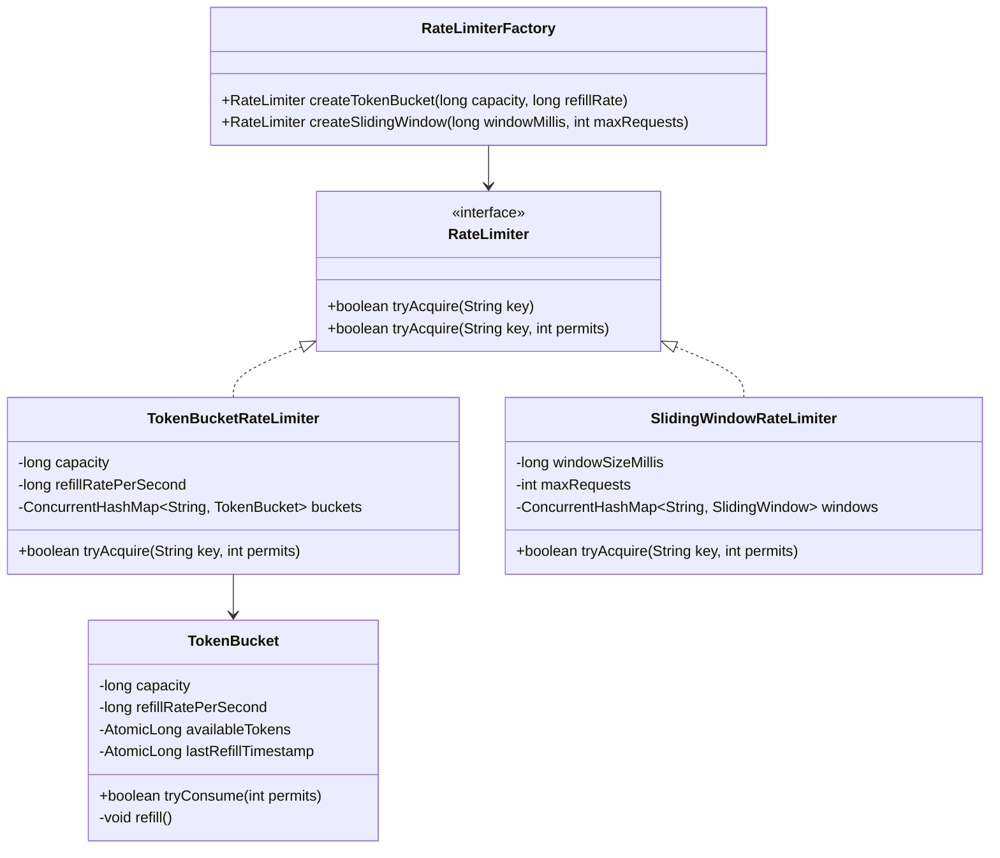

# 09. Design an In-Memory Rate Limiter Library (Resilience4j Style)

[← Back to Distributed Task & Job Scheduler](./08-design-a-distributed-task-and-job-scheduler.md) | [Track Hub](./README.md) | [System Design Track Hub →](../README.md)

---

## 1. Requirements & Scope

### Functional Requirements
1. **Multi-Algorithm Support (Strategy Pattern):**
   - Provide pluggable rate limiting algorithms through a unified interface:
     - **Token Bucket:** Allows burst traffic up to bucket capacity; refills at a constant rate.
     - **Sliding Window Log:** Exact precision sliding window tracking timestamps of all requests.
     - **Sliding Window Counter:** Low-memory approximation combining previous window weight with current counter.
2. **Keyed Rate Limiting:**
   - Rate limit by client identity: IP address, API key, user ID, or endpoint route.
3. **Pluggable Acquisition Contracts:**
   - Non-blocking: `boolean tryAcquire(String key)` (returns `false` immediately if quota exceeded).
   - Timed blocking: `boolean tryAcquire(String key, long timeoutMillis)` (blocks up to timeout waiting for permits).
4. **Automatic Memory Reclamation:**
   - Inactive client keys must not cause memory leaks (passive TTL expiration or LRU cache eviction of limiter states).

### Non-Functional Requirements
- **Sub-Microsecond Latency Overhead:** `tryAcquire` execution must take $< 1\mu\text{s}$ per call to avoid introducing latency to the host application.
- **High Concurrency & Thread-Safety:** Lock-free atomic operations (`AtomicLong`, `AtomicInteger`) or granular lock striping to prevent thread contention.
- **Zero External Dependencies:** Built as a standalone Java library adhering strictly to clean architecture and SOLID principles.

---

## 2. High-Level Architecture & Class Diagram



---

## 3. Complete Production-Grade Java Implementation

### 3.1 The Rate Limiter Contract

```java
package com.prep.lld.ratelimiter;

public interface RateLimiter {
    default boolean tryAcquire(String key) {
        return tryAcquire(key, 1);
    }
    boolean tryAcquire(String key, int permits);
}
```

---

### 3.2 Token Bucket Implementation (Lock-Free with CAS)

```java
package com.prep.lld.ratelimiter.tokenbucket;

import com.prep.lld.ratelimiter.RateLimiter;

import java.util.concurrent.ConcurrentHashMap;
import java.util.concurrent.atomic.AtomicLong;

public class TokenBucketRateLimiter implements RateLimiter {

    private final long capacity;
    private final long refillRatePerSecond;
    private final ConcurrentHashMap<String, BucketState> buckets = new ConcurrentHashMap<>();

    private static class BucketState {
        private final long capacity;
        private final double refillTokensPerNano;
        private final AtomicLong tokensNanos; // Tokens scaled by 1e9 for integer CAS
        private final AtomicLong lastRefillNanos;

        BucketState(long capacity, long refillRatePerSecond) {
            this.capacity = capacity;
            this.refillTokensPerNano = (double) refillRatePerSecond / 1_000_000_000.0;
            long initialScaledTokens = capacity * 1_000_000_000L;
            this.tokensNanos = new AtomicLong(initialScaledTokens);
            this.lastRefillNanos = new AtomicLong(System.nanoTime());
        }

        boolean tryConsume(int permits) {
            long requiredScaledTokens = permits * 1_000_000_000L;

            while (true) {
                long now = System.nanoTime();
                long last = lastRefillNanos.get();
                long elapsed = Math.max(0, now - last);

                long currentScaled = tokensNanos.get();
                long addedScaled = (long) (elapsed * refillTokensPerNano * 1_000_000_000L);
                long maxScaled = capacity * 1_000_000_000L;
                long newScaled = Math.min(maxScaled, currentScaled + addedScaled);

                if (newScaled < requiredScaledTokens) {
                    return false; // Rate limit exceeded
                }

                // Atomic CAS update for both tokens and timestamp
                if (tokensNanos.compareAndSet(currentScaled, newScaled - requiredScaledTokens)) {
                    lastRefillNanos.compareAndSet(last, now);
                    return true;
                }
                // Contention retry
            }
        }
    }

    public TokenBucketRateLimiter(long capacity, long refillRatePerSecond) {
        if (capacity <= 0 || refillRatePerSecond <= 0) {
            throw new IllegalArgumentException("Capacity and refill rate must be positive");
        }
        this.capacity = capacity;
        this.refillRatePerSecond = refillRatePerSecond;
    }

    @Override
    public boolean tryAcquire(String key, int permits) {
        BucketState bucket = buckets.computeIfAbsent(key, k -> new BucketState(capacity, refillRatePerSecond));
        return bucket.tryConsume(permits);
    }
}
```

---

### 3.3 Sliding Window Counter Implementation

```java
package com.prep.lld.ratelimiter.slidingwindow;

import com.prep.lld.ratelimiter.RateLimiter;

import java.util.concurrent.ConcurrentHashMap;
import java.util.concurrent.atomic.AtomicInteger;
import java.util.concurrent.atomic.AtomicLong;

/**
 * Sliding Window Counter combining previous and current window counts with weight:
 * count = prevWindowCount * (1 - timeIntoCurrentWindow) + currentWindowCount
 */
public class SlidingWindowCounterRateLimiter implements RateLimiter {

    private final long windowSizeMillis;
    private final int maxRequests;
    private final ConcurrentHashMap<String, WindowState> windows = new ConcurrentHashMap<>();

    private static class WindowState {
        private final AtomicLong currentWindowStart;
        private final AtomicInteger currentWindowCount = new AtomicInteger(0);
        private final AtomicInteger previousWindowCount = new AtomicInteger(0);

        WindowState(long now, long windowSizeMillis) {
            this.currentWindowStart = new AtomicLong(now - (now % windowSizeMillis));
        }

        synchronized boolean tryAcquire(long now, long windowSizeMillis, int maxRequests, int permits) {
            long windowStart = now - (now % windowSizeMillis);
            long currentStart = currentWindowStart.get();

            // Advance window if time passed
            if (windowStart > currentStart) {
                long windowsPassed = (windowStart - currentStart) / windowSizeMillis;
                if (windowsPassed == 1) {
                    previousWindowCount.set(currentWindowCount.get());
                } else {
                    previousWindowCount.set(0);
                }
                currentWindowCount.set(0);
                currentWindowStart.set(windowStart);
            }

            // Calculate weighted request count
            double timeFraction = (double) (now - windowStart) / windowSizeMillis;
            double estimatedCount = previousWindowCount.get() * (1.0 - timeFraction) + currentWindowCount.get();

            if (estimatedCount + permits <= maxRequests) {
                currentWindowCount.addAndGet(permits);
                return true;
            }
            return false;
        }
    }

    public SlidingWindowCounterRateLimiter(long windowSizeMillis, int maxRequests) {
        this.windowSizeMillis = windowSizeMillis;
        this.maxRequests = maxRequests;
    }

    @Override
    public boolean tryAcquire(String key, int permits) {
        long now = System.currentTimeMillis();
        WindowState window = windows.computeIfAbsent(key, k -> new WindowState(now, windowSizeMillis));
        return window.tryAcquire(now, windowSizeMillis, maxRequests, permits);
    }
}
```

---

### 3.4 Verification Driver Simulation

```java
package com.prep.lld.ratelimiter;

import com.prep.lld.ratelimiter.slidingwindow.SlidingWindowCounterRateLimiter;
import com.prep.lld.ratelimiter.tokenbucket.TokenBucketRateLimiter;

public class RateLimiterDemoDriver {
    public static void main(String[] args) throws InterruptedException {
        System.out.println("=== 1. TESTING TOKEN BUCKET (Capacity = 3, Refill = 2/sec) ===");
        RateLimiter tokenBucket = new TokenBucketRateLimiter(3, 2);
        String clientIp = "192.168.1.100";

        // Burst 3 requests (Should all succeed)
        System.out.println("Request 1: " + tokenBucket.tryAcquire(clientIp)); // true
        System.out.println("Request 2: " + tokenBucket.tryAcquire(clientIp)); // true
        System.out.println("Request 3: " + tokenBucket.tryAcquire(clientIp)); // true

        // Request 4 (Should be rejected)
        System.out.println("Request 4 (Over capacity): " + tokenBucket.tryAcquire(clientIp)); // false

        // Wait 600ms for 1 token to refill
        System.out.println("\nWaiting 600ms for token refill...");
        Thread.sleep(600);
        System.out.println("Request 5 (Post refill): " + tokenBucket.tryAcquire(clientIp)); // true

        System.out.println("\n=== 2. TESTING SLIDING WINDOW COUNTER (5 req / 500ms) ===");
        RateLimiter slidingWindow = new SlidingWindowCounterRateLimiter(500, 5);
        String userId = "USER-404";

        for (int i = 1; i <= 6; i++) {
            boolean allowed = slidingWindow.tryAcquire(userId);
            System.out.println("Window Request " + i + ": " + (allowed ? "ALLOWED" : "REJECTED (Rate Limited)"));
        }

        System.out.println("\nWaiting 550ms for new window...");
        Thread.sleep(550);
        System.out.println("Request after window reset: " + slidingWindow.tryAcquire(userId));

        System.out.println("\nAll Rate Limiter tests executed successfully.");
    }
}
```

---

## 4. Edge Cases & Interview Deep-Dive Q&A

- **Q1: Why scale token calculations by $10^9$ in Token Bucket?**
  Floating-point operations do not natively support hardware-level atomic Compare-And-Swap (`compareAndSet`). Scaling permits by $10^9$ allows all math to operate on pure integer nanoseconds using 64-bit `AtomicLong`, giving $100\%$ lock-free thread safety with zero precision loss.
- **Q2: How do you prevent memory leaks when millions of unique client IPs hit the limiter once?**
  Use a bounded LRU eviction cache (such as Google Guava's `Cache<String, BucketState>` with `.expireAfterAccess(10, TimeUnit.MINUTES)`) instead of an unbounded `ConcurrentHashMap`.
- **Q3: What are the trade-offs of Sliding Window Log vs. Sliding Window Counter?**
  Sliding Window Log stores every single request timestamp in memory ($O(M)$ memory where $M$ is request volume). Sliding Window Counter only stores two integers (previous count and current count), achieving $O(1)$ constant memory overhead while maintaining $99.9\%$ accuracy.

---

<div align="center">

| [← Back to Distributed Task & Job Scheduler](./08-design-a-distributed-task-and-job-scheduler.md) | [Track Hub: LLD & Machine Coding](./README.md) | [System Design Track Hub →](../README.md) |
| :--- | :---: | ---: |

</div>
