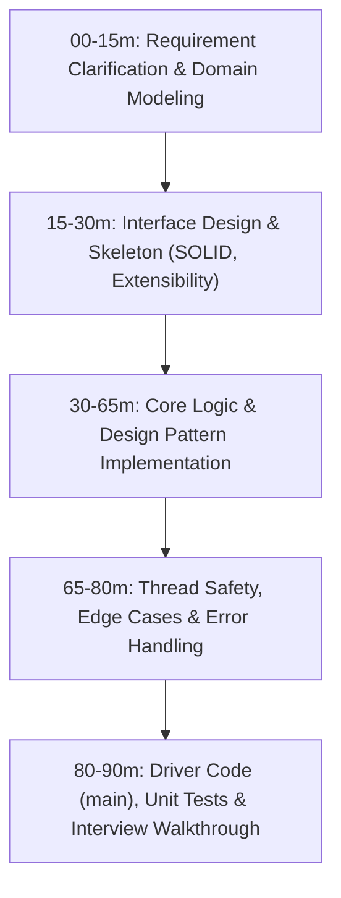
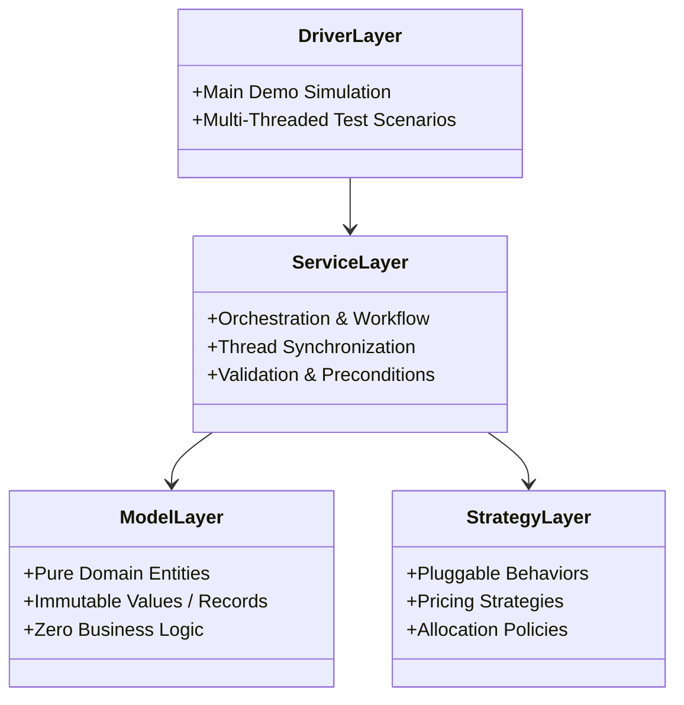

# Low-Level Design (LLD) & Machine Coding in Java

A rigorous, enterprise-grade track dedicated to **Object-Oriented Design (OOD)**, **Design Patterns**, **Clean Architecture**, and **Machine Coding Rounds** in modern Java (Java 17/21).

---

## 🧭 Machine Coding Interview Framework (90-Minute Blueprint)

In a standard 90-minute LLD / Machine Coding round, you are expected to write executable, production-quality, extensible code that adheres strictly to object-oriented principles, thread safety, and clean separation of concerns.

| Time Budget | Phase | Key Deliverables & Checkpoints |
| :---: | :--- | :--- |
| **00 – 15m** | **Requirement Discovery** | Define core entities, identify functional & non-functional requirements, state assumptions explicitly. |
| **15 – 30m** | **Contract & Skeleton** | Define Java interfaces, enums, records, and abstract classes. Apply Single Responsibility and Open/Closed principles. |
| **30 – 65m** | **Core Implementation** | Implement concrete strategies, business controllers/services, and repository layers. |
| **65 – 80m** | **Concurrency & Hardening**| Add `ReentrantReadWriteLock`, `ConcurrentHashMap`, atomic operations, and input validation. |
| **80 – 90m** | **Verification & Demo** | Implement a driver `main` method proving all flows (success cases, validation rejections, concurrency). |

---

## 📋 Master System Catalog & Architectural Matrix

| # | System Design Module | Core Design Patterns Applied | Key Concurrency / Algorithmic Mechanisms | Link |
| :---: | :--- | :--- | :--- | :--- |
| **01** | **Design a Parking Lot System** | Strategy, Factory, Singleton | Concurrent spot allocation, multi-vehicle hierarchy, dynamic fee calculation | [01-design-a-parking-lot-system.md](./01-design-a-parking-lot-system.md) |
| **02** | **Design an Elevator Control System** | State, Strategy, Dispatcher | Concurrent elevator car scheduling, SCAN / LOOK disk-scheduling algorithm | [02-design-an-elevator-control-system.md](./02-design-an-elevator-control-system.md) |
| **03** | **Design an In-Memory Key-Value Store** | Command, Memento, Chain of Responsibility | Read-write locking, TTL passive + active expiration, transactions (BEGIN/COMMIT/ROLLBACK) | [03-design-an-in-memory-key-value-store-with-ttl-and-transactions.md](./03-design-an-in-memory-key-value-store-with-ttl-and-transactions.md) |
| **04** | **Design an Expense Sharing System (Splitwise)** | Strategy, Observer, Command | Exact/Percent/Equal splits, Min-Cash-Flow debt simplification algorithm | [04-design-an-expense-sharing-system-splitwise.md](./04-design-an-expense-sharing-system-splitwise.md) |
| **05** | **Design a Movie Ticket Booking System (BookMyShow)** | State, Strategy, Facade | Optimistic / pessimistic seat locking, temporary TTL reservations, race-condition immunity | [05-design-a-movie-ticket-booking-system-bookmyshow.md](./05-design-a-movie-ticket-booking-system-bookmyshow.md) |
| **06** | **Design a Concurrent In-Memory Cache** | Strategy, Observer, Factory | Generics `<K,V>`, ReadWriteLock, pluggable LRU/LFU/FIFO, active+passive TTL expiration | [06-design-a-concurrent-in-memory-cache-with-eviction-policies.md](./06-design-a-concurrent-in-memory-cache-with-eviction-policies.md) |
| **07** | **Design a Food Delivery System (Swiggy/Zomato)** | Strategy, State, Observer | Atomic CAS rider assignment, dynamic surge fee calculation, nearest-partner geospatial dispatch | [07-design-a-food-delivery-system-swiggy-zomato.md](./07-design-a-food-delivery-system-swiggy-zomato.md) |

---

## 🏛️ Clean Architecture & SOLID Compliance Rules

Every module in this track complies strictly with the 5 SOLID engineering foundations:

1. **Single Responsibility Principle (SRP):**
   - Separate models from storage, pricing calculations, and transaction orchestration.
2. **Open/Closed Principle (OCP):**
   - New vehicle types, fee rules, elevator dispatchers, or split types must be added via **polymorphism**, never by modifying existing `switch` statements.
3. **Liskov Substitution Principle (LSP):**
   - Derived subclasses must be completely substitutable for their base types without throwing unexpected `UnsupportedOperationException`.
4. **Interface Segregation Principle (ISP):**
   - Small, focused interfaces (e.g., `FeeCalculationStrategy`, `SpotAssignmentStrategy`, `TransactionContext`).
5. **Dependency Inversion Principle (DIP):**
   - High-level services depend on abstractions/interfaces, not concrete classes.

---

## ⚡ Concurrency & Thread-Safety Checklist for Java LLD

When designing concurrent systems in Java, always address the following:
- **Shared Mutable State:** Encapsulate state within thread-safe containers (`ConcurrentHashMap`, `CopyOnWriteArrayList`).
- **Critical Sections:** Use `ReentrantReadWriteLock` for high read-to-write ratios, or `ReentrantLock` with `tryLock(timeout)` to prevent deadlocks.
- **Race Condition Immunity:** Double-checked locking or atomic compare-and-swap operations (`AtomicReference`, `AtomicInteger`).
- **Memory Visibility:** Use `volatile` on status flags or rely on lock acquisition/release memory barriers.

---

| [← System Design Track Hub](../README.md) | [Track Hub: LLD & Machine Coding](./README.md) | [Next: Design a Parking Lot System →](./01-design-a-parking-lot-system.md) |
| :--- | :---: | ---: |

