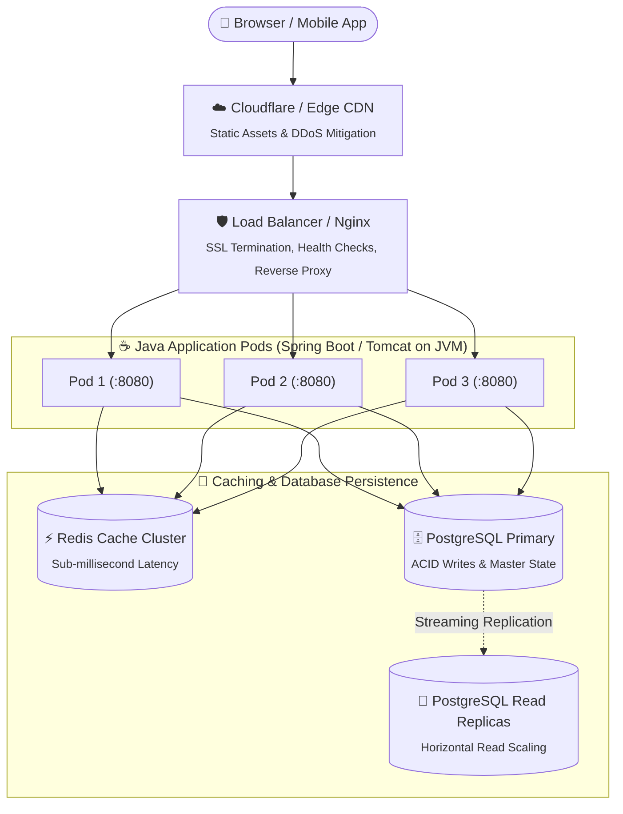

# Page 1: Java Backend Architecture & Threading Models

Welcome to Page 1 of the System Design Fundamentals series. When interviewers ask you to design a high-scale system, they expect you to understand not just abstract boxes, but how requests flow through the operating system, network, and application runtime (JVM).

---

## 1. End-to-End Request Flow in a Java System

A modern scalable Java web architecture typically follows this request pipeline:



1. **DNS & CDN**: Resolves domain to IP; caches static assets at edge servers near the user.
2. **Reverse Proxy / Load Balancer**: Nginx / AWS ALB distributes incoming traffic across backend Java instances using algorithms like Round Robin or Least Connections.
3. **Application Layer (JVM)**: Runs compiled Java bytecode on embedded servlet containers (Tomcat, Jetty, or Netty).
4. **Data Layer**: High-speed caching (Redis) fronting durable relational or document databases.

---

## 2. The Evolution of Java Thread Models

Understanding how Java processes incoming HTTP connections is a classic system design interview topic.

```text
╭─────────────────────────────────────────────────────────────────────────────╮
│                     The 3 Java Concurrency Thread Models                    │
├─────────────────────────────────────────────────────────────────────────────┤
│ 🧵 Model 1: Thread-Per-Request (Traditional Tomcat)                         │
│    Client 1 ──▶ [ OS Thread 1 (1MB Stack) ] ──▶ Blocks on DB query (Waiting)│
│    Client 2 ──▶ [ OS Thread 2 (1MB Stack) ] ──▶ Blocks on REST API (Waiting)│
│    ⚠️ Limit: 200 - 500 threads per JVM before RAM / context-switch failure  │
├─────────────────────────────────────────────────────────────────────────────┤
│ ⚡ Model 2: Event-Driven / Reactive (Netty / Spring WebFlux)                │
│    10,000 Clients ──▶ [ Single Event Loop Thread ] ──▶ Non-blocking sockets │
│    ⚠️ Drawback: Callback hell, steep learning curve, breaks ThreadLocal     │
├─────────────────────────────────────────────────────────────────────────────┤
│ 🚀 Model 3: Virtual Threads (Java 21 Project Loom — Modern Standard)        │
│    100,000s of Virtual Threads (Cheap KB memory) ──▶ [ JVM Scheduler ]       │
│                                                            │                │
│             Pool of Carrier OS Threads (Equal to CPU Cores)                 │
│    ✨ Advantage: Write simple synchronous code with massive reactive scale! │
╰─────────────────────────────────────────────────────────────────────────────╯
```

### 1. Traditional Servlet Model (Thread-Per-Request)
- Standard in Spring MVC + Tomcat.
- Tomcat maintains a worker thread pool (default max: 200 threads).
- **The Bottleneck**: If an external API call or database query takes $100\text{ ms}$, each thread handles only $10\text{ requests/sec}$. With 200 threads, the server caps at $2,000\text{ QPS}$ before new requests queue up or get rejected (`HTTP 503`).

### 2. Event-Driven Non-Blocking (Netty / WebFlux)
- Uses OS-level multiplexing (`epoll` on Linux, `kqueue` on macOS).
- 4 to 16 threads handle thousands of concurrent requests without blocking.
- Drawback: Complex code, hard-to-read stack traces, breaks standard `ThreadLocal` context.

### 3. Modern Revolution: Virtual Threads (Java 21+)
Project Loom introduced **Virtual Threads**, giving you the simple, readable imperative style of Thread-Per-Request with the throughput of Reactive Netty:

```java
import java.util.concurrent.Executors;

public class VirtualThreadServer {
    public static void main(String[] args) {
        // Creates an executor that spawns a lightweight virtual thread for every task!
        try (var executor = Executors.newVirtualThreadPerTaskExecutor()) {
            for (int i = 0; i < 100_000; i++) {
                final int taskId = i;
                executor.submit(() -> {
                    // This blocking call unmounts the virtual thread, freeing the carrier OS thread!
                    Thread.sleep(1000); 
                    return "Task " + taskId + " complete";
                });
            }
        } // Auto-closes and waits for all 100k tasks to finish
    }
}
```

---

## 3. Monolithic vs. Microservices Architecture in Java

```
                 Monolith                                      Microservices
       +--------------------------+              +-------------+   +-------------+
       |   Single Deployable War  |              | User Service|   |Order Service|
       |  (Spring Boot monolith)  |              |   (JVM 1)   |   |   (JVM 2)   |
       |                          |              +-------------+   +-------------+
       |  Auth | Order | Billing  |                     \                 /
       +--------------------------+                      \               /
                    |                                  +-------------------+
             +--------------+                          |  Shared or Split  |
             |  Single DB   |                          |    Databases      |
             +--------------+                          +-------------------+
```

| Dimension | Java Monolith (Modular Monolith) | Java Microservices (Spring Cloud) |
| :--- | :--- | :--- |
| **Deployment** | Single JAR / WAR file | Multiple independent JARs / Docker containers |
| **Communication** | Fast in-memory method calls (`service.process()`) | Network RPC calls (REST, gRPC, Kafka) |
| **Failure Domain** | A memory leak or crash impacts the whole app | Isolated (Order service crash doesn't kill Auth) |
| **Complexity** | Low operational overhead (single CI/CD pipeline) | High operational overhead (K8s, tracing, distributed transactions) |
| **Recommendation** | **Start here!** Best for early startups & students | Scale to this when team/traffic demands it |

---

## 4. Self-Check & Quick Review

1. **Q**: Why can't a traditional Java server handle 1,000,000 concurrent OS threads?
   - *A*: Each OS thread allocates $\approx 1\text{ MB}$ of stack memory ($10^6 \times 1\text{ MB} = 1\text{ TB}$ RAM!) and causes severe CPU thrashing due to kernel context switching overhead.
2. **Q**: What happens when a Virtual Thread in Java 21 makes a blocking database query?
   - *A*: The JVM intercepts the blocking call, "unmounts" the virtual thread from the underlying OS carrier thread, and allows the carrier thread to execute other virtual threads.
3. **Q**: What is the purpose of SSL Termination at the Load Balancer?
   - *A*: Decrypts incoming HTTPS traffic at the load balancer so internal communication between the load balancer and Java application servers can happen over fast, unencrypted private HTTP.

---

## 🧭 Continue Learning

| 🏁 Track Start | 🧭 Track Hub | Next Topic ▶️ |
| :--- | :---: | ---: |
| *You are at the first topic* | [**System Design Index**](README.md)<br><sub>*Architecture, LLD & Scalability*</sub> | [**Page 2: SOLID Principles & LLD**](02-solid-principles-in-java.md)<br><sub>*Clean Architecture & Dependency Injection*</sub> |
