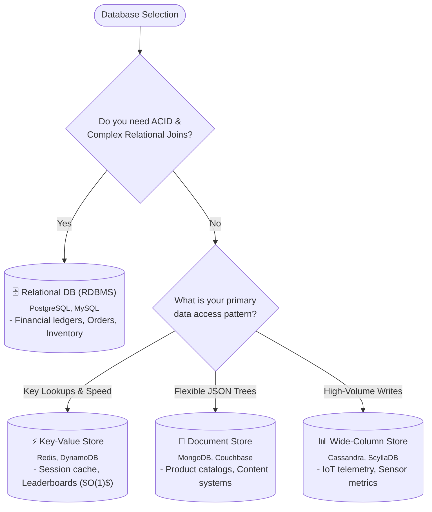
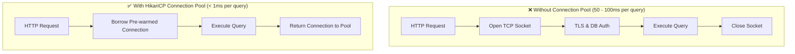

# Page 5: Databases & Connection Pooling (HikariCP) in Java

Welcome to Page 5 of the System Design Fundamentals series. The database is almost always the ultimate bottleneck in any distributed system. This page covers database selection, connection pool tuning with HikariCP, and transaction locking strategies in Java.

---

## 1. SQL vs. NoSQL: Decision Framework



| Type | Examples | Best For | Trade-offs |
| :--- | :--- | :--- | :--- |
| **Relational (RDBMS)** | PostgreSQL, MySQL | Financial systems, order processing, strict schema | Harder to scale horizontally (sharding is complex) |
| **Key-Value** | Redis, DynamoDB | Session storage, caching, leaderboards ($O(1)$) | Limited query flexibility (no complex joins) |
| **Document** | MongoDB, Couchbase | Product catalogs, content management | Eventual consistency, document size limits |
| **Wide-Column** | Apache Cassandra | IoT telemetry, write-heavy chat logs, metrics | No ad-hoc SQL joins, eventual consistency |

---

## 2. Database Connection Pooling: HikariCP

In Java, opening a raw JDBC database connection incurs significant overhead:
1. TCP 3-way handshake
2. TLS/SSL certificate negotiation
3. Database authentication & privilege check
4. Memory allocation on the database server ($\approx 2\text{ MB to } 10\text{ MB}$ per backend process in PostgreSQL)



### Why Smaller Connection Pools are Actually Faster!
A common beginner mistake is configuring large pools like 500 connections. A single disk spindle can only process one I/O operation at a time, and a CPU core can only run one query at a time. Too many simultaneous connections cause disk queue thrashing and OS context switching.

The official PostgreSQL / HikariCP formula for optimal pool size:
$$\text{Pool Size} = (\text{CPU Cores} \times 2) + \text{Effective Spindle Count}$$
*For a 16-core database server with an SSD, a pool size of around 32 to 40 connections delivers peak throughput!*

### Essential HikariCP Configuration in Java:
```properties
# Spring Boot / HikariCP properties
spring.datasource.hikari.maximum-pool-size=20
spring.datasource.hikari.minimum-idle=10
spring.datasource.hikari.idle-timeout=300000        # 5 minutes
spring.datasource.hikari.connection-timeout=20000  # 20 seconds before throwing exception
spring.datasource.hikari.max-lifetime=1800000      # 30 minutes (must be < DB wait_timeout)
```

---

## 3. Database Transactions: ACID & Isolation Levels

### ACID Properties:
- **Atomicity**: All operations succeed or all roll back (all-or-nothing).
- **Consistency**: Data transitions from one valid schema state to another.
- **Isolation**: Concurrent transactions do not interfere with each other.
- **Durability**: Committed data persists even across power outages (Write-Ahead Logging / WAL).

### The 4 Isolation Levels & Read Phenomena:

| Isolation Level | Dirty Read | Non-Repeatable Read | Phantom Read | Performance |
| :--- | :---: | :---: | :---: | :--- |
| **Read Uncommitted** | ❌ Allowed | ❌ Allowed | ❌ Allowed | Fastest |
| **Read Committed** (Postgres default) | ✅ Prevented | ❌ Allowed | ❌ Allowed | Fast |
| **Repeatable Read** (MySQL default) | ✅ Prevented | ✅ Prevented | ❌ Allowed | Moderate |
| **Serializable** | ✅ Prevented | ✅ Prevented | ✅ Prevented | Slowest (Pessimistic) |

- **Dirty Read**: Transaction A reads uncommitted changes from Transaction B (which later rolls back).
- **Non-Repeatable Read**: Transaction A reads a row, Transaction B modifies it and commits, Transaction A re-reads the row and sees different values.
- **Phantom Read**: Transaction A queries a range of rows, Transaction B inserts a new row matching that range and commits, Transaction A re-queries and sees new "phantom" rows.

---

## 4. Concurrency Control: Optimistic vs. Pessimistic Locking

When two users try to purchase the last ticket simultaneously, how does Java prevent race conditions?

```text
╭─────────────────────────────────────────────────────────────────────────────╮
│                Optimistic Locking vs. Pessimistic Locking                   │
├──────────────────────────────────────────────┬──────────────────────────────┤
│ 🚀 Optimistic Locking (@Version)             │ 🔒 Pessimistic Locking (DB)  │
│    (Assume conflicts are rare: Fast & Scalable) (Assume high write collisions)│
├──────────────────────────────────────────────┼──────────────────────────────┤
│ 1. Read Seat row (Version = 1)               │ 1. SELECT * FROM Seats       │
│ 2. Compute in application memory             │    WHERE id = 42 FOR UPDATE; │
│ 3. Execute update with version check:        │    (Locks row exclusively)   │
│    UPDATE Seats SET user = 'Bob',            │ 2. Thread 1 updates row;     │
│    version = 2 WHERE id = 42 AND version = 1;│    Thread 2 BLOCKS!          │
│ 4. If 1 row updated ➔ Success!               │ 3. Thread 1 commits and      │
│    If 0 rows updated ➔ OptimisticLockException releases DB row lock.        │
╰──────────────────────────────────────────────┴──────────────────────────────╯
```

### 1. Optimistic Locking in Java (JPA / Hibernate)
Uses an incremental `@Version` column. No database locks are held while the application computes.

```java
@Entity
public class Product {
    @Id
    private Long id;
    private String name;
    private int stock;

    @Version // JPA automatically checks and increments this on UPDATE!
    private int version;
}
```

### 2. Pessimistic Locking in Java (JPA / Hibernate)
Directly locks the database row using `SELECT ... FOR UPDATE`, blocking other transactions until commit.

```java
public interface ProductRepository extends JpaRepository<Product, Long> {
    @Lock(LockModeType.PESSIMISTIC_WRITE)
    @Query("SELECT p FROM Product p WHERE p.id = :id")
    Optional<Product> findByIdWithLock(@Param("id") Long id);
}
```

---

## 5. Self-Check & Quick Review

1. **Q**: Why should HikariCP's `maxLifetime` be slightly shorter than the database server's connection timeout?
   - *A*: If the database forcibly closes an idle connection from its end first, the Java connection pool might hand a "dead" socket to an application thread, causing unexpected connection errors.
2. **Q**: When would you pick Optimistic Locking over Pessimistic Locking?
   - *A*: When read volume is high and concurrent write collisions are rare (e.g., editing user profile details). Pessimistic locking is preferred under heavy contention (e.g., flash sales, airline seat reservations).
3. **Q**: What read phenomenon does `Repeatable Read` eliminate that `Read Committed` does not?
   - *A*: **Non-repeatable reads**. In Repeatable Read, re-reading the same row within a transaction is guaranteed to return identical data.

---

## 🧭 Continue Learning

| ◀️ Previous Topic | 🧭 Track Hub | Next Topic ▶️ |
| :--- | :---: | ---: |
| [**Page 4: Scaling & Thread Pools**](04-scaling-and-thread-pools.md)<br><sub>*Vertical/Horizontal Scaling & Pool Sizing Math*</sub> | [**System Design Index**](README.md)<br><sub>*Architecture, LLD & Scalability*</sub> | [**Page 6: Caching & LRU in Java**](06-caching-strategies-and-lru.md)<br><sub>*Cache-Aside, LinkedHashMap LRU & Redis*</sub> |
