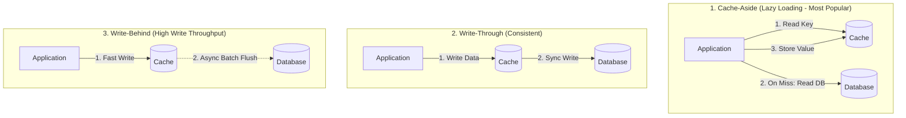

# Page 6: Caching Strategies & Implementing In-Memory LRU in Java

Welcome to Page 6 of the System Design Fundamentals series. Caching is the most effective way to reduce database load and slash API response latency from $50\text{ ms}$ down to sub-millisecond speeds.

---

## 1. Memory Access Hierarchy & The 80/20 Rule

```text
╭─────────────────────────────────────────────────────────────────────────────╮
│                        Storage Hierarchy Latency Numbers                    │
├──────────────────────────────────────────────┬──────────────────────────────┤
│ Layer & Technology                           │ Approximate Latency          │
├──────────────────────────────────────────────┼──────────────────────────────┤
│ ⚡ L1 / L2 / L3 CPU Caches                   │ 0.5 – 10 nanoseconds         │
│ 🧠 Main Memory (RAM / Local Heap - Caffeine) │ ~ 100 nanoseconds            │
│ 🌐 Remote Distributed Cache (Redis over LAN) │ ~ 1 – 2 milliseconds         │
│ 💾 Solid State Drive (SSD / Relational DB)   │ ~ 10 – 50 milliseconds       │
╰──────────────────────────────────────────────┴──────────────────────────────╯
```

The **Pareto Principle (80/20 Rule)** states that $80\%$ of application traffic typically requests only $20\%$ of the data (the "hot" working set). Caching this $20\%$ in RAM yields massive performance gains.

---

## 2. Caching Patterns



### 1. Cache-Aside (Most Common in Web Apps)
- Application attempts to read from cache.
- **Cache Hit**: Returns data immediately.
- **Cache Miss**: Reads from DB, populates cache with TTL, returns data.
- **Advantage**: Resilient (if cache goes down, DB serves requests); only requested data is cached.

### 2. Write-Through
- Application writes to the cache; the cache synchronously updates the database before acknowledging success.
- **Advantage**: Cache is never stale.
- **Drawback**: Higher write latency (two write operations per update).

### 3. Write-Behind (Write-Back)
- Application writes directly to the cache, which acknowledges immediately. A background worker asynchronously flushes batched writes to the DB.
- **Advantage**: Extremely fast write throughput (great for view counters, analytics).
- **Drawback**: Risk of permanent data loss if the cache node crashes before writing to disk.

---

## 3. Local (In-Memory) vs. Distributed Caching

| Feature | Local JVM Cache (Caffeine, Guava) | Distributed Cache (Redis Cluster) |
| :--- | :--- | :--- |
| **Location** | Inside JVM process Heap memory | Dedicated external server cluster |
| **Speed** | **Sub-microsecond ($< 1\,\mu\text{s}$)** | Network hop ($1\text{–}3\text{ ms}$) |
| **Serialization** | None (direct Java object references) | Requires JSON/Protobuf/Binary serialization |
| **Consistency** | Inconsistent across multiple app pods | **Consistent** across all app instances |
| **Best Used For** | Immutable static metadata, country codes | User sessions, shopping carts, inventory |

---

## 4. Implementing an In-Memory LRU Cache in Java

Interviewers frequently ask candidates to implement a **Least Recently Used (LRU) Cache** in Java. Java's `java.util.LinkedHashMap` provides this out of the box:

```java
import java.util.LinkedHashMap;
import java.util.Map;

public class LRUCache<K, V> extends LinkedHashMap<K, V> {
    private final int capacity;

    public LRUCache(int capacity) {
        // initialCapacity, loadFactor, accessOrder = true (enables LRU ordering!)
        super(capacity, 0.75f, true);
        this.capacity = capacity;
    }

    // Called automatically by LinkedHashMap after every put/putAll operation:
    @Override
    protected boolean removeEldestEntry(Map.Entry<K, V> eldest) {
        // Evicts the oldest accessed element once size exceeds capacity
        return size() > capacity;
    }

    public static void main(String[] args) {
        LRUCache<Integer, String> cache = new LRUCache<>(2);
        cache.put(1, "A");
        cache.put(2, "B");
        cache.get(1);      // 1 was accessed; 2 becomes the eldest
        cache.put(3, "C"); // Evicts key 2!

        System.out.println(cache.keySet()); // Prints [1, 3]
    }
}
```

---

## 5. Cache Traps & Distributed System Mitigations

```text
╭─────────────────────────────────────────────────────────────────────────────╮
│                    Common Production Cache Failure Patterns                 │
├──────────────────────────────┬──────────────────────────────┬───────────────┤
│ 🏔️ Cache Avalanche          │ 🦬 Thundering Herd / Stampede│ 🕳️ Penetration │
├──────────────────────────────┼──────────────────────────────┼───────────────┤
│ 10,000 keys expire at the    │ A single viral key expires   │ Attacker sends│
│ exact same second.           │ during peak traffic.         │ ID = -99999   │
│             │                │              │               │ (Invalid key) │
│             ▼                │              ▼               │       │       │
│ All requests hit DB at once! │ 10,000 threads query DB!     │ Bypasses cache│
│             │                │              │               │ and hits DB!  │
│             ▼                │              ▼               │       │       │
│        [ DB CRASH ]          │         [ DB CRASH ]         │       ▼       │
│ 🛡️ Fix: Add TTL jitter       │ 🛡️ Fix: Mutex lock (Redisson)│ 🛡️ Bloom filter│
╰──────────────────────────────┴──────────────────────────────┴───────────────╯
```

### 1. Cache Avalanche
- **Problem**: Many cache keys share the same TTL and expire at the exact same second, dumping massive query traffic onto the DB.
- **Solution**: Add a **randomized TTL jitter** (e.g., `TTL = 3600 + Random(-300, 300)` seconds).

### 2. Thundering Herd (Cache Stampede)
- **Problem**: A single, ultra-popular key expires, causing thousands of concurrent incoming requests to all query the DB simultaneously.
- **Solution**: Use a **distributed mutex lock (via Redis / Redisson)** or Java `ReentrantLock` so only one thread recomputes the key while others wait.

### 3. Cache Penetration
- **Problem**: Malicious or invalid queries (e.g., `GET /user/-9999`) miss the cache and force a DB lookup every time.
- **Solution**:
  1. Cache `null` or empty results with a short TTL ($60\text{ seconds}$).
  2. Place a **Bloom Filter** (probabilistic data structure) in front of the cache to instantly reject keys that definitely do not exist in the database.

---

## 6. Self-Check & Quick Review

1. **Q**: Why does setting `accessOrder = true` in `LinkedHashMap` enable LRU behavior?
   - *A*: By default (`accessOrder = false`), `LinkedHashMap` orders entries by **insertion order**. When set to `true`, every `.get()` or `.put()` moves that entry to the tail, leaving the least-recently used entry at the head.
2. **Q**: What is the difference between Cache Eviction and Cache Expiration?
   - *A*: **Expiration** occurs when an entry exceeds its Time-To-Live (TTL). **Eviction** occurs when the cache is full and must delete valid entries to make room for new ones (e.g., LRU, LFU).
3. **Q**: What are the false-positive characteristics of a Bloom Filter?
   - *A*: A Bloom filter can return **false positives** (may report a key exists when it doesn't), but **never false negatives** (if it says a key does not exist, it definitely does not exist).

---

## 🧭 Continue Learning

| ◀️ Previous Topic | 🧭 Track Hub | Next Topic ▶️ |
| :--- | :---: | ---: |
| [**Page 5: Databases & Connection Pooling**](05-databases-and-connection-pooling.md)<br><sub>*HikariCP Sizing, ACID & Locking Strategies*</sub> | [**System Design Index**](README.md)<br><sub>*Architecture, LLD & Scalability*</sub> | [**Page 7: Asynchronous Messaging & Kafka**](07-asynchronous-messaging-and-kafka.md)<br><sub>*Kafka Partitions, Consumer Groups & Idempotency*</sub> |
