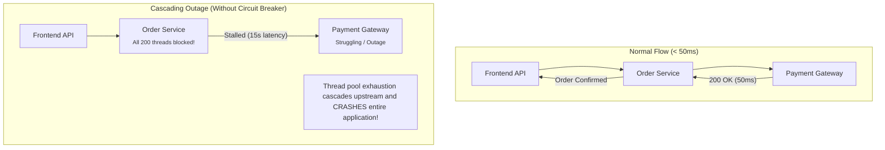

# Page 8: System Resilience: Circuit Breakers & Rate Limiters

Welcome to Page 8 of the System Design Fundamentals series. In distributed systems, failures are guaranteed to happen: network packets drop, third-party APIs experience downtime, and databases slow down. **Resilience engineering** ensures that when one component fails, the entire system does not collapse.

---

## 1. Cascading Failures: The Ripple Effect

Consider three microservices:
$$\text{Frontend API} \longrightarrow \text{Order Service} \longrightarrow \text{Payment Gateway}$$



---

## 2. The Circuit Breaker Pattern (Resilience4j)

A **Circuit Breaker** wraps remote calls and monitors failure rates. When failure crosses a threshold, the breaker "trips" and fails fast without stressing the struggling downstream service.

```
                    +---------------------------------------+
                    |                                       |
                    v (Success Rate Normal)                 | (Failure Threshold
             +--------------+                               |  Exceeded e.g., >50%)
             |    CLOSED    | ------------------------------+
             | (Normal Flow)|
             +--------------+
                    ^
                    | (Trial Calls
                    |  Succeed)
             +--------------+                               +--------------+
             |  HALF-OPEN   | <---------------------------- |     OPEN     |
             | (Test Calls) |        (Wait Duration         | (Fail-Fast   |
             +--------------+         Expires e.g., 10s)    |  Immediately)|
                    |                                       +--------------+
                    | (Trial Calls Fail)                            ^
                    +-----------------------------------------------+
```

### The 3 Breaker States:
1. **CLOSED**: Normal state. Requests pass through. If error rate over a sliding window exceeds a threshold (e.g., $50\%$), the breaker trips to **OPEN**.
2. **OPEN**: All calls fail immediately without touching the downstream network. A fallback method is invoked instantly ($< 1\text{ ms}$).
3. **HALF-OPEN**: After a configured sleep duration (e.g., $10\text{ seconds}$), a trial set of requests is allowed through to test downstream health.

### Resilience4j Java Example:

```java
import io.github.resilience4j.circuitbreaker.annotation.CircuitBreaker;
import org.springframework.stereotype.Service;

@Service
public class PaymentClient {

    @CircuitBreaker(name = "paymentService", fallbackMethod = "paymentFallback")
    public String processPayment(String paymentDetails) {
        // Remote HTTP call to external gateway
        return restTemplate.postForObject("https://gateway.com/pay", paymentDetails, String.class);
    }

    // Fallback executed instantly when circuit is OPEN:
    public String paymentFallback(String paymentDetails, Throwable t) {
        return "Payment service is currently degraded. Please try again in a few moments.";
    }
}
```

---

## 3. Rate Limiting: Protecting Against Overload

Rate limiting throttles incoming requests to defend against DDoS attacks, brute-force login attempts, and API quota abuse.

```text
╭─────────────────────────────────────────────────────────────────────────────╮
│                 Token Bucket vs. Leaky Bucket Rate Limiting                 │
├──────────────────────────────────────────────┬──────────────────────────────┤
│ 🪙 Token Bucket (Allows Bursts)              │ 💧 Leaky Bucket (Smooth Flow)│
├──────────────────────────────────────────────┼──────────────────────────────┤
│ Tokens added at fixed rate (e.g. 5/sec)      │ Incoming requests fill bucket queue  │
│        \  |  /                               │        \  |  /                       │
│       ╭───────╮                              │       ╭───────╮                      │
│       │ • • • │ Max Capacity = 10 tokens     │       │ = = = │ Requests buffer      │
│       ╰───────╯                              │       ╰───────╯                      │
│           │                                  │           │                          │
│     Consumes 1 token per request             │     Drips at constant, smooth rate   │
│     Burst up to capacity allowed!            │     (e.g., exactly 2 req/sec)        │
╰──────────────────────────────────────────────┴──────────────────────────────╯
```

| Algorithm | How it Works | Pros & Cons |
| :--- | :--- | :--- |
| **Token Bucket** | Tokens added at steady rate up to capacity. Consumed per request. | **Allows short bursts** of traffic; memory efficient. |
| **Leaky Bucket** | Requests queue up and exit at a smooth, constant rate. | Smooths out bursty traffic; drops excess when queue is full. |
| **Fixed Window** | Counts requests within fixed intervals (e.g., 100 req/min). | Flawed at boundaries: $2\times$ burst at minute transition! |
| **Sliding Window** | Tracks timestamps in a sliding duration window. | Highly accurate; slightly higher memory usage in Redis. |

---

## 4. In-Memory Token Bucket Rate Limiter in Java

Here is a clean, thread-safe implementation of the **Token Bucket** algorithm:

```java
public class TokenBucketRateLimiter {
    private final long capacity;
    private final double refillRatePerSecond;
    private double tokens;
    private long lastRefillTimestamp;

    public TokenBucketRateLimiter(long capacity, double refillRatePerSecond) {
        this.capacity = capacity;
        this.refillRatePerSecond = refillRatePerSecond;
        this.tokens = capacity;
        this.lastRefillTimestamp = System.currentTimeMillis();
    }

    public synchronized boolean tryAcquire() {
        refill();
        if (tokens >= 1.0) {
            tokens -= 1.0;
            return true; // Allowed
        }
        return false; // Throttled (HTTP 429 Too Many Requests)
    }

    private void refill() {
        long now = System.currentTimeMillis();
        double elapsedSeconds = (now - lastRefillTimestamp) / 1000.0;
        tokens = Math.min(capacity, tokens + elapsedSeconds * refillRatePerSecond);
        lastRefillTimestamp = now;
    }
}
```

---

## 5. Retries with Exponential Backoff and Jitter

Retrying immediately upon failure creates a **thundering herd** that takes down recovering services. Production systems use **Exponential Backoff with Jitter**:

$$\text{Delay} = \min\left(\text{MaxDelay}, \text{BaseDelay} \times 2^{\text{attempt}}\right) + \text{RandomJitter}$$

```java
public class RetryHelper {
    public static void executeWithRetry(Runnable task, int maxRetries) throws InterruptedException {
        long baseDelayMs = 100;
        long maxDelayMs = 5000;

        for (int attempt = 0; attempt < maxRetries; attempt++) {
            try {
                task.run();
                return; // Success
            } catch (Exception e) {
                if (attempt == maxRetries - 1) throw e;

                // Calculate exponential delay
                long delay = Math.min(maxDelayMs, baseDelayMs * (1L << attempt));
                // Add full randomized jitter (0 to delay) to disperse concurrent retries
                long jitter = (long) (Math.random() * delay);
                long sleepTime = delay + jitter;

                System.out.println("Retry " + (attempt + 1) + " sleeping for " + sleepTime + "ms");
                Thread.sleep(sleepTime);
            }
        }
    }
}
```

---

## 6. Self-Check & Quick Review

1. **Q**: Why is randomized "jitter" essential in retry logic?
   - *A*: If 10,000 clients fail at once and retry after exactly $2^{\text{attempt}}$ seconds, all 10,000 clients hit the recovered server at the exact same millisecond. Jitter randomizes retry times, spreading traffic evenly.
2. **Q**: What HTTP response code should a rate limiter return when a client exceeds their limit?
   - *A*: **HTTP 429 (Too Many Requests)**, often accompanied by a `Retry-After: <seconds>` header.
3. **Q**: In Resilience4j, what triggers the transition from `HALF-OPEN` back to `CLOSED`?
   - *A*: If a configured threshold of test calls succeed during the half-open trial phase, indicating the downstream dependency is healthy again.

---

## 🧭 Continue Learning

| ◀️ Previous Topic | 🧭 Track Hub | Next Topic ▶️ |
| :--- | :---: | ---: |
| [**Page 7: Asynchronous Messaging & Kafka**](07-asynchronous-messaging-and-kafka.md)<br><sub>*Kafka Partitions, Consumer Groups & Idempotency*</sub> | [**System Design Index**](README.md)<br><sub>*Architecture, LLD & Scalability*</sub> | [**Page 9: Microservices & API Gateways**](09-microservices-and-api-gateways.md)<br><sub>*API Gateway, Service Discovery & gRPC*</sub> |
